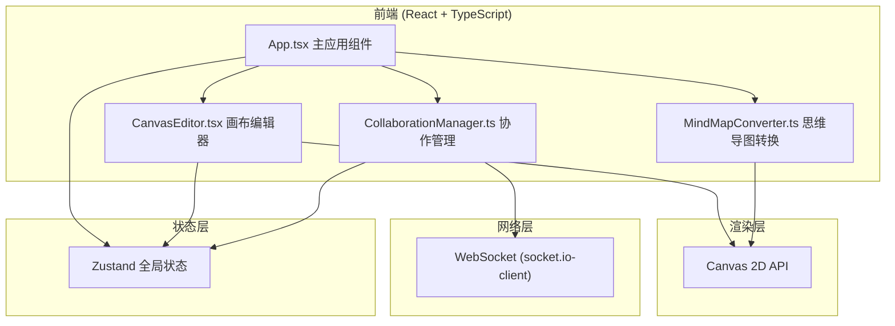

## 1. 架构设计



## 2. 技术说明

- 前端：React 18 + TypeScript + Vite + Tailwind CSS + Zustand
- 初始化工具：vite-init（react-ts 模板）
- 后端：无独立后端，WebSocket 使用模拟连接（本地模拟协作行为，可后续扩展 socket.io 服务端）
- 数据库：无，使用内存状态管理

## 3. 路由定义

| 路由 | 用途 |
|------|------|
| / | 画布主页面，包含所有功能模块 |

## 4. 文件结构

```
├── package.json
├── vite.config.js
├── tsconfig.json
├── index.html
└── src/
    ├── App.tsx                  # 主应用组件
    ├── CanvasEditor.tsx         # 画布编辑器组件
    ├── MindMapConverter.ts      # 思维导图转换工具类
    ├── CollaborationManager.ts  # 协作管理模块
    ├── main.tsx                 # 入口文件
    └── index.css                # 全局样式
```

## 5. 核心数据结构

### 5.1 图形数据模型

```typescript
interface Shape {
  id: string;
  type: 'rect' | 'circle' | 'freehand' | 'sticky';
  x: number;
  y: number;
  width: number;
  height: number;
  color: string;
  strokeWidth: number;
  points?: { x: number; y: number }[];
  text?: string;
}

interface CanvasState {
  shapes: Shape[];
  selectedId: string | null;
  history: Shape[][];
  historyIndex: number;
  mode: 'draw' | 'select' | 'mindmap';
}
```

### 5.2 思维导图数据模型

```typescript
interface MindMapNode {
  id: string;
  text: string;
  x: number;
  y: number;
  children: MindMapNode[];
  collapsed: boolean;
  shapeId: string;
}

interface MindMapData {
  root: MindMapNode;
  connections: {
    from: string;
    to: string;
    controlPoints: { x: number; y: number }[];
  }[];
}
```

### 5.3 协作操作数据模型

```typescript
interface Operation {
  type: 'add' | 'move' | 'resize' | 'delete' | 'edit';
  shapeId: string;
  userId: string;
  timestamp: number;
  payload: Partial<Shape>;
}

interface UserCursor {
  userId: string;
  color: string;
  selectedShapeId: string | null;
}
```

## 6. 性能要求

- 画布绘制帧率不低于30FPS（使用 requestAnimationFrame + 脏区域重绘）
- 单个图形选中/拖拽响应时间不超过50ms（事件委托 + 直接DOM操作）
- 操作同步间隔0.1秒（节流处理）
- 撤销/重做最多50步历史记录

## 7. 关键算法

### 7.1 操作转换（OT）算法

- 基于时间戳和操作类型进行冲突检测
- 移动/缩放操作：采用最后写入胜出（LWW）+ 位置偏移补偿
- 同时编辑同一图形：先到的操作生效，后到的操作基于变换后的状态重新应用

### 7.2 思维导图布局算法

- 根节点居中画布中心
- 子节点按角度均匀辐射排列
- 递归计算子树占用空间，避免重叠
- 连线使用三次贝塞尔曲线
