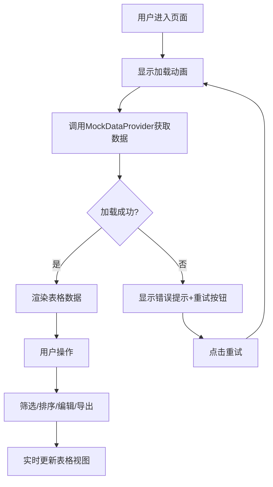

## 1. 产品概述

数据表格管理面板是一个面向前端开发者和管理后台用户的高性能数据表格组件解决方案。它解决了现有表格库集成度低、样式定制困难、交互反馈不灵活的痛点，提供了数据动态加载、多条件筛选、列排序、行内编辑和数据导出等核心功能。

- 主要用途：管理后台数据展示与操作、数据分析与导出
- 目标用户：管理后台开发者、数据运营人员
- 产品价值：提升开发效率，提供流畅的用户交互体验，满足复杂数据场景需求

## 2. 核心功能

### 2.2 功能模块

1. **数据加载模块**：支持50条模拟数据加载，加载动画，错误重试机制
2. **多条件筛选模块**：关键词搜索、状态筛选、日期范围筛选，支持防抖优化
3. **列排序模块**：点击表头排序，支持升序/降序切换，排序状态可视化
4. **行内编辑模块**：双击单元格进入编辑模式，回车/失焦保存，动画反馈
5. **数据导出模块**：支持CSV和PDF两种格式导出，导出状态反馈

### 2.3 页面详情

| 页面名称 | 模块名称 | 功能描述 |
|-----------|-------------|---------------------|
| 主页面 | 顶部导航栏 | 显示应用标题"数据表格管理面板"，包含导出CSV和导出PDF按钮 |
| 主页面 | 筛选面板 | 吸顶布局，包含关键词搜索框、状态下拉选择、日期范围选择器 |
| 主页面 | 数据表格区 | 展示50条数据，支持点击排序、双击编辑、悬停高亮 |
| 主页面 | 加载状态 | 旋转圆环加载动画，加载失败重试提示 |
| 主页面 | 表格页脚 | 显示总数据条数统计 |

## 3. 核心流程

### 用户操作流程
用户进入页面后，首先看到加载动画，数据加载完成后展示表格。用户可以在筛选面板中输入关键词、选择状态、设置日期范围进行组合筛选；点击表头进行排序；双击单元格进行行内编辑；点击导出按钮将数据导出为CSV或PDF文件。

## 4. 用户界面设计

### 4.1 设计风格
- **主色调**：#3b82f6（蓝色），用于按钮、排序箭头、聚焦边框
- **辅助色**：#10b981（绿色），用于导出PDF按钮；#fef3c7（淡黄色），用于编辑保存动画
- **中性色**：#1e293b（深灰）头部背景；#f1f5f9（浅灰）表头背景；#ffffff/#f8fafc（白/灰白）斑马纹行
- **按钮样式**：圆角矩形，高度36px，圆角4px，平滑hover过渡
- **字体**：系统无衬线字体，标题加粗，正文常规
- **布局风格**：1200px居中布局，顶部导航+吸顶筛选面板+表格区三段式结构
- **图标风格**：简洁的上下箭头（▲▼）用于排序状态指示

### 4.2 页面设计概述

| 页面名称 | 模块名称 | UI元素 |
|-----------|-------------|-------------|
| 主页面 | 顶部导航栏 | 深灰背景#1e293b，白色标题文字，右侧两个彩色圆角按钮 |
| 主页面 | 筛选面板 | 吸顶布局，白色背景，底部1px分隔线#e2e8f0，输入框高度36px，聚焦蓝色光晕动画0.2秒 |
| 主页面 | 数据表格 | 表头背景#f1f5f9，底部2px蓝色实线#3b82f6，斑马纹行背景，悬停#e0f2fe高亮 |
| 主页面 | 交互反馈 | 编辑保存0.3秒淡黄渐变动画，输入聚焦0.2秒蓝色光晕，按钮hover 0.2秒颜色变化 |
| 主页面 | 加载状态 | 旋转圆环动画#3b82f6，1秒/圈，全屏居中 |

### 4.3 响应式
- 桌面端（≥1200px）：1200px固定宽度居中布局，表格正常展示
- 平板端（768px-1199px）：自适应宽度，表格水平滚动
- 移动端（<768px）：表格转为卡片式布局，每行数据一张卡片，字段垂直排列，触控优化

### 4.4 交互动效
- 输入框聚焦：边框变为#3b82f6，向外扩散0.2秒蓝色光晕
- 按钮hover：0.2秒平滑颜色变亮
- 行编辑保存：背景色由#fef3c7渐变到白色，0.3秒
- 行hover：背景色变为#e0f2fe，0.2秒过渡
- 加载动画：圆环旋转，1秒一圈，无限循环
