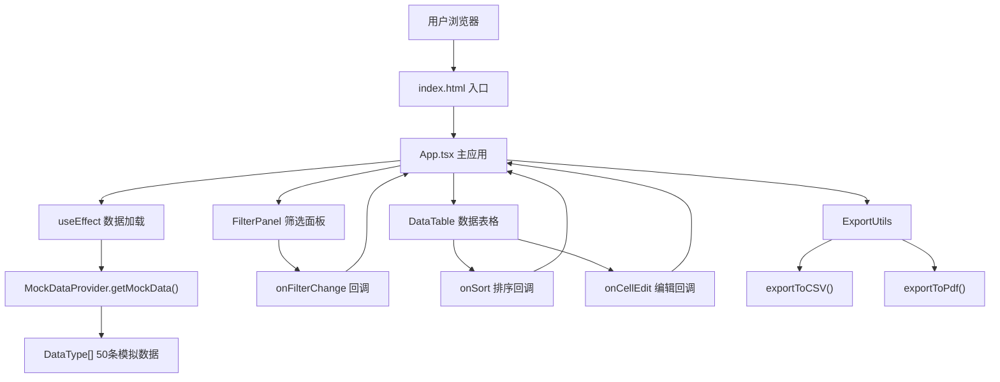

## 1. 架构设计



## 2. 技术描述

- **前端框架**：React@18 + TypeScript@5
- **构建工具**：Vite@5 + @vitejs/plugin-react@4
- **状态管理**：React Hooks (useState, useEffect, useMemo, useCallback, useRef)
- **样式方案**：原生CSS + CSS变量，不使用CSS框架
- **数据来源**：本地Mock数据生成器，50条随机数据
- **性能优化**：useMemo缓存排序筛选结果，useCallback防抖处理，React.memo按需使用

## 3. 文件结构与调用关系

```
项目根目录
├── package.json                    # 项目依赖配置
├── vite.config.js                  # Vite构建配置
├── tsconfig.json                   # TypeScript配置
├── index.html                      # 应用入口HTML
└── src/
    ├── App.tsx                     # 主应用入口
    │   ├── 调用 MockDataProvider.getMockData()
    │   ├── 渲染 FilterPanel
    │   ├── 渲染 DataTable
    │   └── 调用 ExportUtils.exportToCSV/PDF
    ├── components/
    │   ├── DataTable.tsx           # 核心表格组件
    │   │   ├── 使用 useMemo 进行排序筛选
    │   │   ├── 渲染 thead/tbody
    │   │   └── 处理双击编辑逻辑
    │   └── FilterPanel.tsx         # 筛选面板组件
    │       ├── 关键词搜索 input
    │       ├── 状态筛选 select
    │       ├── 日期范围 input[type=date]
    │       └── onFilterChange 回调
    └── utils/
        ├── MockDataProvider.ts     # Mock数据生成
        │   ├── DataType 接口定义
        │   └── getMockData() 函数
        └── ExportUtils.ts          # 导出工具
            ├── exportToCSV() 函数
            └── exportToPdf() 函数
```

**数据流向**：
1. App.tsx → MockDataProvider.getMockData() → 获得 DataType[] → 存储到 useState
2. App.tsx → 传递 filters, sortConfig 给 DataTable
3. FilterPanel → onFilterChange → 更新 App.tsx 中的 filters 状态
4. DataTable → 接收 data + filters + sortConfig → useMemo 计算展示数据
5. DataTable → onCellEdit → 更新 App.tsx 中的 data 状态
6. 导出按钮 → 调用 ExportUtils → 传入当前展示数据 → 触发下载

## 4. 类型定义

```typescript
// src/utils/MockDataProvider.ts
export interface DataType {
  id: number;
  name: string;
  email: string;
  status: 'active' | 'inactive';
  createdAt: string; // ISO 日期格式
}

// 筛选条件类型
export interface FilterConfig {
  keyword: string;
  status: 'all' | 'active' | 'inactive';
  dateStart: string; // yyyy-mm-dd
  dateEnd: string;   // yyyy-mm-dd
}

// 排序配置类型
export interface SortConfig {
  key: keyof DataType | null;
  direction: 'asc' | 'desc';
}

// 编辑单元格类型
export interface EditingCell {
  rowId: number | null;
  field: keyof DataType | null;
}
```

## 5. 核心模块技术说明

### 5.1 数据加载模块
- 使用 `useEffect` 在组件挂载时触发数据加载
- 模拟0.1%概率加载失败
- 加载状态使用 `useState` 管理
- 重试按钮重新触发加载逻辑

### 5.2 筛选防抖优化
- 使用 `useRef` 存储 timeoutId
- 每次输入变化时清除上一个定时器，设置新的0.3秒定时器
- 定时器回调触发真正的筛选更新
- 下拉选择和日期选择立即生效，不防抖

### 5.3 排序与筛选性能
- 使用 `useMemo` 缓存筛选和排序后的数据
- 依赖项：原始数据、筛选条件、排序配置
- 时间复杂度：筛选 O(n)，排序 O(n log n)，n ≤ 50
- 目标响应时间 < 16ms

### 5.4 行内编辑实现
- 双击单元格设置 `editingCell` 状态
- 渲染条件判断：editingCell 匹配则显示 input，否则显示文本
- input 自动聚焦
- onBlur 和 onKeyDown(Enter) 触发保存
- 保存后设置 `flashRowId` 状态，0.3秒后清除，触发CSS动画

### 5.5 数据导出实现
- **CSV导出**：将数据转换为 `\uFEFF` + CSV 字符串，创建 Blob，创建 a 标签触发下载，文件名包含 `new Date().toISOString().slice(0,10)`
- **PDF导出**：使用 `window.print()` 或创建文本Blob模拟PDF下载，提示用户保存

### 5.6 CSS动画实现
- 加载动画：`@keyframes spin` 1s linear infinite
- 输入框聚焦：`@keyframes glow` 0.2s ease-out
- 编辑保存闪烁：`@keyframes flash` 0.3s ease-out
- 所有hover过渡：`transition: all 0.2s ease`

### 5.7 响应式布局
- 使用 `@media (max-width: 768px)` 媒体查询
- 移动端表格转为卡片布局：隐藏thead，每个tr作为卡片，td转为block并添加data-label伪元素显示字段名
- 筛选面板在移动端改为垂直堆叠布局

## 6. 性能指标

| 操作 | 目标响应时间 | 实现方式 |
|------|-------------|----------|
| 初始渲染 | < 500ms | 50条数据量小，直接渲染 |
| 筛选/排序 | < 16ms | useMemo缓存，O(n log n)算法 |
| 行内编辑保存 | < 10ms | 直接更新数组元素，无复杂计算 |
| 防抖延迟 | 300ms | setTimeout 防抖 |
| CSS动画帧率 | 60FPS | 使用transform和opacity动画 |
