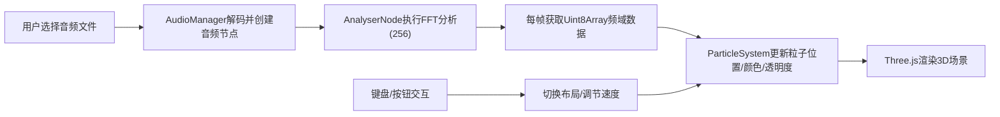

## 1. 产品概述

三维音乐可视化系统，通过解析本地音频文件，实时将音频频谱和节奏转化为沉浸式三维粒子动画。面向音乐爱好者、视觉设计师和创意工作者，提供独特的音乐视觉化体验。

核心价值：将抽象的听觉感受转化为具象的、可交互的三维视觉艺术。

## 2. 核心功能

### 2.1 功能模块
1. **音频处理模块**：本地音频文件上传（WAV/MP3，≤20MB）、播放/暂停/停止控制、实时频谱分析（FFT 256）
2. **三维粒子系统**：2048个粒子的BufferGeometry实现、三种布局模式（球壳/螺旋/瀑布）、频率驱动的位置/颜色/透明度动画
3. **场景增强元素**：旋转环形结构（TorusGeometry线框）、背景星点场（1000个随机点）
4. **交互控制**：键盘快捷键（1/2/3切换布局，+/-调节速度）、鼠标拖拽旋转视角、侧边栏UI控制面板
5. **实时信息显示**：播放进度条、频率峰值、平均振幅、RMS、速度倍率

### 2.2 页面详情
| 页面名称 | 模块名称 | 功能描述 |
|-----------|-------------|---------------------|
| 主页面 | 侧边栏 | 文件选择、播放控制、布局切换、音频信息实时显示 |
| 主页面 | 进度条区 | 左上角播放进度条（渐变色）和播放/暂停切换按钮 |
| 主页面 | 速度标签 | 右上角半透明背景速度倍率显示 |
| 主页面 | 3D场景 | Three.js渲染的粒子系统、环形结构、星点场，鼠标可旋转 |

## 3. 核心流程

用户选择本地音频文件 → 系统解码并创建AudioContext → 连接AnalyserNode进行FFT分析 → 启动播放和渲染循环 → 每帧获取频域数据驱动粒子系统更新 → 用户通过键盘或按钮交互切换布局/调节速度 → 播放结束自动停止

## 4. 用户界面设计

### 4.1 设计风格
- **主色调**：纯黑背景(#000000)，红色(#ff3366)、绿色(#33ff66)、蓝色(#3366ff)分别对应低/中/高频
- **按钮风格**：圆角(border-radius: 4px)，半透明深色背景(rgba(30,30,30,0.8))，hover有0.2秒过渡
- **字体**：高对比度白色文字，12px/14px字号
- **布局**：左侧固定200px侧边栏（滑入动画0.3s），右侧全屏3D场景
- **动效**：所有过渡动画0.2-0.3s ease缓动，粒子位置变化0.3s平滑

### 4.2 页面设计概述
| 页面名称 | 模块名称 | UI元素 |
|-----------|-------------|-------------|
| 主页面 | 侧边栏 | 半透明rgba(20,20,20,0.7)背景，宽200px，从左滑入，包含文件按钮、播放/暂停按钮、三个布局切换按钮、实时音频信息 |
| 主页面 | 进度条 | 左上角深灰(#333)底色，渐变(#ff3366→#3366ff)进度条，圆形播放/暂停按钮(d=36px) |
| 主页面 | 速度标签 | 右上角rgba(0,0,0,0.6)背景，14px白色文字显示当前倍率 |
| 主页面 | 3D场景 | 纯黑背景，Three.js渲染，鼠标拖拽OrbitControls旋转视角 |

### 4.3 响应性
桌面端优先设计，全屏无滚动条(overflow:hidden)，场景自适应窗口resize。

### 4.4 3D场景指导
- **环境**：纯黑背景营造太空感，无HDRI
- **光照**：粒子自发光，无需额外光源
- **相机**：PerspectiveCamera，初始位置(0,0,10)，OrbitControls拖拽旋转
- **构图**：粒子系统居中，环形结构半径4.5环绕，星点场散布背景
- **动画**：粒子Y轴偏移随频率脉动，环形0.2rad/s旋转，星点0.01rad/s自转，布局切换0.5s缓动过渡
- **性能**：BufferGeometry批量渲染，目标帧率≥55 FPS

## 5. 性能要求
- 帧率：≥55 FPS稳定运行
- 音频延迟：解析延迟≤100ms
- 交互响应：鼠标拖拽旋转平滑无卡顿
