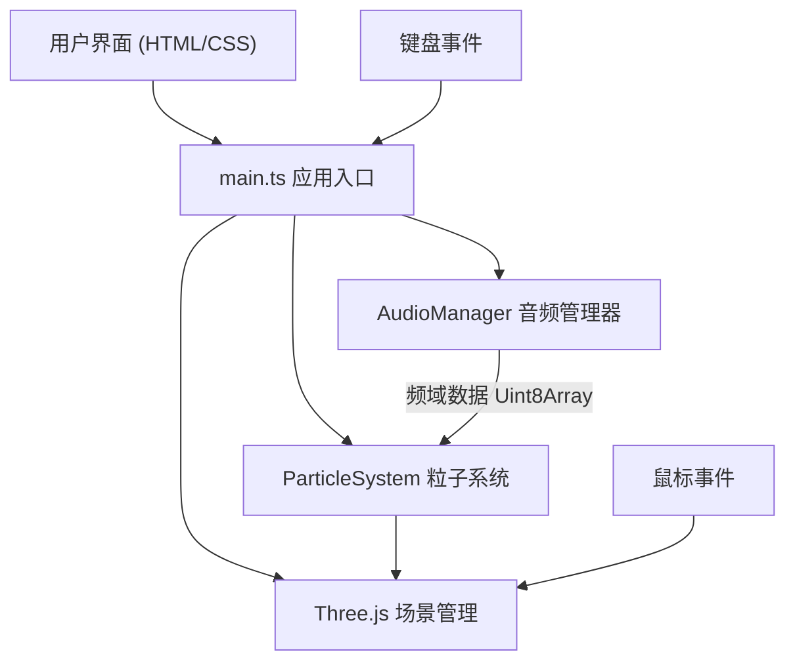

## 1. 架构设计



## 2. 技术说明

- **前端框架**：纯 TypeScript（无React/Vue），面向对象模块化设计
- **构建工具**：Vite 5.x，target ES2020，开发端口3000
- **3D引擎**：Three.js 最新版，BufferGeometry + PointsMaterial实现高性能粒子系统
- **音频处理**：Web Audio API原生实现，AudioContext + AnalyserNode（FFT size 256）
- **类型安全**：TypeScript严格模式(strict: true)

## 3. 文件结构

| 文件路径 | 职责 |
|----------|------|
| `package.json` | 依赖声明：three、typescript、vite、@types/three；脚本：npm run dev |
| `vite.config.js` | Vite配置：build.target=es2020，server.port=3000 |
| `tsconfig.json` | TS配置：strict=true，target=ES2020，module=ESNext |
| `index.html` | 入口页面，包含#app容器，加载src/main.ts |
| `src/main.ts` | 应用初始化：场景/相机/渲染器创建、UI事件绑定、动画循环、音频-粒子数据桥接 |
| `src/audioManager.ts` | AudioManager类：文件解码、播放控制、AnalyserNode频谱分析、getFrequencyData() |
| `src/particleSystem.ts` | ParticleSystem类：BufferGeometry粒子创建、三种布局算法、频域数据驱动更新 |

## 4. 核心类定义

### 4.1 AudioManager
```typescript
class AudioManager {
  private audioContext: AudioContext;
  private analyser: AnalyserNode;  // fftSize=256
  private source: AudioBufferSourceNode | null;
  private gainNode: GainNode;
  private audioBuffer: AudioBuffer | null;
  private startTime: number;
  private isPlaying: boolean;
  
  async loadFile(file: File): Promise<void>;  // 解码≤20MB的WAV/MP3
  play(): void;
  pause(): void;
  stop(): void;
  getFrequencyData(): Uint8Array;  // 返回256个频点数据
  getCurrentTime(): number;
  getDuration(): number;
  getIsPlaying(): boolean;
}
```

### 4.2 ParticleSystem
```typescript
type LayoutType = 'sphere' | 'spiral' | 'waterfall';

class ParticleSystem {
  public points: THREE.Points;
  private geometry: THREE.BufferGeometry;
  private material: THREE.PointsMaterial;
  private particleCount: number = 2048;
  private layout: LayoutType = 'sphere';
  private speedMultiplier: number = 1.0;
  
  // 粒子属性缓冲区
  private basePositions: Float32Array;   // 布局基准位置(用于过渡动画)
  private targetPositions: Float32Array; // 目标位置
  private currentOffsets: Float32Array;  // 当前Y轴偏移
  private colors: Float32Array;
  
  constructor(scene: THREE.Scene);
  setLayout(layout: LayoutType): void;   // 切换布局，0.5s缓动过渡
  setSpeedMultiplier(m: number): void;   // 0.5x ~ 2.0x
  update(frequencyData: Uint8Array, deltaTime: number): void;
  
  // 布局生成算法
  private generateSphereLayout(): Float32Array;  // 球壳r=5
  private generateSpiralLayout(): Float32Array;  // 螺旋上升
  private generateWaterfallLayout(): Float32Array; // 瀑布分布
  
  // 颜色映射：低频红、中频绿、高频蓝
  private mapFrequencyToColor(freqBin: number, amplitude: number): [number, number, number];
  private mapAmplitudeToAlpha(amplitude: number): number;
}
```

## 5. 数据流与渲染循环

```
requestAnimationFrame(render)
  ├─ deltaTime = clock.getDelta() * speedMultiplier
  ├─ if audio playing:
  │    freqData = audioManager.getFrequencyData()
  │    particleSystem.update(freqData, deltaTime)
  │    update UI: progress bar, peak, avg amplitude, RMS
  ├─ torus.rotation.y += 0.2 * deltaTime
  ├─ starField.rotation.y += 0.01 * deltaTime
  ├─ orbitControls.update()
  └─ renderer.render(scene, camera)
```

## 6. 性能优化策略
- **BufferGeometry**：单DrawCall渲染2048个粒子，避免逐粒子对象开销
- **TypedArray**：使用Float32Array存储位置/颜色数据，直接操作GPU缓冲区
- **脏标记**：仅在需要时调用geometry.attributes.needsUpdate = true
- **FFT优化**：fftSize=256平衡精度与性能，每帧一次getByteFrequencyData
- **缓动插值**：使用lerp线性插值平滑过渡，避免突兀跳变
