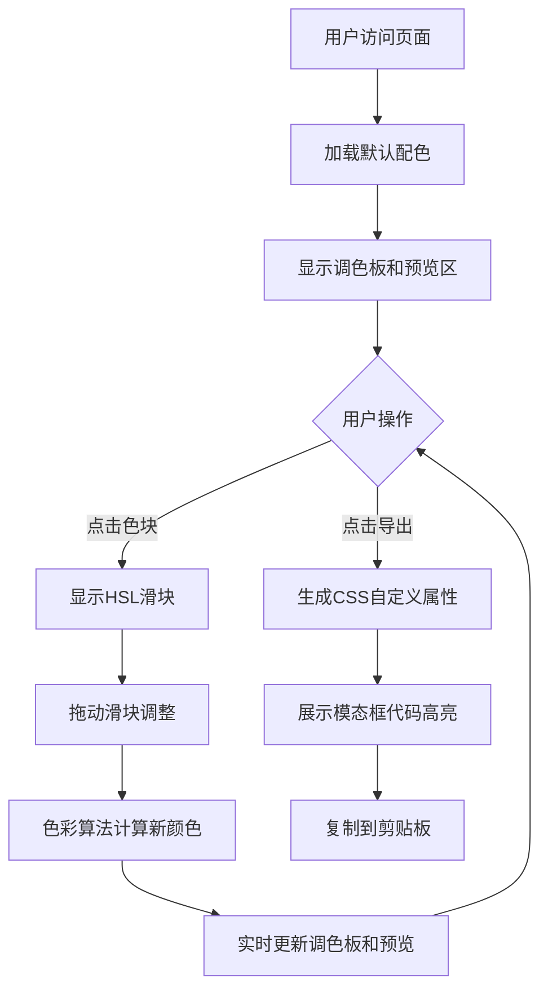

## 1. 产品概述

在线自定义配色方案生成与预览工具，为设计师和开发者提供快速创建、调整并保存完整UI色彩系统的能力，支持实时预览不同配色在典型页面组件上的效果。

- 核心价值：消除UI设计中配色方案的试错成本，一键生成完整色彩系统并可视化预览效果
- 目标用户：前端开发者、UI设计师、产品经理

## 2. 核心功能

### 2.1 用户角色

| 角色 | 注册方式 | 核心权限 |
|------|---------|---------|
| 普通用户 | 无需注册 | 使用全部配色编辑、预览和导出功能 |

### 2.2 功能模块

1. **配色方案生成与编辑**：主色、辅色、中性色、功能色的HSL滑块调整
2. **实时主题预览**：导航栏、卡片、按钮、输入框、标签组件预览
3. **CSS代码导出**：一键生成CSS自定义属性代码，支持复制到剪贴板

### 2.3 页面详情

| 页面名称 | 模块名称 | 功能描述 |
|---------|---------|-----------|
| 主页 | 顶部操作栏 | 固定顶部，提供导出按钮，白色背景带底部边框 |
| 主页 | 调色板编辑区 | 左侧区域，色块网格布局，支持HSL调整，选中放大动画 |
| 主页 | 主题预览区 | 右侧区域，实时渲染典型UI组件示例 |
| 主页 | 导出模态框 | 半透明遮罩，展示CSS代码高亮，支持一键复制 |

## 3. 核心流程

用户访问页面 → 默认加载预设配色方案 → 点击任意色块弹出HSL滑块 → 拖动滑块实时调整颜色 → 调色板和预览区同步刷新 → 点击导出按钮生成CSS代码 → 复制代码到剪贴板用于项目

## 4. 用户界面设计

### 4.1 设计风格
- 设计方向：极简主义（Minimalist），以白色和浅灰为基底
- 主色调：由用户自定义，默认使用蓝色系 #4A90D9
- 按钮风格：圆角8px，主色填充，悬停加深上移2px
- 字体：系统无衬线字体栈 (-apple-system, BlinkMacSystemFont, Segoe UI, Roboto)
- 布局：左右分栏（桌面端）/ 垂直堆叠（移动端），顶部固定操作栏
- 动画：统一0.2-0.3秒过渡，ease/ease-out缓动函数

### 4.2 页面设计概述

| 页面名称 | 模块名称 | UI元素 |
|---------|---------|--------|
| 主页 | 顶部操作栏 | 固定定位、白色背景、底部1px浅灰边框、导出按钮 |
| 主页 | 调色板编辑区 | 白色背景、flex-wrap网格布局（间距12px）、色块悬停遮罩、选中放大1.1倍动画、HSL滑块组、HEX色值显示 |
| 主页 | 主题预览区 | 浅灰背景(#f5f5f5)、毛玻璃导航栏、圆角卡片12px、主色按钮、文本框、成功色标签 |
| 主页 | 导出模态框 | 半透明黑色遮罩、代码编辑器风格背景(#1e1e1e)、Fira Code等宽字体、行号、复制按钮状态切换 |

### 4.3 响应式设计
- Desktop-first设计策略
- 断点1 (>1024px)：左栏35% + 右栏65% 并排显示
- 断点2 (768px-1024px)：左栏40% + 右栏60% 并排显示
- 断点3 (<768px)：两栏垂直堆叠，全屏宽度，导航栏变汉堡菜单，卡片宽度100%

### 4.4 性能要求
- 滑块拖动时颜色计算使用requestAnimationFrame节流，单帧计算≤8ms，保证30fps以上
- 模态框代码高亮渲染≤50ms不阻塞主线程
