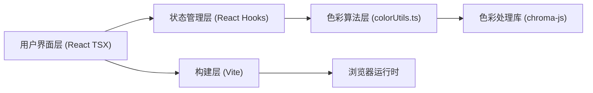

## 1. 架构设计



## 2. 技术栈说明

- 前端框架：React 18 + TypeScript 5
- 构建工具：Vite 5（@vitejs/plugin-react）
- 色彩处理：chroma-js（色彩空间转换、对比度计算）
- 状态管理：React useState + useRef（轻量级，无额外库）
- 性能优化：requestAnimationFrame 节流
- 样式方案：内联CSS-in-JS对象（与React状态直接绑定，避免样式切换延迟）

## 3. 模块结构定义

| 路径 | 职责 |
|------|------|
| src/colorUtils.ts | 纯函数色彩算法：调色板生成、对比度计算、CSS导出 |
| src/ColorPalette.tsx | 调色板UI：色块网格、HSL滑块、选中动画、交互事件 |
| src/ThemePreview.tsx | 预览UI：导航栏、卡片、按钮、输入框、标签组件渲染 |
| src/App.tsx | 主容器：全局状态管理、布局切换、导出模态框、响应式监听 |

## 4. 核心数据结构

```typescript
// 单个颜色定义
interface ColorToken {
  hex: string;
  name: string;
  category: 'primary' | 'secondary' | 'neutral' | 'functional';
}

// 完整调色板
interface ColorPalette {
  primary: ColorToken;
  secondary: [ColorToken, ColorToken];
  neutral: {
    darkGray: ColorToken;
    lightGray: ColorToken;
    white: ColorToken;
  };
  functional: {
    success: ColorToken;
    warning: ColorToken;
    error: ColorToken;
  };
  // 算法生成变体
  variants: {
    primaryShades: string[]; // 5阶明度
    primarySaturations: string[]; // 4阶饱和度
  };
}

// HSL色彩空间
interface HSL {
  h: number; // 0-360
  s: number; // 0-100
  l: number; // 0-100
}
```

## 5. 色彩算法核心逻辑

1. **generatePalette(primaryHex: string)**：输入主色，通过chroma-js的HSL色彩空间生成5阶明度变体（-30% ~ +30%）和4阶饱和度变体（0% ~ 100%）
2. **getContrastText(colorHex: string)**：基于WCAG AA标准（对比度≥4.5:1），计算给定颜色背景上应使用黑色还是白色文字
3. **exportCSSVars(palette: ColorPalette)**：遍历调色板对象，生成标准CSS :root 自定义属性字符串，含注释和分组

## 6. 性能优化策略

- 滑块输入使用useRef暂存最新值，requestAnimationFrame在下一帧统一触发状态更新，避免过度渲染
- chroma-js色彩计算结果缓存（useMemo），相同输入不重复计算
- 预览组件包裹React.memo，仅当依赖的颜色值变化时重渲染
