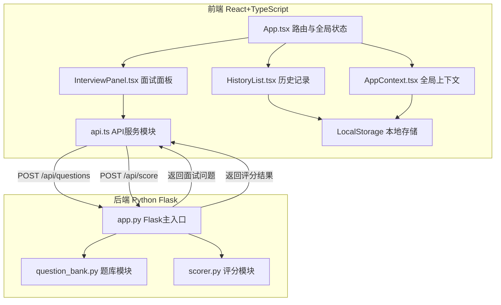

## 1. 架构设计



## 2. 技术说明

- 前端：React@18 + TypeScript + Vite + TailwindCSS
- 初始化工具：vite-init（react-ts模板）
- 后端：Python Flask + flask-cors
- 数据库：无（使用LocalStorage存储历史记录，后端预置题库）
- 状态管理：React Context (AppContext)

## 3. 路由定义

| 路由 | 用途 |
|------|------|
| / | 首页：岗位选择、面试初始化、历史记录列表 |
| /interview | 面试面板：问题展示、作答、评分反馈 |

## 4. API定义

### 4.1 获取面试问题

```
POST /api/questions
Request: { "position": "frontend" | "backend" | "pm" | "data_analyst" }
Response: { "questions": [{ "id": number, "text": string }] }
```

### 4.2 提交答案并获取评分

```
POST /api/score
Request: {
  "question_id": number,
  "answer": string,
  "position": string
}
Response: {
  "scores": {
    "technical_accuracy": number,
    "logical_expression": number,
    "completeness": number
  },
  "overall_score": number,
  "feedback": {
    "strengths": string,
    "improvements": string
  }
}
```

### 4.3 TypeScript类型定义

```typescript
type Position = 'frontend' | 'backend' | 'pm' | 'data_analyst';

interface Question {
  id: number;
  text: string;
}

interface ScoreResult {
  scores: {
    technical_accuracy: number;
    logical_expression: number;
    completeness: number;
  };
  overall_score: number;
  feedback: {
    strengths: string;
    improvements: string;
  };
}

interface InterviewRecord {
  id: string;
  date: string;
  position: Position;
  positionLabel: string;
  overallScore: number;
  questions: {
    question: string;
    answer: string;
    scores: ScoreResult;
  }[];
}
```

## 5. 数据模型

### 5.1 LocalStorage数据结构

键名：`interview_history`

```json
[
  {
    "id": "uuid",
    "date": "2026-06-20T10:30:00.000Z",
    "position": "frontend",
    "positionLabel": "前端开发",
    "overallScore": 78,
    "questions": [
      {
        "question": "请解释React中虚拟DOM的工作原理",
        "answer": "虚拟DOM是...",
        "scores": {
          "scores": {
            "technical_accuracy": 80,
            "logical_expression": 75,
            "completeness": 70
          },
          "overall_score": 75,
          "feedback": {
            "strengths": "...",
            "improvements": "..."
          }
        }
      }
    ]
  }
]
```

## 6. 文件结构与调用关系

```
project/
├── package.json                    # 依赖配置与启动脚本
├── vite.config.js                  # Vite构建配置
├── tsconfig.json                   # TypeScript配置
├── index.html                      # 入口HTML
├── src/
│   ├── App.tsx                     # 主组件，路由切换，全局状态管理
│   │   → 调用 AppContext 提供全局状态
│   │   → 数据流：接收用户选择 → 调用面试模块 → 展示反馈
│   ├── context/
│   │   └── AppContext.tsx           # 全局上下文
│   │   → 存储：面试状态、问题列表、评分结果
│   │   → 被App.tsx和所有子组件读写
│   ├── components/
│   │   ├── InterviewPanel.tsx      # 面试主面板
│   │   │   → 从AppContext读取当前问题
│   │   │   → 调用api.ts提交答案
│   │   │   → 更新AppContext中的评分结果
│   │   ├── ScoreGauge.tsx          # 评分仪表盘组件
│   │   ├── HistoryList.tsx         # 历史记录列表
│   │   │   → 读写LocalStorage
│   │   ├── PositionSelector.tsx    # 岗位选择器
│   │   └── InterviewerAvatar.tsx   # 面试官头像与语音
│   ├── services/
│   │   └── api.ts                  # API服务模块
│   │   → 封装所有后端请求
│   │   → 被InterviewPanel和其他组件调用
│   └── main.tsx                    # React入口
├── api/
│   ├── app.py                      # Flask主入口，路由定义
│   ├── question_bank.py            # 预置题库模块
│   ├── scorer.py                   # 评分逻辑模块
│   └── requirements.txt            # Python依赖
```
