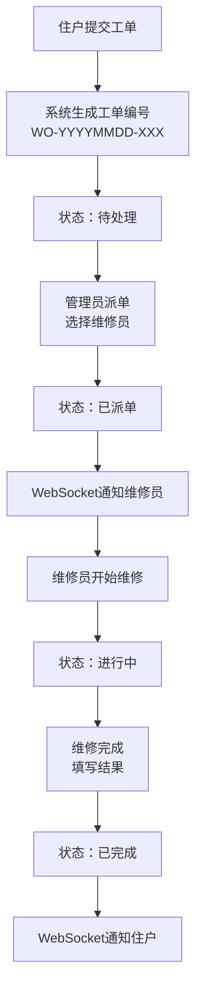
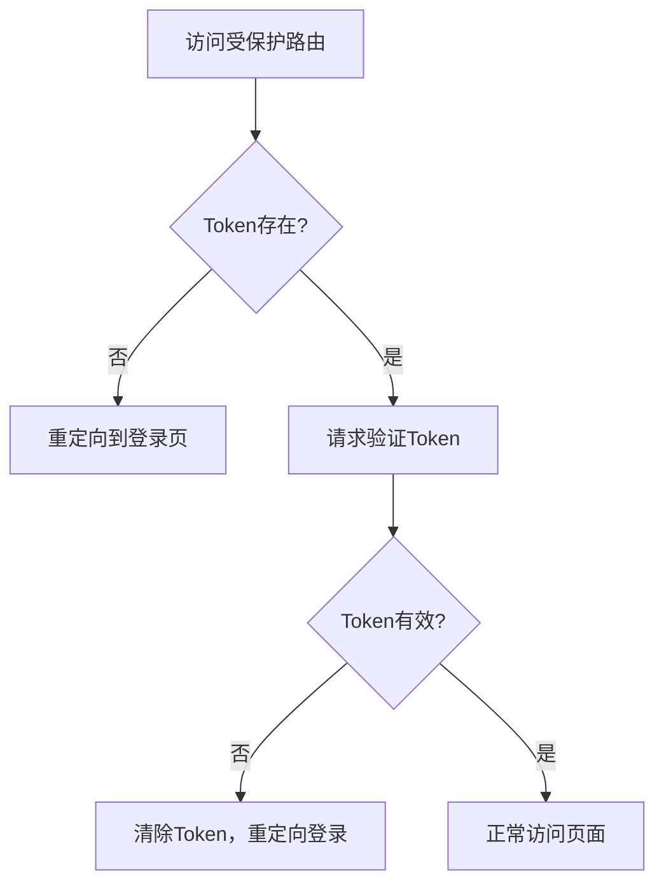

## 1. 产品概述

物业维修工单管理系统，解决社区物业在住户报修和公共设施维护中依赖纸质工单和微信群沟通导致的维修进度不透明、派单效率低、历史记录难以追溯等问题。面向住户、管理员、维修员三类用户，提供工单全流程可视化追踪和实时通知功能。

## 2. 核心功能

### 2.1 用户角色

| 角色 | 注册方式 | 核心权限 |
|------|----------|----------|
| 住户 | 邮箱注册 | 提交报修工单、查看工单进度、搜索历史工单、管理个人资料 |
| 管理员 | 邮箱注册 | 查看所有工单、派单给维修员、查看统计数据、管理个人资料 |
| 维修员 | 邮箱注册 | 接收工单、处理工单、反馈进度、设置在线状态和技能标签 |

### 2.2 功能模块

1. **登录注册页**：用户登录、注册、密码加密存储、JWT认证
2. **仪表盘页**：工单统计卡片、实时工单动态、待处理工单列表、派单功能
3. **工单列表页**：工单列表展示、状态筛选、紧急程度排序、搜索过滤、分页
4. **工单详情页**：工单信息展示、状态时间线、维修进度反馈
5. **个人资料页**：昵称修改、电话修改、头像上传、技能标签设置、在线状态

### 2.3 页面详情

| 页面名称 | 模块名称 | 功能描述 |
|----------|----------|----------|
| 登录注册页 | 登录表单 | 邮箱密码登录、JWT token存储、未登录重定向 |
| 登录注册页 | 注册表单 | 邮箱密码注册、bcrypt密码加密、角色选择 |
| 仪表盘页 | 统计卡片 | 今日工单数、待处理、进行中、已完成统计，渐入动画 |
| 仪表盘页 | 实时动态 | WebSocket实时更新工单动态列表 |
| 仪表盘页 | 待派单列表 | 待处理工单展示、派单弹窗、选择维修员 |
| 工单列表页 | 筛选排序 | 状态筛选、紧急程度排序、时间范围过滤、关键词搜索 |
| 工单列表页 | 工单列表 | 分页展示、状态标签、悬停效果、骨架屏加载 |
| 工单详情页 | 信息展示 | 工单标题、描述、位置、图片、联系人信息 |
| 工单详情页 | 状态时间线 | 提交、派单、维修中、完成节点可视化 |
| 工单详情页 | 操作按钮 | 开始维修、完成维修、填写维修结果 |
| 工单提交表单 | 表单组件 | Formik+Yup验证、图片上传压缩、位置选择 |
| 个人资料页 | 基础信息 | 昵称、电话修改、头像裁剪上传 |
| 个人资料页 | 维修员设置 | 技能标签、在线状态切换 |

## 3. 核心流程

### 3.1 工单处理主流程

### 3.2 用户登录流程

## 4. 用户界面设计

### 4.1 设计风格

- **主题色**：主色 #3498db（蓝色），辅助色 #2ecc71（绿色）、#e74c3c（红色）
- **整体风格**：浅色主题，简洁专业，卡片式布局
- **按钮风格**：圆角8px，hover时向上位移1px且颜色加深，点击时scale 0.98按压效果
- **字体**：采用现代无衬线字体，标题加粗，正文清晰可读
- **状态标签**：圆角6px，不同状态对应不同颜色，带小图标
- **输入框**：聚焦时边框变为主色，带浅蓝色外发光 box-shadow: 0 0 0 3px rgba(52,152,219,0.25)

### 4.2 页面设计概览

| 页面名称 | 模块名称 | UI元素 |
|----------|----------|--------|
| 仪表盘页 | 统计卡片 | 宽220px高120px，白色背景圆角12px，左侧4px彩色竖条装饰，浅灰阴影 |
| 仪表盘页 | 工单动态 | 时间轴式列表，最新动态高亮，WebSocket更新时淡入动画 |
| 工单列表页 | 工单行 | 悬停时背景变浅灰 #f5f7fa，0.2秒平滑过渡 |
| 工单列表页 | 状态标签 | 待处理#e74c3c、已派单#f39c12、进行中#3498db、已完成#2ecc71 |
| 工单详情页 | 状态时间线 | 水平排列，圆形节点图标，节点间#dcdfe6细线连接，未完成虚线 |
| 工单提交表单 | 图片上传 | 多选最多3张，单张2MB限制，canvas压缩至800px宽，进度条显示 |
| 个人资料页 | 头像上传 | canvas裁剪为100x100圆形，压缩至200px宽上传 |
| 骨架屏 | 加载占位 | 灰色脉冲动画块，数据到达后平滑替换 |

### 4.3 响应式设计

- **桌面端**（≥768px）：卡片水平排列，多列布局
- **移动端**（<768px）：卡片垂直堆叠，文字大小自适应，按钮宽度100%
- **触摸优化**：增大点击区域，按钮最小高度44px，移除hover效果改用active状态

### 4.4 动画与交互

- 页面加载：统计卡片渐入动画，stagger延迟效果
- 数据更新：WebSocket推送时列表项滑入动画，200ms内完成
- 图片上传：进度条实时百分比显示
- 状态变更：时间线节点点亮动画
- 表单验证：错误提示抖动效果，成功toast提示
