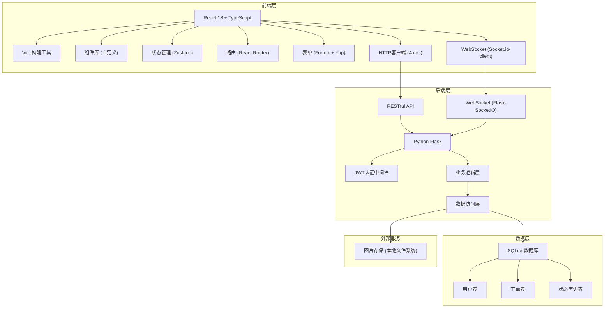
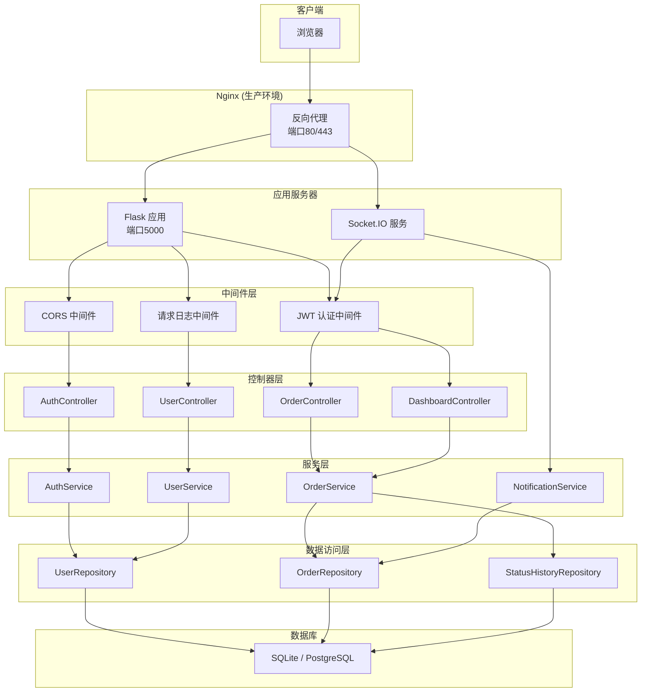
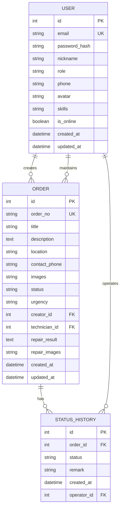
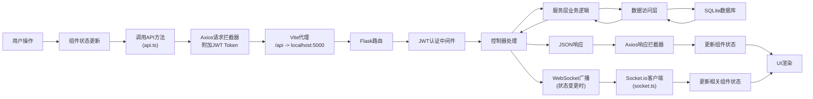

## 1. 架构设计



## 2. 技术描述

- **前端**：React 18 + TypeScript + Vite 5
  - 路由：react-router-dom v6
  - 表单：formik + yup
  - HTTP：axios
  - WebSocket：socket.io-client
  - 图标：lucide-react
  - 状态管理：zustand
  - 样式：CSS Modules + 全局样式变量

- **后端**：Python 3.9 + Flask 3.0
  - API：Flask-RESTful
  - WebSocket：Flask-SocketIO
  - ORM：SQLAlchemy 2.0
  - 认证：Flask-JWT-Extended
  - 密码加密：bcrypt
  - 数据库：SQLite（开发环境）

- **开发工具**：
  - TypeScript 5.0（严格模式）
  - ESLint + Prettier
  - Vite 代理（/api -> localhost:5000）

## 3. 路由定义

| 路由路径 | 页面组件 | 权限要求 | 说明 |
|----------|----------|----------|------|
| /login | Login | 未登录 | 登录注册页面 |
| /dashboard | Dashboard | 已登录 | 仪表盘（管理员首页） |
| /orders | OrderList | 已登录 | 工单列表页 |
| /orders/:id | OrderDetail | 已登录 | 工单详情页 |
| /orders/new | OrderForm | 已登录 | 创建工单页 |
| /profile | Profile | 已登录 | 个人资料页 |
| * | NotFound | - | 404页面 |

## 4. API 定义

### 4.1 TypeScript 类型定义

```typescript
// 用户类型
type UserRole = 'resident' | 'admin' | 'technician';

interface User {
  id: number;
  email: string;
  nickname: string;
  role: UserRole;
  phone: string;
  avatar: string | null;
  skills?: string[];
  is_online?: boolean;
  created_at: string;
}

// 工单状态
type OrderStatus = 'pending' | 'assigned' | 'in_progress' | 'completed';

// 紧急程度
type UrgencyLevel = 'urgent' | 'normal' | 'low';

interface Order {
  id: number;
  order_no: string;
  title: string;
  description: string;
  location: string;
  contact_phone: string;
  images: string[];
  status: OrderStatus;
  urgency: UrgencyLevel;
  creator_id: number;
  creator?: User;
  technician_id?: number;
  technician?: User;
  repair_result?: string;
  repair_images?: string[];
  created_at: string;
  updated_at: string;
  status_history: StatusHistory[];
}

interface StatusHistory {
  id: number;
  order_id: number;
  status: OrderStatus;
  remark: string;
  created_at: string;
  operator_id?: number;
  operator?: User;
}

interface DashboardStats {
  today_total: number;
  pending: number;
  in_progress: number;
  completed: number;
}

interface ApiResponse<T> {
  success: boolean;
  data?: T;
  message?: string;
}
```

### 4.2 RESTful API 接口

| 方法 | 路径 | 说明 | 请求参数 | 响应 |
|------|------|------|----------|------|
| POST | /api/auth/register | 用户注册 | { email, password, nickname, role, phone } | { token, user } |
| POST | /api/auth/login | 用户登录 | { email, password } | { token, user } |
| GET | /api/auth/profile | 获取当前用户 | - | { user } |
| PUT | /api/auth/profile | 更新个人资料 | { nickname, phone, avatar, skills, is_online } | { user } |
| GET | /api/dashboard/stats | 获取统计数据 | - | { stats } |
| GET | /api/orders | 获取工单列表 | { page, page_size, status, keyword, start_date, end_date, sort } | { orders, total, page, page_size } |
| GET | /api/orders/:id | 获取工单详情 | - | { order } |
| POST | /api/orders | 创建工单 | { title, description, location, contact_phone, images, urgency } | { order } |
| PUT | /api/orders/:id/assign | 派单 | { technician_id } | { order } |
| PUT | /api/orders/:id/start | 开始维修 | - | { order } |
| PUT | /api/orders/:id/complete | 完成维修 | { repair_result, repair_images } | { order } |
| GET | /api/technicians/online | 获取在线维修员 | - | { technicians } |

### 4.3 WebSocket 事件

| 事件名 | 方向 | 说明 | 数据 |
|--------|------|------|------|
| connection | 客户端→服务端 | 建立连接，携带token | { token } |
| order_update | 服务端→客户端 | 工单状态更新 | { order } |
| new_order | 服务端→客户端 | 新工单创建（管理员/维修员） | { order } |
| subscribe | 客户端→服务端 | 订阅特定订单更新 | { order_id } |
| unsubscribe | 客户端→服务端 | 取消订阅 | { order_id } |

## 5. 服务器架构图



## 6. 数据模型

### 6.1 ER 图



### 6.2 DDL 语句

```sql
-- 用户表
CREATE TABLE users (
    id INTEGER PRIMARY KEY AUTOINCREMENT,
    email VARCHAR(255) UNIQUE NOT NULL,
    password_hash VARCHAR(255) NOT NULL,
    nickname VARCHAR(100) NOT NULL,
    role VARCHAR(20) NOT NULL CHECK (role IN ('resident', 'admin', 'technician')),
    phone VARCHAR(20),
    avatar VARCHAR(255),
    skills TEXT,
    is_online BOOLEAN DEFAULT 0,
    created_at DATETIME DEFAULT CURRENT_TIMESTAMP,
    updated_at DATETIME DEFAULT CURRENT_TIMESTAMP
);

-- 工单表
CREATE TABLE orders (
    id INTEGER PRIMARY KEY AUTOINCREMENT,
    order_no VARCHAR(50) UNIQUE NOT NULL,
    title VARCHAR(200) NOT NULL,
    description TEXT NOT NULL,
    location VARCHAR(200) NOT NULL,
    contact_phone VARCHAR(20) NOT NULL,
    images TEXT,
    status VARCHAR(20) NOT NULL DEFAULT 'pending' CHECK (status IN ('pending', 'assigned', 'in_progress', 'completed')),
    urgency VARCHAR(20) NOT NULL DEFAULT 'normal' CHECK (urgency IN ('urgent', 'normal', 'low')),
    creator_id INTEGER NOT NULL,
    technician_id INTEGER,
    repair_result TEXT,
    repair_images TEXT,
    created_at DATETIME DEFAULT CURRENT_TIMESTAMP,
    updated_at DATETIME DEFAULT CURRENT_TIMESTAMP,
    FOREIGN KEY (creator_id) REFERENCES users(id),
    FOREIGN KEY (technician_id) REFERENCES users(id)
);

-- 状态历史表
CREATE TABLE status_histories (
    id INTEGER PRIMARY KEY AUTOINCREMENT,
    order_id INTEGER NOT NULL,
    status VARCHAR(20) NOT NULL,
    remark VARCHAR(500),
    created_at DATETIME DEFAULT CURRENT_TIMESTAMP,
    operator_id INTEGER,
    FOREIGN KEY (order_id) REFERENCES orders(id),
    FOREIGN KEY (operator_id) REFERENCES users(id)
);

-- 索引
CREATE INDEX idx_orders_status ON orders(status);
CREATE INDEX idx_orders_creator ON orders(creator_id);
CREATE INDEX idx_orders_technician ON orders(technician_id);
CREATE INDEX idx_orders_created_at ON orders(created_at);
CREATE INDEX idx_status_histories_order ON status_histories(order_id);
```

### 6.3 初始化数据

```sql
-- 测试账号
INSERT INTO users (email, password_hash, nickname, role, phone, is_online) VALUES
('admin@example.com', '$2b$12$...', '系统管理员', 'admin', '13800000001', 1),
('tech1@example.com', '$2b$12$...', '张师傅', 'technician', '13800000002', 1),
('tech2@example.com', '$2b$12$...', '李师傅', 'technician', '13800000003', 0),
('resident1@example.com', '$2b$12$...', '王先生', 'resident', '13800000004', 0),
('resident2@example.com', '$2b$12$...', '李女士', 'resident', '13800000005', 0);

-- 维修员技能
UPDATE users SET skills = '["水电","木工"]' WHERE email = 'tech1@example.com';
UPDATE users SET skills = '["油漆","泥瓦"]' WHERE email = 'tech2@example.com';
```

## 7. 文件结构与调用关系

### 7.1 前端文件结构

```
src/
├── App.tsx                    # 路由配置，调用各页面组件
├── main.tsx                   # 入口文件，渲染App
├── index.css                  # 全局样式
├── components/                # 可复用组件
│   ├── OrderForm.tsx         # 工单表单，调用api.createOrder
│   ├── StatusTimeline.tsx    # 状态时间线，接收statusHistory数据
│   ├── StatusBadge.tsx       # 状态标签组件
│   ├── Skeleton.tsx          # 骨架屏组件
│   ├── Toast.tsx             # 提示组件
│   ├── Modal.tsx             # 弹窗组件
│   ├── Layout.tsx            # 布局组件（导航+侧边栏）
│   └── ProtectedRoute.tsx    # 路由守卫，检查token
├── pages/                     # 页面组件
│   ├── Login.tsx             # 登录页，调用api.login/register
│   ├── Dashboard.tsx         # 仪表盘，调用api.getStats + socket
│   ├── OrderList.tsx         # 工单列表，调用api.getOrders
│   ├── OrderDetail.tsx       # 工单详情，调用api.getOrder + socket
│   └── Profile.tsx           # 个人资料，调用api.updateProfile
├── utils/                     # 工具函数
│   ├── api.ts                # Axios封装，提供所有API方法
│   ├── socket.ts             # Socket.io封装，提供订阅方法
│   ├── imageCompressor.ts    # 图片压缩工具
│   └── helpers.ts            # 通用辅助函数
├── store/                     # 状态管理
│   └── useAuthStore.ts       # 用户认证状态
└── types/                     # 类型定义
    └── index.ts              # TypeScript类型定义
```

### 7.2 后端文件结构

```
backend/
├── app.py                     # Flask应用入口
├── config.py                  # 配置文件
├── models/                    # 数据模型
│   ├── user.py               # User模型
│   ├── order.py              # Order模型
│   └── status_history.py     # StatusHistory模型
├── controllers/               # 控制器
│   ├── auth_controller.py    # 认证控制器
│   ├── order_controller.py   # 工单控制器
│   ├── user_controller.py    # 用户控制器
│   └── dashboard_controller.py # 仪表盘控制器
├── services/                  # 服务层
│   ├── auth_service.py       # 认证服务
│   ├── order_service.py      # 工单服务
│   ├── user_service.py       # 用户服务
│   └── notification_service.py # 通知服务(WebSocket)
├── middleware/                # 中间件
│   ├── auth_middleware.py    # JWT认证中间件
│   └── cors_middleware.py    # CORS中间件
├── utils/                     # 工具函数
│   ├── database.py           # 数据库连接
│   ├── helpers.py            # 辅助函数
│   └── image_uploader.py     # 图片上传处理
├── migrations/                # 数据库迁移
├── uploads/                   # 上传文件存储
└── requirements.txt           # Python依赖
```

### 7.3 数据流向图


