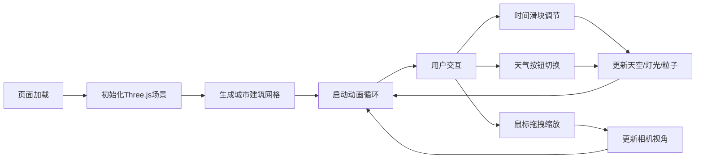

## 1. 产品概述

基于Three.js的三维城市天际线动态可视化项目，用户可以在浏览器中观察程序化生成的微缩城市在昼夜交替与天气变化下的动态效果。

- 主要目的：提供一个沉浸式的3D城市天际线观赏体验，展示昼夜循环与天气系统对城市景观的影响
- 目标用户：对3D可视化、程序化生成感兴趣的开发者和设计师
- 产品价值：展示Three.js在实时3D渲染、粒子系统、光照变化方面的技术能力

## 2. 核心功能

### 2.1 功能模块

1. **城市生成模块**：程序化生成摩天大楼网格、地面、建筑装饰
2. **昼夜控制模块**：时间滑块控制天空颜色渐变、建筑灯光逐栋亮起
3. **天气粒子模块**：晴天浮尘、雨天雨滴、阴天云层三种天气效果
4. **交互控制模块**：鼠标拖拽旋转视角、滚轮缩放、天气切换按钮

### 2.2 页面详情

| 页面名称 | 模块名称 | 功能描述 |
|----------|----------|----------|
| 主页面 | 3D城市场景 | 居中展示70%宽度的Three.js渲染场景，包含建筑、地面、天空、粒子 |
| 主页面 | 时间滑块 | 右侧垂直滑块，0-24小时控制昼夜交替 |
| 主页面 | 天气按钮组 | 左下方三个圆形按钮切换晴天/雨天/阴天 |
| 主页面 | 顶部状态栏 | 半透明磨砂玻璃效果，显示当前时间和天气状态 |

## 3. 核心流程

用户进入页面 → 看到默认时间（清晨6点）和晴天天气的3D城市 → 拖动时间滑块观察昼夜变化 → 点击天气按钮切换不同天气效果 → 通过鼠标拖拽和缩放改变视角

## 4. 用户界面设计

### 4.1 设计风格

- **主色调**：深色主题，背景 #1a1a2e
- **强调色**：时间滑块 #ffaa00，晴天按钮 #ffd700，雨天按钮 #4a90d9，阴天按钮 #888
- **建筑色**：浅灰 #b0b0b0、米白 #e8e0d0、淡蓝 #a0c4e0
- **窗户灯光**：暖黄色 #ffdd44
- **整体风格**：微缩模型感、精致细腻、沉浸式深色主题

### 4.2 页面设计概览

| 页面名称 | 模块名称 | UI元素 |
|----------|----------|--------|
| 主页面 | 3D场景 | 居中70%宽度，深色背景衬托，45度俯视视角 |
| 主页面 | 垂直时间滑块 | 右侧30%区域，轨道宽6px高200px，滑块钮半径12px带金色描边 |
| 主页面 | 天气按钮组 | 左下方，三个直径30px圆形按钮，间距8px，选中时外发光 |
| 主页面 | 顶部状态栏 | 半透明磨砂玻璃，白色文字14px字重500 |

### 4.3 响应式设计

- 桌面端优先设计，城市场景占70%宽度，控制面板占30%
- 小屏幕下可调整为上下布局
- 鼠标交互：拖拽旋转、滚轮缩放

### 4.4 3D场景指导

- **环境**：程序化天空渐变，随时间变化颜色
- **光照**：白天使用方向光模拟太阳光，夜晚使用环境光配合建筑窗户自发光
- **相机**：透视相机，初始45度俯视，OrbitControls控制
- **构图**：20x20网格建筑，建筑高度3-12单位随机，形成错落有致的天际线
- **动画**：窗户灯光缓动亮起、粒子持续运动、云层缓慢移动
- **性能**：粒子不超过5000个，建筑不超过80栋，稳定60fps
