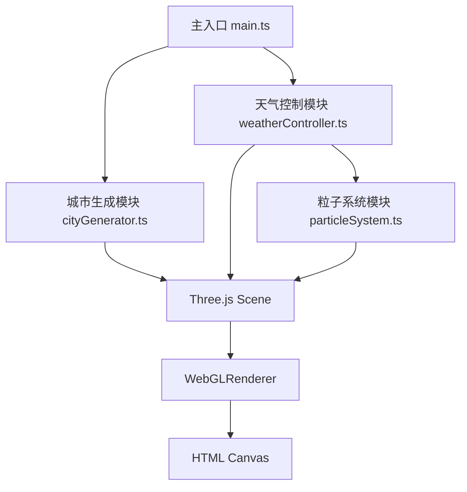

## 1. 架构设计



## 2. 技术描述

- **前端框架**：TypeScript + Three.js
- **构建工具**：Vite 5.x
- **开发语言**：TypeScript（严格模式）
- **3D引擎**：Three.js (three + @types/three)
- **相机控制**：OrbitControls（Three.js内置）
- **样式**：原生CSS

### 项目结构
```
├── package.json
├── tsconfig.json
├── vite.config.js
├── index.html
└── src/
    ├── main.ts
    ├── cityGenerator.ts
    ├── weatherController.ts
    └── particleSystem.ts
```

## 3. 模块职责

| 模块 | 文件名 | 职责 |
|------|--------|------|
| 主入口 | main.ts | 初始化场景、相机、渲染器，启动动画循环，协调各模块数据流向 |
| 城市生成 | cityGenerator.ts | 程序化生成网格地面和随机建筑，返回场景组 |
| 天气控制 | weatherController.ts | 管理昼夜滑块和天气切换，调节天空、灯光、粒子 |
| 粒子系统 | particleSystem.ts | 管理浮尘、雨滴、云层三种天气粒子 |

## 4. 数据流向

1. **初始化阶段**：main.ts → 创建Three.js场景 → 调用cityGenerator生成城市 → 调用weatherController初始化控制
2. **动画循环**：main.ts → requestAnimationFrame → 调用weatherController.update(time) → 更新粒子系统 → 渲染
3. **用户交互**：UI控件 → weatherController → 更新状态 → 影响场景渲染

## 5. 关键技术点

### 5.1 城市生成
- 20x20网格，每格2单位，地面颜色#3a3a3a
- 建筑高度3-12单位随机，颜色三选一
- 建筑顶部随机装饰（立方体或棱锥）
- 窗户灯光与建筑高度成正比

### 5.2 昼夜系统
- 时间范围0-24，步长0.1
- 白天(6-18时)：天空#87ceeb→#4a90d9渐变
- 夜晚(18-6时)：天空#0a0a2e→#000000渐变
- 窗户灯光1秒缓动，透明度0→1

### 5.3 粒子系统
- 晴天：半透明白色圆点，大小2px，速度0.5，透明度0.2
- 雨天：蓝色线条，长度0.4，速度8，透明度0.4，每帧200个，上限5000
- 阴天：半透明灰色平面云层，#cccccc，透明度0.3-0.6，缓慢移动

### 5.4 UI组件
- 垂直时间滑块：轨道6px×200px，滑块半径12px，#ffaa00描边
- 天气按钮组：直径30px圆形，间距8px，选中外发光4px
- 顶部状态栏：磨砂玻璃效果，rgba(255,255,255,0.1)背景，blur(8px)

## 6. 性能要求

- 粒子总数不超过5000个
- 建筑数量不超过80栋
- 稳定60fps运行
- 使用BufferGeometry优化粒子性能
