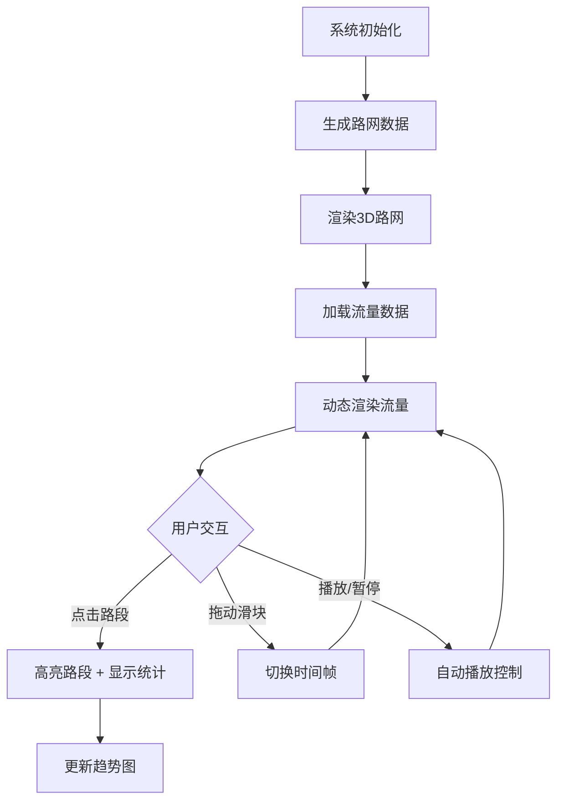

## 1. 产品概述
城市交通流量三维可视化看板，用于智慧城市和数字孪生项目中的交通数据实时映射，辅助管理人员直观分析拥堵热点和路线规划。

- 核心目的：将复杂交通流量数据映射到三维场景，通过颜色、宽度、动画实时展示车流密度和通行速度
- 目标用户：城市交通管理人员、智慧城市项目运维人员

## 2. 核心功能

### 2.1 功能模块
1. **三维路网可视化**：20个路口灰色球体 + 40条路段浅灰色圆柱，经纬网格地面，俯视45度相机
2. **流量动态模拟**：60帧流量数据，密度颜色渐变（绿→黄→红），宽度动态缩放，0.5秒过渡动画
3. **交互式查询**：射线检测选中路段，高亮发光，右下角显示统计信息
4. **时间控制**：底部时间滑块 + 右上角播放/暂停按钮
5. **统计趋势图**：选中路段显示密度变化折线图（绿→红渐变）

### 2.2 页面详情
| 页面名称 | 模块名称 | 功能描述 |
|---------|---------|---------|
| 主看板 | 路网可视化 | 三维空间中渲染20路口40路段的路网，灰色球体路口、浅灰色圆柱路段、经纬网格地面 |
| 主看板 | 流量动态 | 根据密度值颜色渐变（绿→黄→红），路段宽度随密度缩放（0.2→0.6），0.5秒过渡 |
| 主看板 | 交互查询 | 点击/悬停路段高亮发光，右下角统计面板显示编号、密度、速度 |
| 主看板 | 时间控制 | 底部滑块0-59帧，右上角播放/暂停按钮，自动播放1秒/帧 |
| 主看板 | 趋势图 | 选中路段折线图显示0帧到当前帧密度变化，颜色渐变 |

## 3. 核心流程
用户打开看板 → 三维路网加载并渲染 → 流量数据按帧自动播放 → 用户交互选择路段 → 显示详细统计和趋势图 → 手动拖动时间滑块切换帧

## 4. 用户界面设计

### 4.1 设计风格
- 深色科技主题，背景#121a2a
- 主色调：浅蓝#60a5fa，白色#e0e0e0
- 面板背景：半透明深色#1e2a3a，边框#3a5a8a
- 字体：无衬线字体，标题24px
- 圆角8-12px，弹性过渡动画0.2秒

### 4.2 页面设计概览
| 页面名称 | 模块名称 | UI元素 |
|---------|---------|--------|
| 主看板 | 标题 | 左上角"城市交通流量看板"，白色半透明背景，圆角8px |
| 主看板 | 时间滑块 | 底部细长条，灰色轨道，蓝色滑块，两端帧号显示 |
| 主看板 | 播放按钮 | 右上角圆形，绿色播放/黄色暂停，悬停放大1.1倍 |
| 主看板 | 统计面板 | 右下角，半透明深色背景，渐变折线图 |

### 4.3 响应式
- 桌面优先设计，1280x720以上正常显示
- 低于1080p自动缩放至80%
- UI元素布局不重叠

### 4.4 3D场景指引
- 环境：深色科技风背景#121a2a
- 光照：环境光 + 方向光，适度亮度
- 相机：初始俯视45度，可旋转缩放（OrbitControls）
- 交互：射线检测选中路段，高亮发光效果
- 性能：60FPS，射线检测每帧一次，仅更新属性不重建几何体
