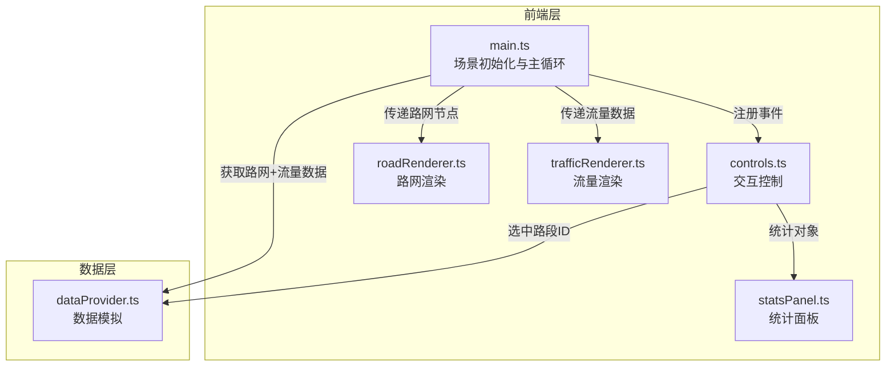

## 1. 架构设计



## 2. 技术说明
- 前端框架：纯TypeScript + Three.js（非React/Vue，因3D场景为主）
- 构建工具：Vite
- 3D渲染：Three.js + OrbitControls
- UI覆盖层：CSS2DRenderer（统计面板）+ 原生DOM（时间滑块、按钮）
- 状态管理：模块间直接函数调用，无额外状态库
- 数据模拟：前端内置随机生成，无需后端服务

## 3. 文件结构与调用关系

| 文件路径 | 职责 | 调用关系 |
|---------|------|---------|
| package.json | 依赖管理：three, typescript, vite, @types/three, lodash | - |
| index.html | 入口页面，全屏Canvas容器 | 引用src/main.ts |
| vite.config.js | 构建配置，开发服务器端口3000 | - |
| tsconfig.json | TS严格模式，target ES2020，module ESNext | - |
| src/main.ts | 场景初始化与主循环 | 调用dataProvider, roadRenderer, trafficRenderer, controls |
| src/scene/roadRenderer.ts | 读取路网数据生成3D道路和交叉口 | 被main.ts调用 |
| src/scene/trafficRenderer.ts | 基于流量数据动态更新路段颜色和宽度 | 被main.ts调用 |
| src/data/dataProvider.ts | 生成20路口40路段路网+60帧流量数据 | 被main.ts和controls.ts调用 |
| src/ui/controls.ts | 鼠标交互，射线检测，选中路段 | 被main.ts调用，调用dataProvider和statsPanel |
| src/ui/statsPanel.ts | 统计面板DOM+折线图Canvas | 被controls.ts调用 |

## 4. 数据模型

### 4.1 路网数据
```typescript
interface RoadNode {
  id: number;
  x: number;  // -50 ~ 50
  z: number;  // -50 ~ 50
}

interface RoadSegment {
  id: number;
  from: number;  // 路口ID
  to: number;    // 路口ID
}
```

### 4.2 流量数据
```typescript
interface TrafficFrame {
  frameIndex: number;
  segments: SegmentTraffic[];
}

interface SegmentTraffic {
  segmentId: number;
  density: number;   // 0-100
  speed: number;     // 0-80 km/h
}
```

## 5. 性能策略
- 路段几何体仅在初始化时创建一次，流量更新仅修改material.color和scale
- 射线检测在requestAnimationFrame中每帧执行一次，使用Raycaster
- 过渡动画使用线性插值（lerp），0.5秒内完成颜色和宽度的渐变
- OrbitControls内置节流，避免过度重绘
