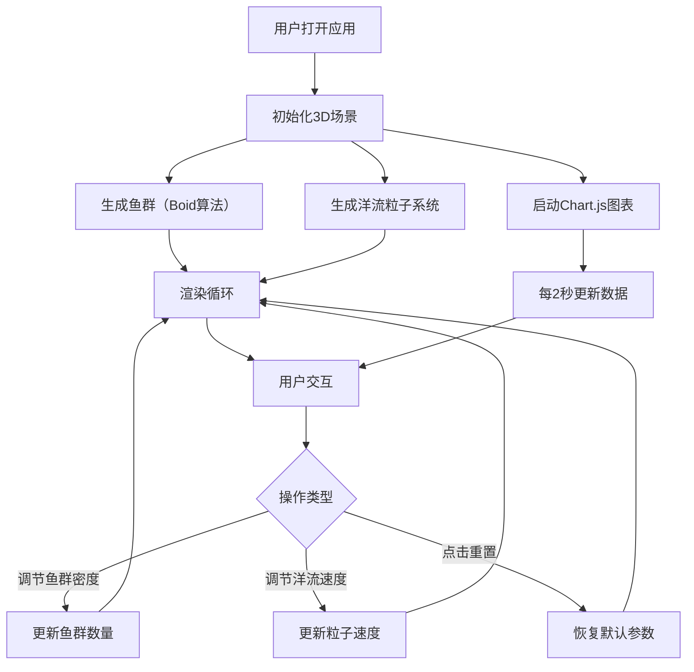

## 1. 产品概述

实时海洋生态模拟可视化应用——基于Three.js的3D交互式海洋生态模拟系统，在网页中展示动态鱼群行为（Boid算法）、洋流粒子系统和环境数据图表。目标用户为海洋科学爱好者、教育工作者和数据可视化开发者，产品价值在于将复杂的海洋生态行为以沉浸式3D可视化方式呈现。

## 2. 核心功能

### 2.1 功能模块

1. **3D海洋场景页面**：全屏3D画布，展示鱼群游动、洋流粒子流动、海洋环境光照
2. **实时数据面板**：侧边栏折线图，展示水温和盐度变化曲线
3. **交互控制面板**：悬浮控制面板，调节鱼群密度、洋流速度，重置模拟

### 2.2 页面详情

| 页面名称 | 模块名称 | 功能描述 |
|----------|----------|----------|
| 3D海洋场景 | 鱼群模拟 | 基于Boid算法的鱼群行为模拟，包含聚集、分散、避障三种基本行为，每条鱼独立游动轨迹，鱼群整体协调运动 |
| 3D海洋场景 | 洋流粒子系统 | 500+粒子沿曲线路径流动，蓝到绿颜色渐变，粒子流影响鱼群方向 |
| 3D海洋场景 | 场景渲染 | 深蓝色海洋主题背景，渐变光照，鱼群蓝绿到紫红渐变色 |
| 实时数据面板 | 温度曲线 | 折线图展示水温变化（20-30°C），每2秒更新 |
| 实时数据面板 | 盐度曲线 | 折线图展示盐度变化（30-35ppt），每2秒更新 |
| 交互控制面板 | 鱼群密度滑块 | 调节鱼数量20-200条，实时生效 |
| 交互控制面板 | 洋流速度滑块 | 调节0.5-3倍速，实时生效 |
| 交互控制面板 | 重置按钮 | 重置所有参数到默认值 |
| 顶部信息栏 | FPS/数量显示 | 实时显示FPS帧率、鱼群数量、粒子数量 |

## 3. 核心流程

用户打开页面后进入全屏3D海洋场景，鱼群和粒子系统自动运行。用户可通过左侧控制面板调节参数（鱼群密度、洋流速度），右侧查看实时环境数据图表，顶部显示运行状态信息。参数变化立即反映到3D场景中。

## 4. 用户界面设计

### 4.1 设计风格

- **主色调**：深蓝色海洋背景（#0a1628），辅以蓝绿色（#00d4aa）和紫红色（#c850c0）渐变
- **按钮样式**：圆角半透明玻璃拟态，带微光效（box-shadow glow）
- **字体**：Rajdhani（显示字体）+ Source Sans 3（UI字体）
- **布局风格**：全屏3D画布 + 浮动半透明面板（左侧控制、右侧图表、顶部状态栏）
- **图标风格**：线性图标，蓝绿色调

### 4.2 页面设计概览

| 页面名称 | 模块名称 | UI元素 |
|----------|----------|--------|
| 3D海洋场景 | 全屏画布 | 深蓝色渐变背景，体积光照，鱼群蓝绿→紫红渐变，粒子蓝→绿渐变高亮 |
| 交互控制面板 | 左侧悬浮面板 | 半透明深色背景（rgba(10,22,40,0.85)），圆角12px，蓝绿微光边框，滑块+按钮 |
| 实时数据面板 | 右侧悬浮面板 | 半透明深色背景，Chart.js折线图，蓝绿色系配色 |
| 顶部信息栏 | 悬浮状态栏 | 半透明背景，FPS/鱼群数/粒子数，等宽字体显示 |

### 4.3 响应式

- 桌面优先设计，适配1920x1080和1440x900分辨率
- 控制面板和图表面板在小屏幕下可折叠
- 3D画布始终全屏，UI元素浮动叠加

### 4.4 3D场景指导

- **环境**：深海氛围，深蓝色雾效，微弱体积光从上方照射
- **灯光**：方向光模拟水面折射光（蓝绿色调），环境光提供基础照明，点光源提供焦散效果
- **相机**：透视相机，初始俯视角度（约30°），用户可旋转/缩放
- **构图**：鱼群作为焦点在场景中心区域活动，粒子系统作为背景流场
- **交互**：OrbitControls支持旋转缩放，鱼群与粒子互动
- **后处理**：可选的辉光效果增强粒子视觉
- **性能预算**：200条鱼+500粒子保持60FPS（RTX 3060），最低30FPS
