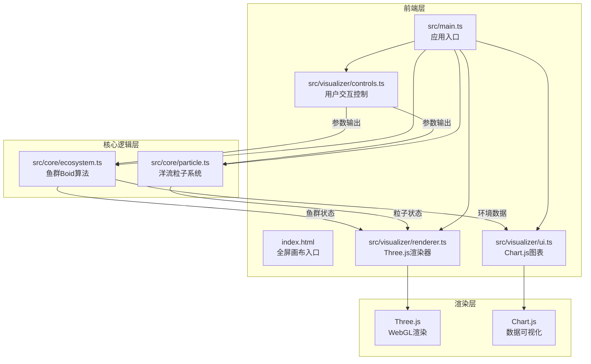
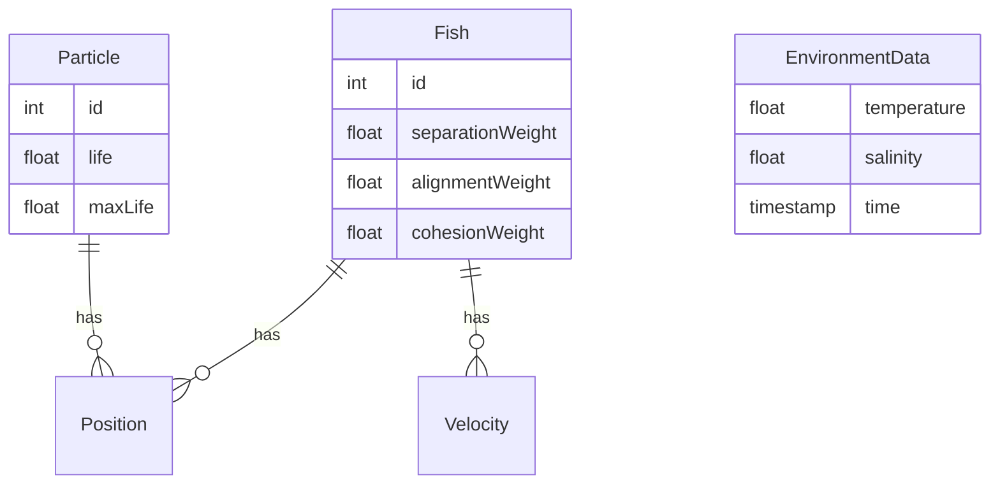

## 1. 架构设计



## 2. 技术说明

- **前端框架**：TypeScript + Three.js（纯TS，无React/Vue，3D可视化专用架构）
- **构建工具**：Vite + TypeScript插件
- **3D渲染**：Three.js（场景、相机、灯光、几何体）
- **数据可视化**：Chart.js（折线图）
- **物理模拟**：自定义Boid算法实现
- **粒子系统**：自研粒子引擎（Three.js BufferGeometry + Points）
- **状态管理**：模块间直接函数调用，无全局状态库

## 3. 路由定义

| 路由 | 用途 |
|------|------|
| / | 单页应用，全屏3D海洋模拟场景 |

## 4. API定义

无后端API，所有数据在客户端生成。环境数据（水温、盐度）使用随机算法模拟。

## 5. 模块接口定义

### 5.1 ecosystem.ts 接口

```typescript
interface Fish {
  position: Vector3;
  velocity: Vector3;
  acceleration: Vector3;
  meshIndex: number;
}

interface EcosystemParams {
  fishCount: number;
  currentSpeed: number;
  bounds: { x: number; y: number; z: number };
}

interface EcosystemState {
  fishes: Fish[];
  temperature: number;
  salinity: number;
}
```

### 5.2 particle.ts 接口

```typescript
interface Particle {
  position: Vector3;
  velocity: Vector3;
  life: number;
  maxLife: number;
}

interface ParticleSystemParams {
  count: number;
  currentSpeed: number;
  flowField: (pos: Vector3) => Vector3;
}
```

### 5.3 controls.ts 接口

```typescript
interface ControlParams {
  fishDensity: number;
  currentSpeed: number;
  onFishDensityChange: (value: number) => void;
  onCurrentSpeedChange: (value: number) => void;
  onReset: () => void;
}
```

## 6. 数据模型

### 6.1 模拟数据模型



### 6.2 数据定义

- 鱼群数据：每帧更新位置/速度，存储在Float32Array中用于InstancedMesh渲染
- 粒子数据：位置/生命周期存储在BufferGeometry属性中，GPU端更新
- 环境数据：最近60个数据点的时间序列数组，每2秒追加新值
