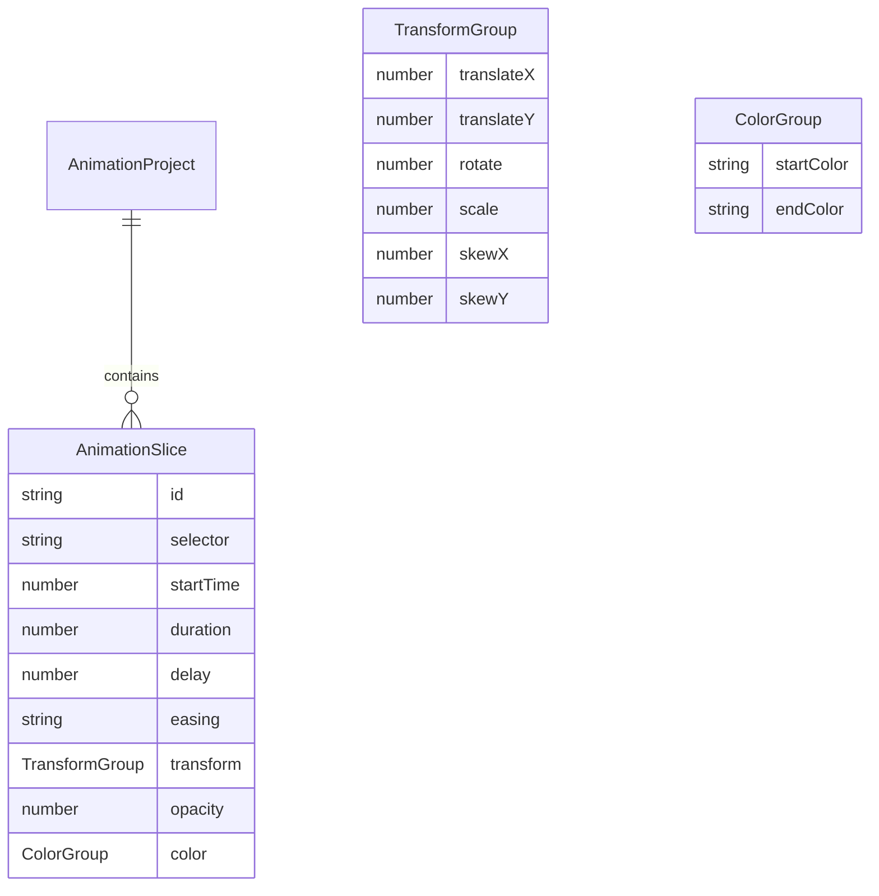

## 1. 架构设计

```mermaid
flowchart TB
    subgraph "前端层"
        "时间轴模块<br/>timeline/"
        "属性编辑模块<br/>editor/"
        "预览模块<br/>preview/"
        "导出模块<br/>export/"
    end
    subgraph "工具层"
        "Web Worker<br/>parser.worker.ts"
        "导出生成器<br/>exporter.ts"
        "状态管理<br/>zustand store"
    end
    "时间轴模块" --> "状态管理"
    "属性编辑模块" --> "状态管理"
    "预览模块" --> "状态管理"
    "状态管理" --> "Web Worker"
    "导出模块" --> "导出生成器"
```

## 2. 技术说明

- 前端：React@18 + TypeScript + Tailwind CSS + Vite
- 初始化工具：vite-init (react-ts模板)
- 状态管理：Zustand + Immer
- Web Worker：用于动画时间轴数据解析和计算，保证UI流畅度≥30FPS
- 包依赖：react, react-dom, uuid, immer, lucide-react
- 无后端：纯前端工具应用

## 3. 路由定义

| 路由 | 用途 |
|------|------|
| / | 主页面，包含时间轴、属性面板、预览区、导出功能 |

## 4. 模块划分

```
src/
├── modules/
│   ├── timeline/
│   │   ├── TimeLine.tsx        # 时间轴容器，管理片段列表与拖拽排序
│   │   └── TimeSlice.tsx       # 单个色条渲染及悬停预览
│   ├── editor/
│   │   ├── PropertyPanel.tsx   # 属性面板，折叠卡片布局
│   │   └── SliderInput.tsx     # 滑块+数字输入双向绑定组件
│   ├── preview/
│   │   ├── PreviewArea.tsx     # 预览区域，渲染目标元素
│   │   └── AnimationRunner.ts  # requestAnimationFrame循环管理
│   └── export/
│       └── ExportModal.tsx     # 导出模态框，代码展示+复制
├── utils/
│   ├── parser.worker.ts        # Worker中解析动画数据
│   └── exporter.ts             # 生成CSS @keyframes和JS动画API代码
├── store/
│   └── useAnimationStore.ts    # Zustand全局状态
├── types/
│   └── index.ts                # TypeScript类型定义
├── App.tsx
└── main.tsx
```

## 5. 数据模型



## 6. 关键技术决策

1. **Web Worker**：将动画时间轴的解析计算放入Worker线程，避免阻塞主线程渲染
2. **Immer**：用于Zustand store的不可变状态更新，简化复杂嵌套数据的修改
3. **requestAnimationFrame**：AnimationRunner维护RAF循环驱动预览区动画播放
4. **UUID**：为每个动效片段生成唯一标识符
5. **Vite Worker支持**：通过`new Worker(new URL(...), { type: 'module' })`语法支持Worker模块
