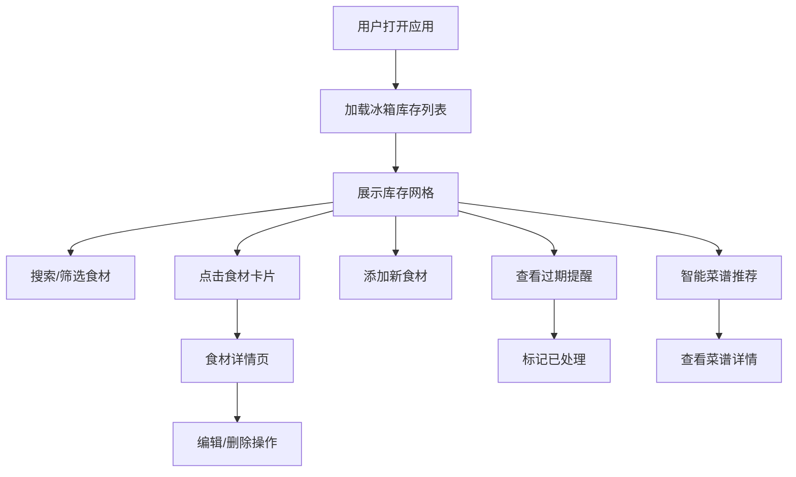

## 1. 产品概述

智能冰箱助手是一款帮助家庭用户管理和规划冰箱库存的智能应用，通过食材入库、保质期追踪、过期提醒和菜谱推荐等功能，减少食材浪费，提升家庭饮食管理效率。目标用户为注重家庭生活品质、追求高效食材管理的用户。

## 2. 核心功能

### 2.1 用户角色
| 角色 | 注册方式 | 核心权限 |
|------|----------|----------|
| 家庭用户 | 本地使用 | 管理食材、查看提醒、获取菜谱推荐 |

### 2.2 功能模块
1. **冰箱列表页：库存网格展示、添加食材表单、搜索筛选、过期提醒面板、智能菜谱推荐
2. **食材详情页：食材信息展示、编辑表单、删除操作

### 2.3 页面详情
| 页面名称 | 模块名称 | 功能描述 |
|----------|----------|----------|
| 冰箱列表页 | 库存网格 | 分类图标、彩色卡片、剩余天数颜色标记、悬停动效、拖拽排序 |
| 冰箱列表页 | 添加食材表单 | 分类选择、名称、数量、单位、购买日期、保质期录入 |
| 冰箱列表页 | 搜索与筛选 | 300ms防抖搜索、分类胶囊按钮、弹跳选中动画 |
| 冰箱列表页 | 过期提醒面板 | 底部滑动面板、脉冲感叹号图标、紧急程度渐变色、标记已处理 |
| 冰箱列表页 | 智能菜谱推荐 | 横向滚动卡片、暖色渐变背景、食材库存标记 |
| 食材详情页 | 食材信息展示 | 大图/大号分类图标、名称、数量、类别、毛玻璃效果 |
| 食材详情页 | 编辑表单 | 修改数量、更新保质期、分类色外发光聚焦效果 |

## 3. 核心流程

用户打开应用 → 查看冰箱库存 → 通过搜索/筛选定位食材 → 点击食材查看详情 → 更新信息或删除 → 添加新食材 → 查看过期提醒并处理 → 点击智能推荐获取菜谱建议

## 4. 用户界面设计

### 4.1 设计风格
- **主色调**：薄荷绿 (#98D8C8) 和米白色 (#F5F5F0)
- **分类色**：蔬菜草绿(#8FBC8F)、水果橙黄(#FFB347)、肉类玫瑰红(#E8A0A0)、乳制品乳白(#FFF8E7)、调味品浅褐(#D2B48C)
- **按钮样式**：圆角胶囊形、300ms ease-in-out过渡
- **字体**：系统无衬线字体、分级字号层次分明
- **布局风格**：卡片式网格布局、毛玻璃详情页
- **图标**：lucide-react图标库，简洁线性风格

### 4.2 页面设计概述
| 页面名称 | 模块名称 | UI元素 |
|----------|----------|--------|
| 冰箱列表页 | 库存网格 | 分类图标、彩色卡片背景、剩余天数角标、悬停放大阴影 |
| 冰箱列表页 | 搜索筛选 | 自适应搜索框、圆角胶囊分类按钮、选中弹跳 |
| 冰箱列表页 | 过期提醒 | 底部滑动面板、脉冲感叹号、黄到红渐变、处理按钮 |
| 冰箱列表页 | 菜谱推荐 | 横向滚动、暖色渐变卡片、纸质感纹理、圆角阴影 |
| 食材详情页 | 顶部栏 | 毛玻璃背景、渐变返回按钮、菜单按钮 |
| 食材详情页 | 编辑表单 | 分类色外发光聚焦动画 |

### 4.3 响应式
- 桌面端4列、平板3列、手机2列
- Touch优化手势支持
- 触控目标≥44px
- 移动端底部提醒面板全屏展开
