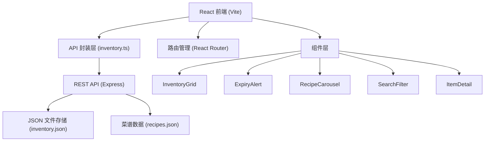
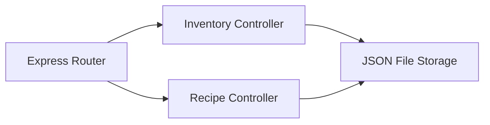
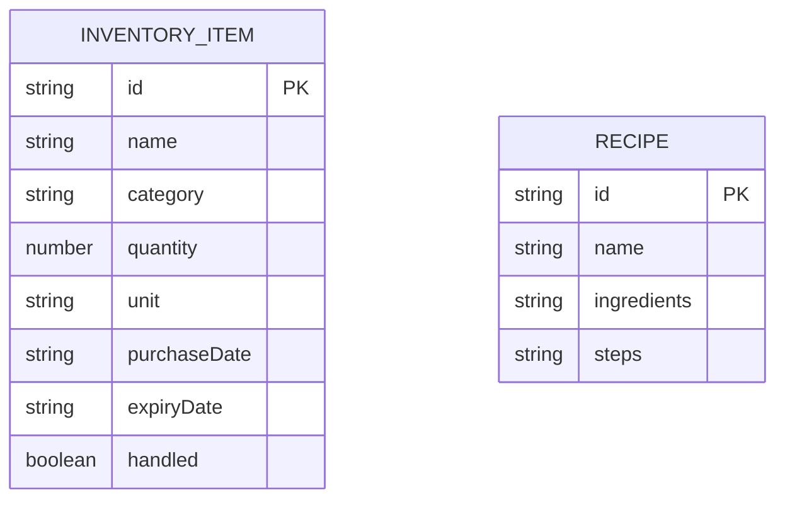

## 1. 架构设计



## 2. 技术栈说明
- **前端**：React 18 + TypeScript + Vite
- **状态管理**：React Hooks (useState, useEffect)
- **路由**：React Router DOM
- **图标**：lucide-react
- **工具库**：uuid, date-fns
- **后端**：Express 4 + CORS + body-parser
- **数据库**：本地 JSON 文件存储
- **构建工具**：Vite（proxy 到 localhost:3001）
- **运行脚本**：concurrently 同时启动前后端

## 3. 路由定义
| 路由 | 用途 |
|------|------|
| / | 冰箱列表页（库存网格 + 搜索筛选 + 过期提醒 + 菜谱推荐） |
| /item/:id | 食材详情页（展示 + 编辑 + 删除） |

## 4. API 定义

### TypeScript 类型

```typescript
type Category = '蔬菜' | '水果' | '肉类' | '乳制品' | '调味品' | '饮料' | '其他'

interface InventoryItem {
  id: string;
  name: string;
  category: Category;
  quantity: number;
  unit: string;
  purchaseDate: string;
  expiryDate: string;
  handled: boolean;
}

interface Recipe {
  id: string;
  name: string;
  ingredients: { name: string; required: boolean }[];
  steps: string[];
}
```

### API 接口

| 方法 | 路径 | 描述 | 请求/响应 |
|------|------|------|-----------|
| GET | /api/inventory | 获取所有食材 | 响应：InventoryItem[] |
| POST | /api/inventory | 添加食材 | 请求：Omit<InventoryItem, 'id' 'handled'>，响应：InventoryItem |
| PUT | /api/inventory/:id | 更新食材 | 请求：Partial<InventoryItem>，响应：InventoryItem |
| DELETE | /api/inventory/:id | 删除食材 | 响应：{ success: boolean } |
| PUT | /api/inventory/:id/handle | 标记已处理 | 响应：InventoryItem |
| GET | /api/recipes | 获取所有菜谱 | 响应：Recipe[] |
| POST | /api/recipes/recommend | 推荐菜谱 | 请求：{ items: string[] }，响应：Recipe[] |

## 5. 服务端架构



## 6. 数据模型

### 6.1 数据模型定义



### 6.2 初始数据

- inventory.json: 包含15-20条示例食材数据
- recipes.json: 包含10-15道家常菜谱
