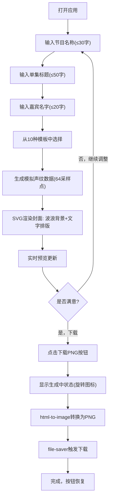

## 1. 产品概述

播客单集封面生成工具，帮助播客创作者和音频爱好者快速生成风格化的视觉海报用于社交媒体分享。解决手动设计封面耗时且缺乏专业模板的痛点，通过一键式操作从10种预置模板中选择，自动生成包含动态声纹背景和精美文字排版的SVG海报。

- 目标用户：播客创作者、音频节目制作人、社交媒体内容运营者
- 核心价值：降低设计门槛，提升内容传播效率

---

## 2. 核心功能

### 2.1 功能模块

1. **输入面板**：节目名称、单集标题、嘉宾名字三个字段的输入，带彩色装饰条与聚焦光晕动画
2. **模板选择**：10种预置模板的缩略图预览与选择，选中状态与悬停交互
3. **声纹波浪背景**：根据输入文本生成模拟声波数据（64采样点），SVG渐变曲线渲染，浮动动画
4. **文字排版系统**：多级字号、字体、颜色对比，符合WCAG AA无障碍标准
5. **实时预览与导出**：400x400px封面预览，一键导出PNG，加载状态提示

---

### 2.2 页面详情

| 页面名称 | 模块名称 | 功能描述 |
|-----------|-------------|---------------------|
| 主页面 | 输入面板 | 三个垂直排列的输入框（节目名-蓝色条、标题-橙色条、嘉宾-绿色条），聚焦时光晕动画，字符数限制 |
| 主页面 | 模板选择器 | 10个模板缩略图卡片，选中态2px主色实线边框，未选中1px浅灰虚线，悬停scale 1.05+白色遮罩+模板名 |
| 主页面 | 封面预览区 | 400x400px矩形卡片，实时渲染SVG封面，包含声纹背景+文字排版 |
| 主页面 | 导出按钮 | "下载PNG"按钮，点击后显示"生成中..."+旋转加载图标，完成后恢复 |

---

## 3. 核心流程

用户打开页面 → 依次输入节目名称/单集标题/嘉宾名字 → 从10个模板中选择一种（或使用默认）→ 实时预览区动态显示封面效果（声纹波形随输入变化）→ 点击"下载PNG"按钮 → 系统显示加载状态 → 浏览器触发PNG文件下载 → 用户获得封面图片。

---

## 4. 用户界面设计

### 4.1 设计风格

- **设计基调**：深色模式（Dark Mode），科技感、专业、现代
- **主色调**：紫蓝色 `#7C5CFC`（按钮、选中态、主强调色）
- **背景色**：`#1A1B2E`（页面背景），`#252742`（卡片背景）
- **文字颜色**：`#E4E6F0`（主文字），对比度不低于4.5:1（WCAG AA）
- **按钮风格**：圆角胶囊形，紫蓝渐变填充，悬停微提亮，点击微下沉
- **字体选择**：展示字体使用有设计感的无衬线字体（如Poppins/Outfit），正文使用清晰易读的无衬线字体
- **布局风格**：左右分栏布局（左40%输入区/右60%预览区），卡片式容器，中间1px半透紫分隔线
- **图标风格**：简约线条风，与整体科技感一致
- **动画特征**：所有过渡300ms ease-in-out，声纹波浪缓慢上下浮动（-3px~3px循环）

### 4.2 页面设计概述

| 页面名称 | 模块名称 | UI元素 |
|-----------|-------------|-------------|
| 主页面 | 输入面板 | 深色卡片容器(#252742)，圆角16px，输入框左装饰条(蓝#3B82F6/橙#F59E0B/绿#10B981)，聚焦光晕box-shadow 0 0 20px主色 |
| 主页面 | 模板选择器 | 2行5列网格布局(gap 12px)，缩略图带微缩预览，选中态2px #7C5CFC边框，悬停scale 1.05 + rgba(255,255,255,0.15)遮罩 |
| 主页面 | 封面预览区 | 400x400px圆角卡片，SVG viewBox自适应，居中展示，阴影层次丰富 |
| 主页面 | 导出按钮 | 紫蓝渐变背景，圆角12px，padding 14px 32px，hover scale 1.02，active scale 0.98 |

### 4.3 响应式适配

- **桌面端(≥900px)**：左右两栏布局，左侧输入区40%，右侧预览区60%，1px半透紫分隔竖线
- **移动端/窄屏(<900px)**：上下堆叠布局，输入区在上占满宽度，预览区在下占满宽度，分隔线变为横线
- **触控优化**：按钮最小触控区44px，模板卡片悬停效果在移动端改为点击反馈

---

### 4.4 模板设计方案（10种）

| 模板ID | 名称 | 主色 | 辅色 | 背景渐变 | 字体风格 | 设计意象 |
|--------|------|------|------|----------|----------|----------|
| 01 | 午夜电波 | #7C5CFC | #22D3EE | #1E1B4B → #312E81 | 现代几何 | 深夜电台 |
| 02 | 日落橙调 | #F97316 | #FBBF24 | #7C2D12 → #9A3412 | 温暖人文 | 落日时分 |
| 03 | 薄荷清新 | #10B981 | #34D399 | #064E3B → #065F46 | 清新自然 | 晨间播客 |
| 04 | 玫瑰甜心 | #EC4899 | #F472B6 | #831843 → #9D174D | 柔和优雅 | 女性向节目 |
| 05 | 深海潜行 | #0EA5E9 | #38BDF8 | #0C4A6E → #075985 | 冷静理性 | 科技访谈 |
| 06 | 复古磁带 | #A78BFA | #C4B5FD | #3B0764 → #4C1D95 | 怀旧经典 | 复古音乐节目 |
| 07 | 翡翠秘境 | #14B8A6 | #5EEAD4 | #134E4A → #115E59 | 神秘探索 | 悬疑故事 |
| 08 | 熔岩烈焰 | #EF4444 | #FCA5A5 | #7F1D1D → #991B1B | 激情活力 | 运动/热血 |
| 09 | 星尘银河 | #A855F7 | #E879F9 | #3B0764 → #581C87 | 梦幻科幻 | 科幻/天文 |
| 10 | 极简明灰 | #64748B | #94A3B8 | #1E293B → #334155 | 商务极简 | 商业/教育 |
