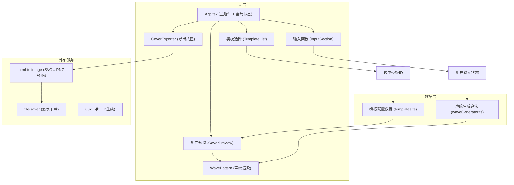

## 1. 架构设计



---

## 2. 技术描述

- **前端框架**：React@18 + TypeScript@5（严格模式）
- **构建工具**：Vite@5（开启SVG loader）
- **样式方案**：CSS Modules + 内联CSS变量（实现主题切换）
- **核心依赖**：
  - `react` / `react-dom`：UI框架
  - `uuid`：生成唯一元素ID（避免SVG渐变ID冲突）
  - `file-saver`：触发浏览器文件下载
  - `html-to-image`：将DOM节点（SVG）转换为PNG图片
- **开发脚本**：`npm run dev`（启动Vite开发服务器）

---

## 3. 项目文件结构

```
auto109/
├── package.json                  # 依赖配置 & 启动脚本
├── vite.config.js                # Vite构建配置（SVG loader）
├── tsconfig.json                 # TypeScript配置（严格模式）
├── index.html                    # 入口HTML
└── src/
    ├── App.tsx                   # 主组件，全局状态管理
    ├── main.tsx                  # React挂载入口
    ├── index.css                 # 全局样式（深色主题、CSS变量）
    ├── types/
    │   └── index.ts              # TypeScript类型定义（Template, WaveData等）
    ├── data/
    │   └── templates.ts          # 10种模板的配置数据
    ├── utils/
    │   └── waveGenerator.ts      # 声纹数据生成算法
    ├── templates/
    │   └── TemplateList.tsx      # 模板选择组件
    ├── generator/
    │   ├── WavePattern.tsx       # 声纹波浪SVG渲染组件
    │   ├── CoverExporter.tsx     # 导出按钮组件
    │   └── CoverPreview.tsx      # 封面预览容器组件
    └── components/
        └── InputSection.tsx      # 输入面板组件
```

---

## 4. 核心数据流

### 4.1 状态树（App.tsx）

```typescript
interface AppState {
  showName: string;      // 节目名称（≤30字）
  episodeTitle: string;  // 单集标题（≤50字）
  guestName: string;     // 嘉宾名字（≤20字）
  selectedTemplateId: string;  // 当前选中模板ID
  waveData: number[];    // 64个声纹采样点 [-1, 1]
  isExporting: boolean;  // 是否正在导出
}
```

### 4.2 数据流路径

```
用户输入 (onChange)
    ↓
App.tsx 更新 showName/episodeTitle/guestName
    ↓
useMemo 计算 waveData (64采样点，基于文本hash + 伪随机)
    ↓
props 传递给 WavePattern + CoverPreview
    ↓
SVG 重新渲染（React reconciliation，<200ms）
    ↓
用户点击"下载PNG"
    ↓
html-to-image.toPng(coverNode, {width:400, height:400})
    ↓
file-saver.saveAs(blob, "podcast-cover.png")
```

### 4.3 类型定义

```typescript
// types/index.ts
export interface Template {
  id: string;
  name: string;
  primary: string;       // 主色
  secondary: string;     // 辅色
  bgGradient: [string, string];  // 背景渐变色
  fontFamily: string;    // 封面字体
  waveOpacity: number;   // 波浪透明度
}

export interface WavePatternProps {
  data: number[];        // 64采样点
  primary: string;
  secondary: string;
  width: number;
  height: number;
  gradientId: string;
}

export interface CoverExporterProps {
  targetRef: React.RefObject<HTMLElement>;
  fileName?: string;
}
```

---

## 5. 声纹生成算法（waveGenerator.ts）

```
输入: showName, episodeTitle, guestName
输出: number[64]，每个元素 ∈ [-1, 1]

算法:
1. 将三个文本拼接并计算hash值（djb2算法变体）
2. 以hash值作为种子，使用Mulberry32伪随机生成器
3. 结合多层正弦波叠加 + 随机噪声：
   value = 0.5 * sin(2π*x/λ1) 
         + 0.3 * sin(2π*x/λ2 + phase)
         + 0.2 * (random() * 2 - 1)
4. 归一化到 [-1, 1] 区间
5. 使用Hann窗平滑两端，避免边缘突变
```

---

## 6. 组件职责划分

| 组件 | 文件 | 职责 | Props输入 | 输出/回调 |
|------|------|------|-----------|-----------|
| App | `App.tsx` | 全局状态管理、布局、数据聚合 | - | - |
| InputSection | `components/InputSection.tsx` | 三个输入框渲染、字符计数、装饰条光晕 | values, onChange | onChange回调 |
| TemplateList | `templates/TemplateList.tsx` | 10个模板缩略图卡片网格 | templates[], selectedId | onSelect(templateId) |
| CoverPreview | `generator/CoverPreview.tsx` | 400x400px封面容器，整合背景+波浪+文字 | template, waveData, texts | ref (供导出) |
| WavePattern | `generator/WavePattern.tsx` | SVG path 声纹波浪渲染，渐变+动画 | data, colors, size | SVG <g> 元素 |
| CoverExporter | `generator/CoverExporter.tsx` | 导出按钮，loading状态，下载逻辑 | targetRef | onClick触发下载 |

---

## 7. 性能优化策略

1. **useMemo 缓存声纹数据**：仅当三个输入文本变化时重新计算64个采样点
2. **React.memo 包裹子组件**：TemplateList、WavePattern等避免不必要重渲染
3. **CSS transform动画**：波浪浮动使用`transform: translateY`（GPU加速，60FPS）
4. **SVG viewBox固定尺寸**：400x400，避免复杂的自适应计算
5. **html-to-image配置优化**：`pixelRatio: 1`，`width:400, height:400`，确保1秒内完成转换

---

## 8. 无障碍与安全

- **对比度校验**：所有模板文字色/背景色对比度 ≥ 4.5:1（WCAG AA）
- **键盘可达**：输入框、模板卡片、按钮均可通过Tab聚焦，Enter/Space触发
- **ARIA标签**：输入框aria-label，按钮aria-live（导出状态）
- **SVG id唯一**：使用uuid生成渐变/裁剪路径ID，避免多实例冲突
- **输入长度限制**：maxLength属性 + 视觉字符计数，防止异常数据
