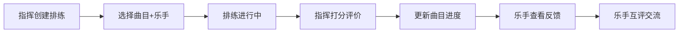

## 1. 产品概述

乐队排练管理系统是一款面向学校乐队或乐团的排练记录与反馈管理工具，旨在解决排练后指挥难以快速整理每位乐手问题与进步点、乐手之间缺少互评渠道、曲目进度难以追踪的核心痛点。

- **核心目标**：提升排练效率，建立乐手成长记录，促进乐队成员间的交流与进步
- **目标用户**：乐队指挥/老师、乐队乐手/学生
- **核心价值**：数字化排练管理，可视化个人成长，智能化进度追踪

## 2. 核心功能

### 2.1 用户角色

| 角色 | 登录方式 | 核心权限 |
|------|----------|----------|
| 指挥 | 账号登录 | 创建排练活动、选择曲目、管理乐手名单、打分评价、查看曲目进度 |
| 乐手 | 账号登录 | 查看个人历史评分、查看反馈评论、点赞回复评论、互评其他乐手 |

### 2.2 功能模块

1. **排练管理首页**：曲目进度条展示、快速导航入口、排练统计概览
2. **打分面板**：选择乐手、星级评分、预设评语、自定义评语
3. **历史反馈页**：评分折线图、评论列表、点赞回复功能
4. **乐手互评**：乐手间互相评价、匿名/实名选择

### 2.3 页面详情

| 页面名称 | 模块名称 | 功能描述 |
|----------|----------|----------|
| 排练管理首页 | 曲目进度展示 | 横向进度条显示各曲目完成度，颜色随进度变化，显示排练次数和下次排练倒计时 |
| 排练管理首页 | 导航面板 | 左侧深蓝灰导航栏，选中项有亮蓝色滑入指示线动画 |
| 打分面板 | 乐手选择 | 下拉选择参与排练的乐手名单 |
| 打分面板 | 星级评分 | 1-5星交互式评分组件 |
| 打分面板 | 评语输入 | 预设短语快速选择 + 自定义评语输入 |
| 历史反馈页 | 评分趋势图 | Recharts折线图展示历史评分，带圆点标记和悬停提示 |
| 历史反馈页 | 评论列表 | 按时间倒序排列，评分颜色渐变背景，支持点赞回复 |

## 3. 核心流程

指挥创建排练活动 → 选择曲目和参与乐手 → 排练中记录问题 → 排练后批量打分评价 → 系统自动更新曲目进度 → 乐手登录查看个人评分和反馈 → 乐手间互评交流

## 4. 用户界面设计

### 4.1 设计风格

- **主色调**：深蓝灰 #2C3E50（导航栏）、亮蓝色 #3498DB（选中指示、交互元素）
- **进度色**：0-30% 红色 #E74C3C、30-70% 橙色 #F39C12、70-100% 绿色 #27AE60
- **评分渐变**：5星 #27AE60 → 1星 #E74C3C 渐变色
- **卡片样式**：毛玻璃效果（backdrop-filter: blur(10px)，背景 rgba(255,255,255,0.85)），柔和阴影
- **按钮交互**：悬停上浮 2px，0.2s 缓动过渡
- **布局动画**：响应式布局切换 0.3s 弹性动画

### 4.2 页面设计概述

| 页面名称 | 模块名称 | UI 元素 |
|----------|----------|----------|
| 排练管理首页 | 曲目进度卡片 | 横向进度条、排练次数标签、倒计时徽章、毛玻璃卡片 |
| 打分面板 | 评分组件 | 交互式星星、预设标签按钮、文本输入框 |
| 历史反馈页 | 折线图表 | 数据点标记、悬停 tooltip、平滑动画 |
| 历史反馈页 | 评论卡片 | 渐变背景、头像、时间戳、点赞按钮、回复输入框 |
| 全局导航 | 侧边栏 | 深蓝灰背景、图标+文字、滑入指示线动画 |

### 4.3 响应式布局

- **桌面端**：三列网格布局（≥1200px）
- **平板端**：两列网格布局（768px-1199px）
- **手机端**：单列堆叠布局（<768px）
- **触控优化**：按钮最小尺寸 44x44px，点击区域适当放大

## 5. 性能要求

- 首屏加载渲染时间 ≤ 1.5秒
- 折线图更新动画帧率 ≥ 60fps
- 交互响应延迟 ≤ 100ms
- 资源压缩后总大小 ≤ 500KB
