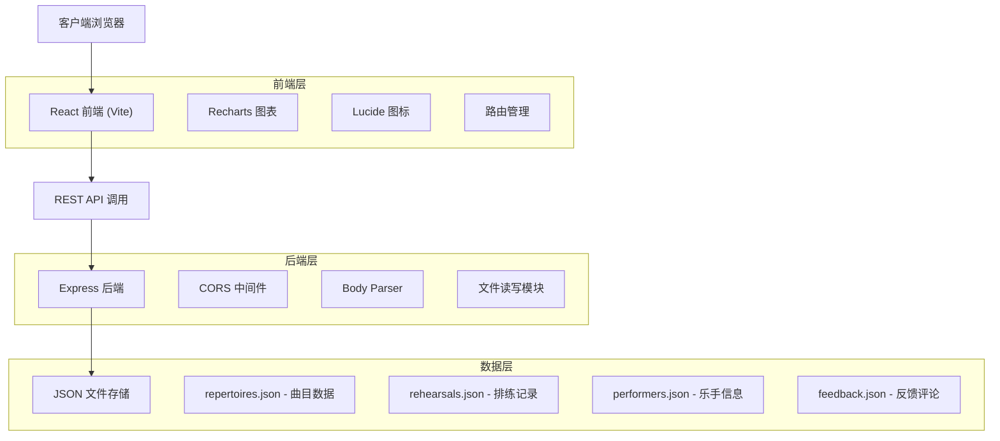
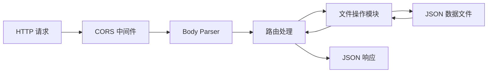
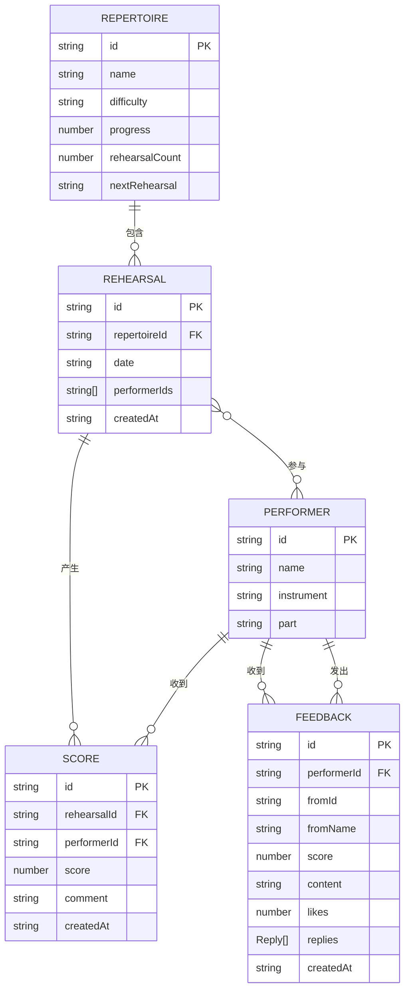

## 1. 架构设计



## 2. 技术描述

- **前端框架**：React 18 + TypeScript
- **构建工具**：Vite 5.x
- **图表库**：Recharts 2.x
- **图标库**：Lucide React
- **工具库**：uuid（ID生成）、date-fns（日期处理）
- **后端框架**：Express 4.x
- **中间件**：cors、body-parser
- **数据存储**：本地 JSON 文件（无需数据库）
- **并发启动**：concurrently 同时启动前后端
- **开发代理**：Vite proxy 转发 API 请求到 localhost:3001

## 3. 路由定义

| 路由路径 | 页面组件 | 功能说明 |
|----------|----------|----------|
| `/` | `RehearsalDashboard` | 排练管理首页，展示曲目进度 |
| `/scoring` | `ScoringPanel` | 打分面板，指挥评价乐手 |
| `/feedback/:id` | `FeedbackHistory` | 乐手个人历史记录页 |
| `*` | 404 重定向 | 无效路径重定向到首页 |

## 4. API 接口定义

### 4.1 TypeScript 类型定义

```typescript
// 曲目
interface Repertoire {
  id: string;
  name: string;
  difficulty: 'easy' | 'medium' | 'hard';
  progress: number;
  rehearsalCount: number;
  nextRehearsal: string;
  parts: string[];
}

// 乐手
interface Performer {
  id: string;
  name: string;
  instrument: string;
  part: string;
}

// 排练
interface Rehearsal {
  id: string;
  repertoireId: string;
  date: string;
  performerIds: string[];
  createdAt: string;
}

// 评分
interface Score {
  id: string;
  rehearsalId: string;
  performerId: string;
  score: number;
  comment: string;
  createdAt: string;
}

// 反馈评论
interface Feedback {
  id: string;
  performerId: string;
  fromId: string;
  fromName: string;
  score: number;
  content: string;
  likes: number;
  replies: Reply[];
  createdAt: string;
}

interface Reply {
  id: string;
  fromName: string;
  content: string;
  createdAt: string;
}
```

### 4.2 API 端点

| 方法 | 路径 | 请求参数 | 响应格式 | 说明 |
|------|------|----------|----------|------|
| `GET` | `/api/repertoires` | 无 | `Repertoire[]` | 获取所有曲目列表 |
| `POST` | `/api/rehearsals` | `{ repertoireId, date, performerIds }` | `Rehearsal` | 创建新排练记录 |
| `GET` | `/api/performers` | 无 | `Performer[]` | 获取所有乐手列表 |
| `GET` | `/api/performers/:id/scores` | `id: string` | `Score[]` | 获取乐手历史评分 |
| `GET` | `/api/feedback/:performerId` | `performerId: string` | `Feedback[]` | 获取乐手收到的评论 |
| `POST` | `/api/feedback` | `{ performerId, fromId, fromName, score, content }` | `Feedback` | 提交新评论/评分 |
| `POST` | `/api/feedback/:id/like` | `id: string` | `{ success: true, likes: number }` | 评论点赞 |
| `POST` | `/api/feedback/:id/reply` | `{ fromName, content }` | `Feedback` | 回复评论 |

## 5. 服务器架构



## 6. 数据模型

### 6.1 ER 图



### 6.2 初始数据

#### repertoires.json（10首预设曲目）

```json
[
  {
    "id": "rep-1",
    "name": "贝多芬第九交响曲",
    "difficulty": "hard",
    "progress": 75,
    "rehearsalCount": 8,
    "nextRehearsal": "2026-06-25",
    "parts": ["小提琴", "中提琴", "大提琴", "长笛", "单簧管", "小号", "大号", "打击乐"]
  },
  {
    "id": "rep-2",
    "name": "蓝色多瑙河",
    "difficulty": "medium",
    "progress": 60,
    "rehearsalCount": 5,
    "nextRehearsal": "2026-06-26",
    "parts": ["小提琴", "中提琴", "大提琴", "长笛", "双簧管", "圆号"]
  }
  // ... 更多曲目
]
```

#### performers.json（预设乐手数据）

```json
[
  { "id": "perf-1", "name": "张小明", "instrument": "小提琴", "part": "第一小提琴" },
  { "id": "perf-2", "name": "李小红", "instrument": "大提琴", "part": "大提琴首席" }
  // ... 更多乐手
]
```

## 7. 项目文件结构

```
├── package.json          # 项目依赖和启动脚本
├── vite.config.js        # Vite 构建配置
├── tsconfig.json         # TypeScript 配置
├── index.html            # 入口 HTML
├── src/
│   ├── App.tsx           # 主组件，路由和全局状态
│   ├── RehearsalDashboard.tsx  # 排练管理首页
│   ├── ScoringPanel.tsx        # 打分面板
│   ├── FeedbackHistory.tsx     # 历史反馈页
│   └── dataStore.ts      # API 调用封装
├── server/
│   └── index.js          # Express 后端服务
└── data/                 # JSON 数据存储目录
    ├── repertoires.json
    ├── performers.json
    ├── rehearsals.json
    └── feedback.json
```

## 8. 性能优化方案

1. **代码分割**：按路由分割代码，减少首屏加载体积
2. **图片优化**：使用 SVG 图标，避免图片资源
3. **动画优化**：使用 CSS transform 和 opacity 实现动画，避免重排重绘
4. **图表优化**：Recharts 使用 `isAnimationActive` 控制动画，数据点按需渲染
5. **缓存策略**：静态资源长期缓存，API 响应添加缓存头
6. **虚拟滚动**：评论列表超过 50 条时使用虚拟滚动
7. **防抖节流**：搜索、输入等高频操作使用防抖
