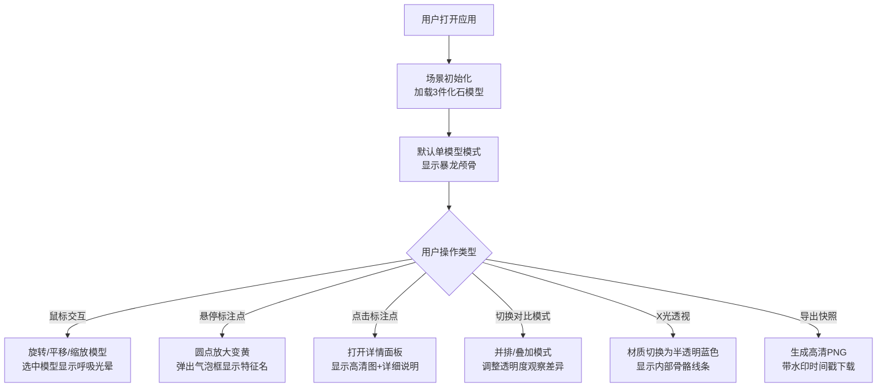

## 1. 产品概述

古生物化石三维交互式可视化系统，为博物馆策展人及教育工作者提供数字展厅解决方案，解决传统展板无法直观展示化石立体结构和解剖学特征的痛点。通过高精度 3D 模型、交互式标注和多模式对比，让观众深入理解古生物形态学特征。

## 2. 核心功能

### 2.1 用户角色

| 角色 | 注册方式 | 核心权限 |
|------|----------|----------|
| 策展人/教育工作者 | 无需注册，本地运行 | 浏览化石模型、查看解剖标注、切换对比模式、导出场景快照 |
| 观众 | 无需注册 | 体验交互式 3D 浏览、学习古生物知识 |

### 2.2 功能模块

1. **3D 场景主视图**：化石模型加载、轨道控制、独立模型旋转平移缩放
2. **解剖标注系统**：模型表面热点、悬停气泡、详情信息面板
3. **对比控制面板**：模型切换、单/并排/叠加三态对比、透明度调节
4. **特效控制系统**：X光透视模式、光晕呼吸动画、阴影网格
5. **场景导出功能**：高清 PNG 快照导出、水印时间戳

### 2.3 页面详情

| 页面名称 | 模块名称 | 功能描述 |
|----------|----------|----------|
| 主场景页面 | 3D Canvas 渲染区 | 全屏 Three.js 渲染，墨蓝到暗褐色径向渐变背景，支持鼠标交互控制模型姿态 |
| 主场景页面 | 标注点系统 | 橙色圆点标注，悬停放大变黄并弹出气泡，点击打开磨砂玻璃详情面板 |
| 主场景页面 | 对比控制面板 | 左下角浮动面板，70x70 缩略图按钮，三态模式切换，透明度滑杆 |
| 主场景页面 | 信息详情面板 | 右下角弹出，深褐色磨砂玻璃效果，高清局部图+300字说明，圆形关闭按钮 |
| 主场景页面 | 功能控制区 | 右下角导出按钮、X光透视切换按钮 |
| 主场景页面 | 响应式适配 | <768px 设备控制面板折叠为底部工具栏，信息面板改为底部抽屉 |

## 3. 核心流程

## 4. 用户界面设计

### 4.1 设计风格

**审美方向：博物馆典藏级 / 学术专业感**

- **主色调**：棕色系 `#5C4033`（深褐）、`#8B7355`（中褐）、`#C4A882`（浅褐）
- **强调色**：明亮橙黄色 `#FFB347`
- **背景色**：从墨蓝 `#0A1628` 到暗褐 `#2D1F14` 的径向渐变
- **字体**：
  - Logo：白色无衬线字体 20px，带微弱投影
  - 正文：白色衬线字体（信息面板）
- **UI 元素**：统一圆角 8px，半透明背景（磨砂玻璃 `backdrop-filter: blur(10px)`）
- **交互反馈**：悬停 200ms 缓动（transform + opacity），点击 20ms 微缩动画

### 4.2 3D 场景设计

| 项目 | 设计规范 |
|------|----------|
| **模型材质** | 微粗糙米白色纹理，带细微裂缝凹凸贴图，微弱次表面散射 |
| **光晕效果** | 选中模型半透明白色光晕，1.5秒周期呼吸脉动 |
| **阴影** | 模型底部淡灰色圆形软阴影，边缘羽化 |
| **环境光** | 色温 3500K 暖色环状环境光 |
| **辅助网格** | 浅咖啡色细线，间距 0.5 单位，透明度 70% |
| **X光模式** | 半透明蓝色材质，白色细线显示内部假想骨骼结构 |

### 4.3 页面设计概览

| 页面 | 模块 | UI 元素与风格 |
|------|------|--------------|
| 主场景 | Logo 区 | 左上角，"Fossil 3D Studio" 白色无衬线 20px，文字阴影 |
| 主场景 | 对比面板 | 左下角深灰半透明圆角矩形，1px 白色细边框，3个 70x70 缩略图 |
| 主场景 | 模式切换 | 三态按钮（单模型/并排/叠加），选中态橙色高亮 |
| 主场景 | 透明度滑杆 | 细长圆润轨道，小圆球滑块，拖动时浅灰渐变暗橙 |
| 主场景 | 信息面板 | 右下角深褐色磨砂玻璃，白色衬线字体，圆形关闭按钮（X→←） |
| 主场景 | 标注气泡 | 半透明白色圆角气泡，深褐文字，标注点跟随模型旋转 |
| 主场景 | 导出按钮 | 右下角橙色圆形按钮，悬停放大 |

### 4.4 响应式设计

- **桌面端（>768px）**：对比面板左下角浮动，信息面板右下角弹出
- **移动端（≤768px）**：
  - 对比面板折叠为底部半透明工具栏
  - 信息面板改为全屏底部抽屉式弹出
  - 触控优化：标注点点击区域扩大，手势识别

## 5. 性能指标

| 指标 | 要求 |
|------|------|
| 模型加载时间 | ≤ 3 秒（本地预加载） |
| 交互帧率 | ≥ 55 FPS |
| 标注点击响应 | ≤ 100 ms |
| 透视模式切换动画 | ≤ 500 ms |
| 导出图片最大宽度 | 1920 px |
