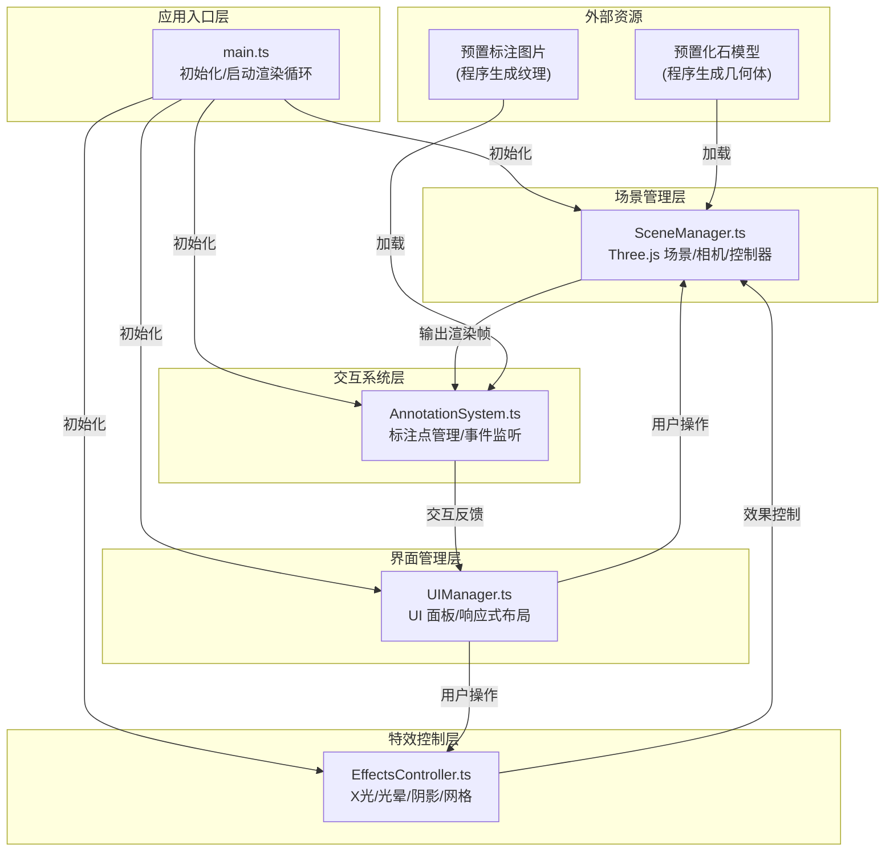

## 1. 架构设计



## 2. 技术栈说明

| 层级 | 技术选型 | 版本 | 用途 |
|------|----------|------|------|
| 构建工具 | Vite | ^5.0.0 | ESM 构建，Three.js tree-shaking 优化 |
| 语言 | TypeScript | ^5.3.0 | 严格模式，ES2020 目标 |
| 3D 引擎 | Three.js | ^0.160.0 | 3D 渲染、模型加载、光照阴影 |
| 动画库 | @tweenjs/tween.js | ^23.1.1 | 平滑动画、呼吸效果、材质过渡 |
| 调试工具 | dat.gui | ^0.7.9 | 开发阶段参数调试 |

**核心设计原则：**
- 面向对象设计，单一职责原则
- 模块间通过明确的接口通信，降低耦合
- 所有 3D 对象使用程序生成（无需外部模型文件）
- DOM UI 使用原生 HTML/CSS，无额外 UI 框架依赖

## 3. 项目文件结构

```
auto116/
├── package.json              # 依赖配置 + npm run dev 脚本
├── vite.config.js            # Three.js 专用构建配置
├── tsconfig.json             # 严格模式 TypeScript 配置
├── index.html                # 入口页面 + 基础 UI 结构
└── src/
    ├── main.ts               # 应用入口：初始化 → 加载 → 渲染循环
    ├── SceneManager.ts       # 场景/相机/控制器/模型组管理
    ├── AnnotationSystem.ts   # 标注点创建/坐标转换/事件监听
    ├── UIManager.ts          # UI 面板创建/更新/响应式布局
    └── EffectsController.ts  # X光/光晕/阴影/网格效果控制
```

## 4. 核心类定义

### 4.1 SceneManager

```typescript
class SceneManager {
  scene: THREE.Scene
  camera: THREE.PerspectiveCamera  // fov 60°
  renderer: THREE.WebGLRenderer
  controls: Map<string, OrbitControls>  // 每个模型独立控制器
  fossilModels: Map<string, FossilModel>
  selectedModel: string | null
  viewMode: 'single' | 'sideBySide' | 'overlay'
  
  init(): void
  loadFossilModels(): Promise<void>
  addModel(name: string, geometry: BufferGeometry): void
  removeModel(name: string): void
  selectModel(name: string): void
  setViewMode(mode: string): void
  renderFrame(delta: number): void
  getRaycasterIntersects(event: MouseEvent): Intersection[]
}
```

### 4.2 AnnotationSystem

```typescript
class AnnotationSystem {
  annotations: Map<string, AnnotationPoint[]>
  activeAnnotation: AnnotationPoint | null
  sceneManager: SceneManager
  
  createAnnotations(modelName: string, points: AnnotationData[]): void
  updateScreenPositions(): void
  handleMouseMove(event: MouseEvent): void
  handleClick(event: MouseEvent): void
  showTooltip(annotation: AnnotationPoint): void
  hideTooltip(): void
  openDetailPanel(annotation: AnnotationPoint): void
}

interface AnnotationData {
  id: string
  position: [number, number, number]  // 模型局部坐标
  name: string
  shortDesc: string    // ≤60字
  fullDesc: string     // ≤300字
  imageUrl: string
}
```

### 4.3 UIManager

```typescript
class UIManager {
  sceneManager: SceneManager
  annotationSystem: AnnotationSystem
  effectsController: EffectsController
  isMobile: boolean
  
  createComparisonPanel(): void
  createInfoPanel(): void
  createExportButton(): void
  createXrayToggle(): void
  updateLayout(): void
  handleResize(): void
  exportSnapshot(): void
}
```

### 4.4 EffectsController

```typescript
class EffectsController {
  sceneManager: SceneManager
  xrayMode: boolean
  gridHelper: THREE.GridHelper
  glowMeshes: Map<string, THREE.Mesh>
  
  toggleXray(animate?: boolean): void
  updateGlowAnimation(time: number): void  // 1.5s 呼吸周期
  createSoftShadow(model: THREE.Object3D): THREE.Mesh
  toggleGrid(visible: boolean): void
}
```

## 5. 数据流向

```
用户交互 → DOM 事件 → UIManager 分发
                      ↓
          ┌───────────┼───────────┐
          ↓           ↓           ↓
    SceneManager  AnnotationSys  EffectsCtrl
          ↓           ↓           ↓
    模型变换     标注点更新     材质/特效
          └───────────┼───────────┘
                      ↓
              渲染帧更新 → main.ts 循环
```

## 6. 化石模型生成策略

由于无外部模型文件，使用 Three.js 内置几何体组合生成近似形态：

| 化石 | 生成方式 |
|------|----------|
| **暴龙颅骨** | `SphereGeometry` 拉伸变形 + `BoxGeometry` 上下颌 + `ConeGeometry` 牙齿 |
| **三角龙头盾** | `CylinderGeometry` 顶盾 + 三个 `ConeGeometry` 角 + 面部 `BoxGeometry` |
| **剑龙背板** | 多个 `BoxGeometry` 不同尺寸骨板 + 身体 `CapsuleGeometry` |

**材质参数：**
- 颜色：`#F5F5DC`（米白）
- 粗糙度：0.85
- 金属度：0.05
- 凹凸贴图：`NoiseGenerator` 生成细微裂缝
- 次表面散射：`MeshPhysicalMaterial` 的 `transmission` + `thickness`

## 7. 性能优化策略

1. **模型简化**：每个模型面数控制在 5000 以内，使用 `BufferGeometry`
2. **材质复用**：相同材质共享实例，仅修改 `map` 和 `bumpMap`
3. **标注点优化**：使用 `Points` 批量渲染，而非独立 `Mesh`
4. **渲染优化**：
   - `renderer.setPixelRatio(Math.min(window.devicePixelRatio, 2))`
   - 冻结不可见物体的 `matrixAutoUpdate`
5. **事件节流**：鼠标移动事件使用 `requestAnimationFrame` 节流
6. **内存管理**：场景切换时调用 `dispose()` 释放几何体和材质

## 8. 关键技术实现点

| 功能 | 实现方案 |
|------|----------|
| **多模型独立控制** | 每个模型放在独立 `Group` 中，各自绑定 `OrbitControls`，根据 `selectedModel` 激活对应控制器 |
| **标注点跟随** | 每一帧将 3D 坐标通过 `project(camera)` 转换为屏幕坐标，更新 DOM 标注点 `transform` |
| **呼吸光晕** | `MeshBasicMaterial` + `AdditiveBlending`，`opacity` 在 0.3-0.6 间以正弦函数 1.5s 周期变化 |
| **X光模式** | 材质切换为 `MeshBasicMaterial({ color: 0x4488ff, transparent: true, opacity: 0.4 })`，添加 `LineSegments` 显示内部骨骼 |
| **快照导出** | `renderer.domElement.toDataURL('image/png')`，Canvas 2D 绘制水印后触发下载 |
| **磨砂玻璃效果** | CSS `backdrop-filter: blur(10px)` + `background: rgba(92, 64, 51, 0.85)` |
