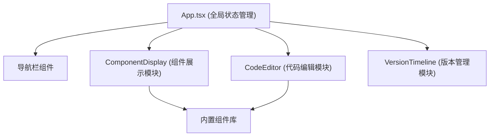

## 1. 架构设计



## 2. 技术描述

- **前端框架**：React 18 + TypeScript
- **构建工具**：Vite
- **样式方案**：纯CSS + CSS Modules
- **依赖库**：
  - react / react-dom
  - uuid（生成版本唯一标识）
  - date-fns（日期格式化）
  - lucide-react（图标库）

## 3. 文件结构

```
src/
├── main.tsx              # 应用入口
├── App.tsx               # 主布局组件，全局状态管理
├── ComponentDisplay.tsx  # 组件展示模块
├── CodeEditor.tsx        # 代码编辑模块
├── VersionTimeline.tsx   # 版本管理模块
├── styles/
│   └── index.css         # 全局样式
└── components/           # 内置组件库
    ├── Button.tsx
    ├── Input.tsx
    ├── Slider.tsx
    ├── Breadcrumb.tsx
    └── Modal.tsx
```

## 4. 数据模型

### 4.1 组件属性类型

```typescript
interface ComponentProps {
  [key: string]: any;
}
```

### 4.2 版本快照

```typescript
interface VersionSnapshot {
  id: string;
  version: number;
  props: ComponentProps;
  code: string;
  timestamp: Date;
}
```

### 4.3 组件配置

```typescript
interface ComponentConfig {
  name: string;
  displayName: string;
  defaultProps: ComponentProps;
  component: React.ComponentType;
  generateCode: (props: ComponentProps) => string;
}
```

## 5. 状态管理

- 使用React Hooks（useState、useEffect、useCallback、useMemo、useRef）
- 状态提升到App.tsx进行统一管理
- 子组件通过props接收数据和回调

## 6. 核心交互流程

1. **导航选择**：点击导航项 → 更新当前选中组件名 → 加载组件默认属性 → 生成初始代码
2. **编辑器修改**：textarea输入 → debounce 500ms → 解析属性对象 → 更新预览 → 生成版本快照
3. **版本切换**：拖动时间轴滑块 → 查找对应快照 → 恢复属性和代码 → 更新预览和编辑器
