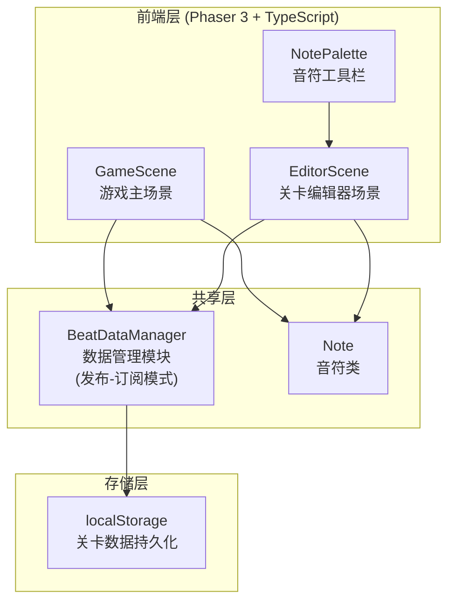
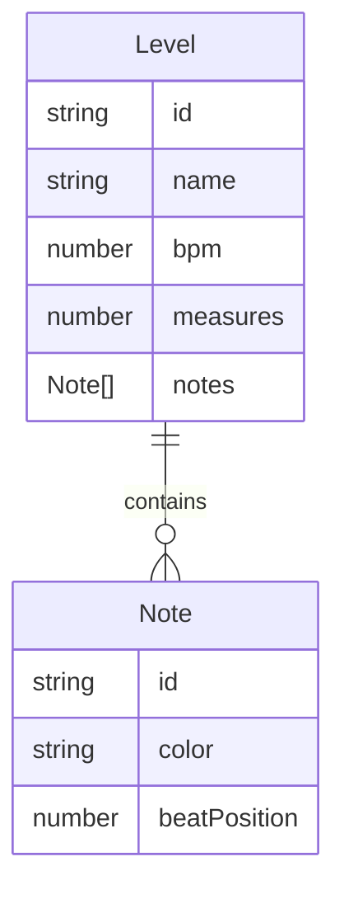

## 1. 架构设计



## 2. 技术说明

- 前端框架：Phaser 3 游戏引擎 + TypeScript
- 构建工具：Vite
- 依赖库：phaser、uuid
- 状态管理：自定义发布-订阅模式（BeatDataManager）
- 数据持久化：localStorage
- 无后端服务

## 3. 场景路由定义

| 场景Key | 用途 |
|---------|------|
| GameScene | 游戏主场景，处理角色移动、音符碰撞、计分 |
| EditorScene | 关卡编辑器场景，管理时间线、音符拖放、试玩切换 |

场景切换通过 Phaser 场景管理器启动/停止实现。

## 4. 数据模型

### 4.1 数据模型定义



### 4.2 数据定义

```typescript
interface LevelData {
  id: string;
  name: string;
  bpm: number;
  measures: number;
  notes: NoteData[];
}

interface NoteData {
  id: string;
  color: 'red' | 'blue' | 'green';
  beatPosition: number;
}
```

### 4.3 localStorage 键值

- Key: `rhythm_levels` → LevelData[]（所有关卡数据数组）

## 5. 文件结构

```
├── package.json
├── vite.config.js
├── tsconfig.json
├── index.html
└── src/
    ├── main.ts              # Phaser Game配置入口
    ├── game/
    │   ├── GameScene.ts     # 游戏主场景
    │   └── Note.ts          # 音符类
    ├── editor/
    │   ├── EditorScene.ts   # 关卡编辑器场景
    │   └── NotePalette.ts   # 音符工具栏组件
    └── shared/
        └── BeatDataManager.ts # 共享数据管理模块
```

## 6. 关键交互协议

### 6.1 发布-订阅事件

| 事件名 | 数据 | 触发场景 |
|--------|------|----------|
| level:loaded | LevelData | 关卡加载完成 |
| level:updated | LevelData | 编辑器修改关卡 |
| level:created | LevelData | 新建关卡 |
| level:deleted | string (id) | 删除关卡 |
| game:start | LevelData | 开始游戏 |
| game:end | { score, maxCombo, rating } | 游戏结束 |
| editor:trial-start | LevelData | 试玩开始 |
| editor:trial-end | void | 试玩结束 |

### 6.2 评级算法

| 评级 | 条件 |
|------|------|
| S | 正确率 ≥ 95% |
| A | 正确率 ≥ 85% |
| B | 正确率 ≥ 70% |
| C | 正确率 ≥ 50% |
| D | 正确率 < 50% |
