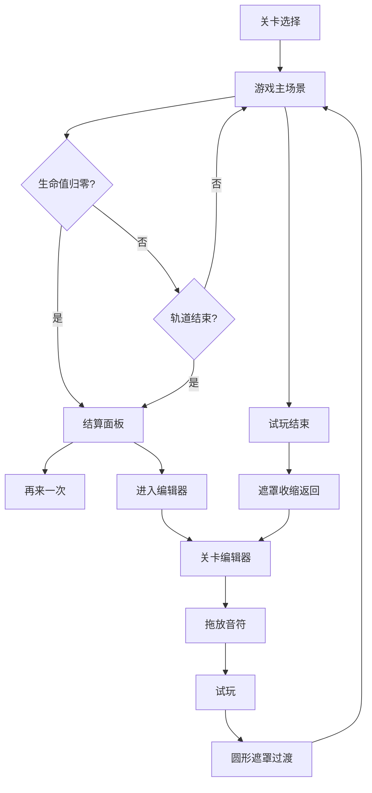

## 1. 产品概述

节奏闯关关卡设计器是一款浏览器端音乐节奏游戏与关卡编辑器，解决音乐游戏关卡设计门槛高、玩家难以快速验证和分享创作曲谱的问题。目标用户为音乐游戏爱好者和创意玩家，提供即玩即编的一体化体验。

## 2. 核心功能

### 2.1 功能模块

1. **游戏主场景**：螺旋轨道自动前进，红蓝绿三色音符按键判定，计分与生命值系统
2. **结算面板**：得分、连击数、评级展示，支持重玩与进入编辑器
3. **关卡编辑器**：自定义轨道长度、BPM、音符排列，拖放式编辑
4. **实时试玩**：编辑器内一键试玩，圆形遮罩过渡，保留编辑内容
5. **数据管理**：localStorage持久化，3个预设关卡，发布-订阅数据同步

### 2.2 页面详情

| 页面名称 | 模块名称 | 功能描述 |
|----------|----------|----------|
| 游戏主场景 | 螺旋轨道 | 角色自动前进，渐变色轨道（紫→青），三色音符按键判定 |
| 游戏主场景 | 视觉效果 | 星点粒子背景、判定环脉冲、正确/错误反馈动画、飘字动画 |
| 游戏主场景 | HUD | 分数显示、生命值条、连击计数 |
| 结算面板 | 评级展示 | S/A/B/C/D评级，金色到红色渐变填充，毛玻璃背景 |
| 结算面板 | 操作按钮 | "再来一次"和"进入编辑器"，悬停渐变填充动画，按压反馈 |
| 关卡编辑器 | 音符工具栏 | 红蓝绿可拖动音符图标，立体浮雕效果，悬停上浮 |
| 关卡编辑器 | 时间线编辑 | 横向时间线，小节分隔线，节拍虚线，拖放吸附十六分音符 |
| 关卡编辑器 | 属性面板 | 总音符数、密度、预估难度显示 |
| 关卡编辑器 | 播放控制 | 试玩按钮，圆形遮罩过渡，播放头红色竖线 |
| 关卡选择 | 关卡列表 | 预设3个示例关卡 + 玩家创建关卡 |

## 3. 核心流程

### 游戏流程
1. 玩家选择关卡 → 进入游戏场景
2. 角色沿螺旋轨道自动前进 → 遇到音符按键判定
3. 正确按键：白色光晕 + 飘字 +1分 → 错误/漏按：红色闪烁 -1生命
4. 生命值归零或轨道结束 → 结算面板（放大淡入400ms）
5. 查看得分、连击、评级 → 选择重玩或进入编辑器

### 编辑器流程
1. 玩家创建/编辑关卡 → 设置BPM、小节数
2. 从工具栏拖放音符到时间线 → 自动吸附十六分音符
3. 可拖拽调整位置或右键删除（缩小淡出200ms）
4. 点击试玩 → 圆形遮罩扩散（500ms）→ 游戏模式预览
5. 试玩结束 → 遮罩收缩 → 返回编辑器保留内容

## 4. 用户界面设计

### 4.1 设计风格
- 主色调：深紫蓝（#1a1a2e）
- 辅色：青绿（#00d2ff）、金色（#ffd700）
- 按钮：圆角矩形，悬停渐变填充（300ms），按压凹陷反馈
- 字体：无衬线体（Nunito/系统默认），加粗用于重要数值
- 过渡：统一贝塞尔曲线 ease-in-out，200-300ms
- 评级字母：大号字体，金色→红色渐变填充

### 4.2 页面设计概览

| 页面名称 | 模块名称 | UI元素 |
|----------|----------|--------|
| 游戏主场景 | 背景 | 径向渐变深紫→深蓝，200个星点粒子，色相蓝紫循环 |
| 游戏主场景 | 轨道 | 渐变色紫→青，判定半透明同心圆环脉冲 |
| 游戏主场景 | 角色 | 圆形，正确白光晕，错误红闪烁 |
| 结算面板 | 面板 | 毛玻璃blur(12px)，中心放大淡入400ms |
| 编辑器 | 工具栏 | 左侧120px，音符图标立体浮雕，悬停上浮 |
| 编辑器 | 编辑区 | 暗色网格纸，浅灰细线网格，小节竖线分隔 |
| 编辑器 | 属性栏 | 右侧显示统计信息 |

### 4.3 响应式适配
- 桌面端：编辑器左右两栏布局（工具栏120px + 编辑区自适应）
- 竖屏平板：编辑器工具栏折叠为顶部横条
- 游戏界面全屏显示

### 4.4 性能要求
- 游戏场景帧率稳定60fps
- 编辑器响应延迟不超过50ms
