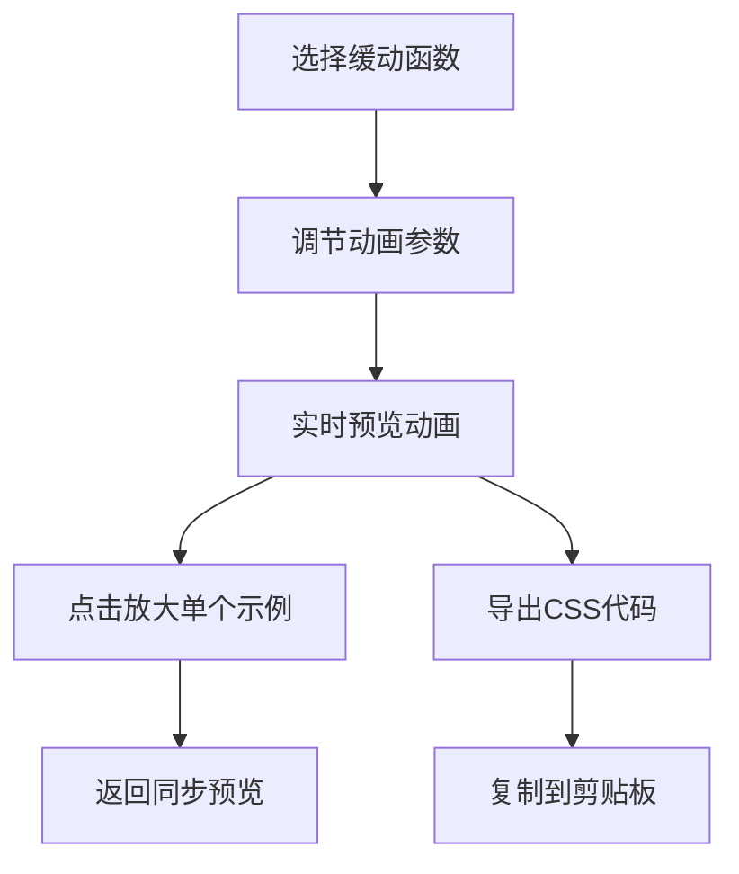

## 1. 产品概述
CSS动画曲线预览调试工具，帮助前端开发者直观对比不同缓动函数对动画效果的影响，解决在代码中反复修改cubic-bezier值、难以快速预览动画感觉的痛点。面向前端开发者和UI设计师，提供交互式的曲线选择、参数调节和实时预览功能。

核心价值：将抽象的贝塞尔曲线参数转化为可视化的运动效果，加速动画调试流程，提升开发效率。

## 2. 核心功能

### 2.1 用户角色
| 角色 | 注册方式 | 核心权限 |
|------|----------|----------|
| 前端开发者 | 无需注册 | 使用所有功能，选择曲线、调节参数、导出CSS代码 |

### 2.2 功能模块
1. **曲线预设库**：8种常用缓动函数选择，包括ease、ease-in、ease-out、ease-in-out、linear、自定义cubic-bezier、弹簧效果、弹性效果
2. **动画预览区**：同时展示4个CSS属性动画示例（translateX、scale、rotate、opacity）
3. **参数调节面板**：调节动画持续时间、延迟、循环次数
4. **代码导出功能**：一键导出CSS代码片段并复制到剪贴板

### 2.3 页面详情
| 页面名称 | 模块名称 | 功能描述 |
|---------|----------|----------|
| 主页面 | 曲线预设列表 | 展示8种缓动函数曲线缩略图，支持选择和高亮 |
| 主页面 | 动画预览区 | 4个同步播放的CSS动画示例，支持全屏放大预览 |
| 主页面 | 参数调节面板 | 滑块调节动画参数，实时反馈到预览区 |
| 主页面 | 导出功能 | 生成带前缀的CSS代码并复制到剪贴板 |

## 3. 核心流程
用户选择缓动函数曲线 → 调节动画参数（持续时间、延迟、循环）→ 实时预览4种动画效果 → 点击单个示例全屏查看 → 满意后导出CSS代码片段

## 4. 用户界面设计

### 4.1 设计风格
- **主色调**：#6366f1 到 #a855f7 柔和渐变
- **左侧背景**：#1e1e2e（深色），右侧背景：#f5f5f9（浅色）
- **边框圆角**：统一8px，卡片阴影：0 2px 8px rgba(0,0,0,0.1)
- **字体**：系统无衬线字体（font-family: system-ui, -apple-system, sans-serif）
- **交互过渡**：所有元素悬停200ms平滑过渡
- **滑块样式**：拖动时轨道颜色从蓝色渐变到紫色，带数值标签

### 4.2 页面设计概述
| 页面名称 | 模块名称 | UI元素 |
|---------|----------|--------|
| 主页面 | 曲线预设列表 | 8个曲线卡片，每个含SVG缩略图、名称，选中时放大1.2倍加光晕 |
| 主页面 | 动画预览区 | 4个彩色圆块（40px直径），分别演示位移、缩放、旋转、透明度 |
| 主页面 | 参数调节面板 | 3个滑块（持续时间、延迟、循环次数），数值实时显示 |
| 主页面 | 导出按钮 | 点击下沉效果，显示"Copied!"提示（1.5s后消失） |

### 4.3 响应式设计
- **桌面端**：左右两栏布局（左侧250px固定宽，右侧自适应）
- **平板端（≤768px）**：左侧面板变为可收缩抽屉式菜单，点击汉堡按钮展开/收起
- **触摸优化**：滑块增大触控区域，按钮最小44x44px触控面积

### 4.4 性能要求
- 4个动画同步运行时帧率稳定60fps
- 所有交互反馈（点击、输入、悬停）响应时间≤50ms
- 动画延迟≤100ms
