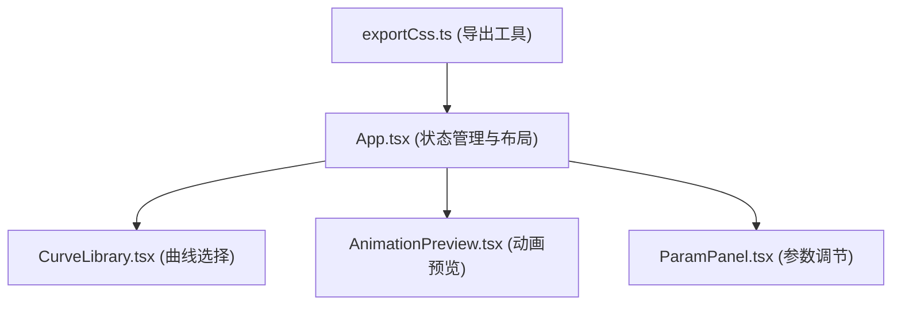

## 1. 架构设计


**数据流方向**：CurveLibrary → App.tsx → ParamPanel → App.tsx → AnimationPreview

## 2. 技术描述
- **前端框架**：React@18 + TypeScript
- **构建工具**：Vite@5
- **状态管理**：React useState（轻量级，无需额外状态管理库）
- **图标库**：lucide-react
- **工具库**：uuid
- **CSS方案**：CSS Modules + CSS变量（避免Tailwind依赖，用户未要求）
- **无需后端**，纯前端单页应用

**初始化命令**（Windows系统）：
```
npm init vite-init@latest -y . "--" --template react-ts --force
```

## 3. 项目结构
```
├── index.html                 # 入口HTML
├── package.json               # 依赖配置
├── tsconfig.json              # TypeScript配置（严格模式）
├── vite.config.js             # Vite构建配置
└── src/
    ├── App.tsx                # 主应用组件
    ├── main.tsx               # React入口
    ├── index.css              # 全局样式
    ├── components/
    │   ├── CurveLibrary.tsx   # 曲线预设列表
    │   ├── AnimationPreview.tsx # 动画预览区
    │   └── ParamPanel.tsx     # 参数调节面板
    └── utils/
        └── exportCss.ts       # CSS导出工具
```

## 4. 路由定义
| 路由 | 用途 |
|------|------|
| / | 主页面（单页应用，无需路由） |

## 5. 数据模型

### 5.1 缓动函数类型定义
```typescript
interface EasingCurve {
  id: string;
  name: string;
  value: string; // CSS timing-function 值
  type: 'preset' | 'cubic-bezier' | 'spring' | 'elastic';
  points?: [number, number, number, number]; // cubic-bezier 参数
}
```

### 5.2 动画参数类型定义
```typescript
interface AnimationParams {
  duration: number;      // 0.1 - 10 秒
  delay: number;         // 0 - 5 秒
  iterationCount: number | 'infinite'; // 1-10 或 infinite
}
```

### 5.3 预设缓动函数列表
```typescript
const CURVES: EasingCurve[] = [
  { id: 'ease', name: 'ease', value: 'ease', type: 'preset' },
  { id: 'ease-in', name: 'ease-in', value: 'ease-in', type: 'preset' },
  { id: 'ease-out', name: 'ease-out', value: 'ease-out', type: 'preset' },
  { id: 'ease-in-out', name: 'ease-in-out', value: 'ease-in-out', type: 'preset' },
  { id: 'linear', name: 'linear', value: 'linear', type: 'preset' },
  { id: 'cubic-bezier', name: 'Cubic Bezier', value: 'cubic-bezier(0.25, 0.1, 0.25, 1)', type: 'cubic-bezier', points: [0.25, 0.1, 0.25, 1] },
  { id: 'spring', name: 'Spring', value: 'cubic-bezier(0.34, 1.56, 0.64, 1)', type: 'spring' },
  { id: 'elastic', name: 'Elastic', value: 'cubic-bezier(0.68, -0.55, 0.265, 1.55)', type: 'elastic' },
];
```

### 5.4 动画示例类型
```typescript
interface AnimationExample {
  id: string;
  property: 'translateX' | 'scale' | 'rotate' | 'opacity';
  color: string;
}
```

## 6. 核心组件说明

### 6.1 CurveLibrary.tsx
- **Props**：`selectedId: string`, `onSelect: (curve: EasingCurve) => void`
- **功能**：渲染8个曲线卡片，SVG绘制运动轨迹缩略图，选中高亮放大1.2倍加光晕
- **性能**：SVG路径预计算，避免重绘

### 6.2 AnimationPreview.tsx
- **Props**：`curve: EasingCurve`, `params: AnimationParams`
- **功能**：渲染4个同步动画示例，支持全屏放大
- **性能**：使用CSS transforms和opacity，触发GPU加速，保证60fps

### 6.3 ParamPanel.tsx
- **Props**：`params: AnimationParams`, `onChange: (params: AnimationParams) => void`, `onExport: () => void`
- **功能**：3个滑块控制参数，导出按钮
- **交互**：滑块拖动实时更新，数值标签显示，轨道渐变

### 6.4 exportCss.ts
- **函数**：`exportCss(curve: EasingCurve, params: AnimationParams): Promise<string>`
- **功能**：生成包含-webkit-前缀的CSS代码，复制到剪贴板，返回生成的代码

## 7. 性能优化策略
1. **CSS动画优化**：仅使用transform和opacity属性，避免布局抖动（Layout Thrashing）
2. **GPU加速**：使用 `will-change` 和 `transform: translateZ(0)` 提升动画性能
3. **事件节流**：滑块拖动事件使用 requestAnimationFrame 节流
4. **组件隔离**：每个组件独立渲染，避免不必要的重渲染
5. **React.memo**：对接收props的组件使用 memo 包裹
6. **时间同步**：所有动画使用相同的animation-delay基准，确保同步

## 8. 响应式实现
- 使用CSS媒体查询 `@media (max-width: 768px)`
- 左侧面板绝对定位，transform控制抽屉展开/收起
- 汉堡按钮使用lucide-react的Menu/X图标
