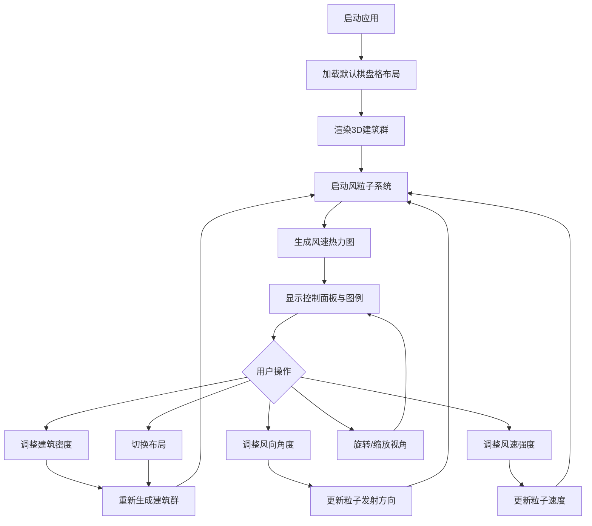

## 1. 产品概述
城市街区风环境与行人舒适度3D交互可视化应用，通过颜色热力图和粒子轨迹直观展示不同建筑布局下风速与风向的变化。
- 面向城市规划师、建筑师和研究人员，用于评估城市微气候和行人风环境舒适度
- 提供直观的3D可视化和实时参数调整，帮助快速理解建筑布局对风环境的影响

## 2. 核心功能

### 2.1 用户角色
| 角色 | 注册方式 | 核心权限 |
|------|---------|----------|
| 通用用户 | 无需注册 | 浏览场景、调整参数、选择布局、查看风环境数据 |

### 2.2 功能模块
1. **主场景页面**：3D城市建筑群可视化、风粒子系统、风速热力图、图例条、控制面板

### 2.3 页面详情
| 页面名称 | 模块名称 | 功能描述 |
|---------|---------|----------|
| 主场景 | 3D建筑群组 | 低多边形风格建筑，高度渐变着色，悬停高亮轮廓，显示高度和楼层数 |
| 主场景 | 风粒子系统 | 2000+粒子从上风方向发射，与建筑碰撞检测，颜色蓝到红映射风速，带拖尾效果 |
| 主场景 | 风速热力图 | 5x5米地面网格，蓝到红渐变表示风速，实时更新，平滑过渡 |
| 主场景 | 控制面板 | 建筑密度滑块(0.3-1.0)、风向角度旋钮(0-360°)、风速强度滑块(1-10)，实时响应 |
| 主场景 | 图例条 | 底部渐变色带，标注0/5/10m/s刻度，带"风速"标签 |
| 主场景 | 布局选择 | 5种预置街区布局切换：棋盘格、放射状、高低错落等 |

## 3. 核心流程
用户打开应用 → 默认加载棋盘格布局 → 3D场景渲染建筑、粒子和热力图 → 用户通过控制面板调整参数或切换布局 → 场景实时更新风环境模拟 → 用户通过轨道控制器旋转缩放查看不同角度

## 4. 用户界面设计

### 4.1 设计风格
- **主色调**：深蓝色(#0a1628)到黑色(#000000)渐变背景，模拟夜空
- **建筑配色**：底部浅灰色(#d0d5dd)渐变到顶部深蓝色(#1e3a5f)
- **热力图配色**：蓝色(#1e90ff)→青色(#00ced1)→绿色(#32cd32)→黄色(#ffd700)→红色(#ff4500)
- **控制面板**：半透明毛玻璃效果(backdrop-filter: blur)，rgba(10, 22, 40, 0.75)背景，8px圆角，2px白色边框(透明度0.1)
- **字体**：使用系统无衬线字体(system-ui, -apple-system, sans-serif)，清晰现代
- **按钮/滑块**：圆角设计，蓝色主题色，悬停微动画，滑块拖动平滑过渡

### 4.2 页面设计概览
| 页面名称 | 模块名称 | UI元素 |
|---------|---------|--------|
| 主场景 | 3D视口 | 全屏Canvas，深蓝-黑渐变背景，场景居中，柔和方向光 |
| 主场景 | 右侧控制面板 | 固定宽度280px，毛玻璃半透明，纵向排列控件，间距16px |
| 主场景 | 底部图例条 | 固定底部居中，高度48px，渐变色带+刻度标注 |
| 主场景 | 建筑悬停提示 | 跟随鼠标的白色文字气泡，显示高度和楼层数 |
| 主场景 | 布局选择器 | 控制面板顶部，下拉选择或按钮组切换5种布局 |

### 4.3 响应式
桌面端优先设计，控制面板固定右侧，图例条固定底部。Canvas自适应窗口大小。

### 4.4 3D场景指引
- **环境**：深蓝到黑色渐变背景，模拟夜空城市天际线氛围，无HDRI
- **光照**：一个方向光模拟太阳(偏上45°)，配柔和环境光(0x404060)，建筑表面有柔和明暗过渡
- **相机**：PerspectiveCamera，fov 60，初始位置俯视角(100, 80, 100)看向原点，OrbitControls轨道控制
- **构图**：建筑群居中，地面网格覆盖街区区域，粒子在建筑空间流动，热力图覆盖地面
- **交互**：鼠标拖拽旋转视角，滚轮缩放，右键平移；悬停建筑高亮轮廓；滑块实时调节
- **后期**：无复杂后期处理，使用半透明叠加实现热力图和粒子拖尾
- **性能**：粒子数2000+，帧率30FPS+，使用BufferGeometry和PointsMaterial优化粒子渲染
