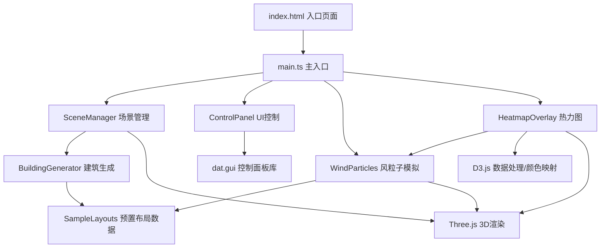

## 1. 架构设计


## 2. 技术说明
- **前端框架**：原生 TypeScript，无React/Vue（按需求使用纯TS + Three.js）
- **3D渲染**：Three.js (r160+)
- **数据处理**：D3.js (d3-array, d3-scale)
- **构建工具**：Vite 5.x
- **UI控件**：dat.gui（控制面板），原生CSS（毛玻璃风格）
- **动画/插值**：tween.js（平滑过渡）
- **类型系统**：TypeScript 严格模式 (strict: true)

## 3. 项目目录结构
```
auto123/
├── package.json
├── vite.config.js
├── tsconfig.json
├── index.html
└── src/
    ├── main.ts
    ├── modules/
    │   ├── scene/
    │   │   ├── SceneManager.ts
    │   │   └── BuildingGenerator.ts
    │   ├── simulation/
    │   │   ├── WindParticles.ts
    │   │   └── HeatmapOverlay.ts
    │   ├── ui/
    │   │   └── ControlPanel.ts
    │   └── data/
    │       └── SampleLayouts.ts
    └── styles/
        └── main.css
```

## 4. 模块职责与接口定义

### 4.1 SceneManager.ts
负责Three.js场景初始化、相机、灯光、轨道控制器、渲染循环，管理建筑群组和粒子系统。

```typescript
export interface SceneConfig {
  container: HTMLElement;
  onFrame?: (delta: number) => void;
}

export class SceneManager {
  public scene: THREE.Scene;
  public camera: THREE.PerspectiveCamera;
  public renderer: THREE.WebGLRenderer;
  public controls: OrbitControls;
  public buildingGroup: THREE.Group;
  public particleSystem: THREE.Points | null;
  public heatmapMesh: THREE.Mesh | null;
  
  constructor(config: SceneConfig);
  public addBuildings(buildings: THREE.Mesh[]): void;
  public clearBuildings(): void;
  public setParticleSystem(system: THREE.Points): void;
  public setHeatmap(mesh: THREE.Mesh): void;
  public raycastBuildings(pointer: THREE.Vector2): THREE.Intersection | null;
  public start(): void;
  public dispose(): void;
}
```

### 4.2 BuildingGenerator.ts
根据布局参数生成低多边形建筑网格，支持高度渐变着色和轮廓线。

```typescript
export interface BuildingData {
  x: number;
  z: number;
  width: number;
  depth: number;
  height: number;
  rotation?: number;
}

export interface BuildingMesh {
  mesh: THREE.Mesh;
  edges: THREE.LineSegments;
  data: BuildingData;
  floors: number;
}

export class BuildingGenerator {
  public generate(buildings: BuildingData[], density: number): BuildingMesh[];
  public createBuildingMesh(data: BuildingData): BuildingMesh;
  public getHeightColor(height: number, maxHeight: number): THREE.Color;
  public highlightEdges(edges: THREE.LineSegments, highlight: boolean): void;
}
```

### 4.3 WindParticles.ts
风粒子物理模拟系统，2000+粒子，支持碰撞检测、颜色映射、拖尾效果。

```typescript
export interface WindConfig {
  particleCount: number;
  windDirection: number;
  windSpeed: number;
  sceneSize: number;
  buildings: THREE.Box3[];
}

export class WindParticles {
  public points: THREE.Points;
  
  constructor(config: WindConfig);
  public update(delta: number, config: Partial<WindConfig>): void;
  public getWindSpeedAt(x: number, z: number): number;
  public getSpeedGrid(resolution: number): number[][];
  public setBuildings(buildings: THREE.Box3[]): void;
  public dispose(): void;
}
```

### 4.4 HeatmapOverlay.ts
地面风速热力图层，使用D3.js颜色映射，5x5米网格，平滑过渡。

```typescript
export interface HeatmapConfig {
  gridSize: number;
  cellSize: number;
  minValue: number;
  maxValue: number;
}

export class HeatmapOverlay {
  public mesh: THREE.Mesh;
  
  constructor(config: HeatmapConfig);
  public update(speedGrid: number[][], smoothness: number): void;
  public getColorScale(): (v: number) => string;
  public dispose(): void;
}
```

### 4.5 ControlPanel.ts
UI控制面板，基于dat.gui封装，包含密度滑块、风向旋钮、风速滑块、布局选择。

```typescript
export interface ControlParams {
  layout: string;
  buildingDensity: number;
  windDirection: number;
  windSpeed: number;
}

export interface ControlPanelCallbacks {
  onLayoutChange: (layout: string) => void;
  onDensityChange: (density: number) => void;
  onWindDirectionChange: (angle: number) => void;
  onWindSpeedChange: (speed: number) => void;
}

export class ControlPanel {
  public params: ControlParams;
  
  constructor(callbacks: ControlPanelCallbacks);
  public setAvailableLayouts(layouts: string[]): void;
  public dispose(): void;
}
```

### 4.6 SampleLayouts.ts
5种预置城市街区布局数据。

```typescript
export interface CityLayout {
  name: string;
  description: string;
  buildings: BuildingData[];
  sceneSize: number;
}

export const SAMPLE_LAYOUTS: CityLayout[];
export function getLayoutByName(name: string): CityLayout | undefined;
```

## 5. 核心数据流
```
用户调整ControlPanel → 更新ControlParams
    → 建筑密度/布局变化 → BuildingGenerator重新生成建筑 → SceneManager更新场景
    → 风向/风速变化 → WindParticles.update()更新粒子速度和发射方向
WindParticles每帧更新 → 生成速度网格 → HeatmapOverlay.update()更新热力图颜色
鼠标移动 → SceneManager.raycastBuildings() → BuildingGenerator.highlightEdges() → 显示楼层信息
```

## 6. 性能优化策略
1. **粒子系统**：使用BufferGeometry + PointsMaterial，单次draw call渲染2000+粒子
2. **建筑网格**：合并静态建筑几何或使用InstancedMesh，减少draw call
3. **热力图**：使用CanvasTexture动态更新，避免每帧重建几何体
4. **碰撞检测**：使用空间网格(Spatial Grid)优化建筑AABB碰撞查询，避免O(n²)复杂度
5. **渲染循环**：requestAnimationFrame驱动，delta time控制物理步长
6. **内存管理**：及时dispose()废弃的Geometry、Material、Texture
