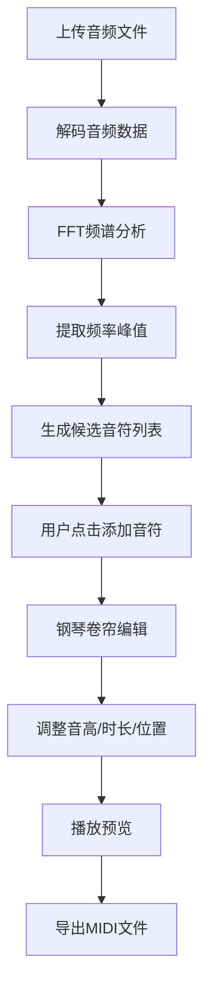

## 1. 产品概述

旋律扒谱辅助工具是一款基于Web的交互式音乐分析应用，帮助音乐爱好者从音频片段中快速提取主旋律乐谱。用户上传20秒内的音频后，系统自动分析频谱并生成候选音符，用户可通过钢琴卷帘界面进行可视化编辑，最终导出MIDI文件。

- 目标用户：音乐爱好者、播客听众、歌曲学习者
- 核心价值：降低扒谱门槛，提高旋律提取效率
- 市场定位：轻量级、易用的在线旋律提取与编辑工具

## 2. 核心功能

### 2.1 用户角色
| 角色 | 注册方式 | 核心权限 |
|------|----------|----------|
| 普通用户 | 无需注册 | 上传音频、编辑音符、导出MIDI |

### 2.2 功能模块
1. **音频上传模块**：支持拖拽和点击上传，实时频谱可视化
2. **候选音符列表**：自动检测频率峰值，按置信度排序展示
3. **钢琴卷帘编辑器**：可视化音符编辑，支持拖拽调整音高和时长
4. **播放控制模块**：实时播放编辑结果，进度指示
5. **MIDI导出模块**：生成并下载MIDI文件

### 2.3 页面详情
| 页面名称 | 模块名称 | 功能描述 |
|-----------|-------------|---------------------|
| 主页面 | 上传区域 | 居中虚线边框上传框，支持拖拽和点击，拖入时金色光晕动画 |
| 主页面 | 频谱显示区 | Canvas实时频谱图，纵向频率横向时间，蓝到红渐变强度 |
| 主页面 | 候选音符列表 | 侧边栏展示检测到的候选音符，按置信度排序，点击试听 |
| 主页面 | 钢琴卷帘编辑器 | 左侧钢琴键(C2-C6)，右侧音符块拖拽编辑，网格吸附 |
| 主页面 | 播放控制栏 | 播放/暂停按钮，进度条，音量控制 |
| 主页面 | 导出按钮 | 右上角固定位置，点击生成下载MIDI文件 |

## 3. 核心流程

用户上传音频文件后，系统解码音频并执行FFT分析，提取频率峰值生成候选音符列表。用户点击候选音符添加到钢琴卷帘编辑器，通过拖拽调整音符的音高、时长和位置。编辑完成后，用户可播放预览旋律，最终导出MIDI文件。

## 4. 用户界面设计

### 4.1 设计风格
- 主色调：深色背景 #1a1a2e，卡片背景 #16213e，文字 #e0e0e0
- 强调色：金色 #ffd700（拖拽高亮），绿色 #4ade80（播放进度），淡黄色（音符高亮）
- 按钮风格：圆角设计，悬停背景变浅，点击缩放0.95
- 字体：现代无衬线字体，清晰的层级结构
- 布局：卡片式布局，分隔线清晰，留白适度

### 4.2 页面设计概述
| 页面名称 | 模块名称 | UI元素 |
|-----------|-------------|-------------|
| 主页面 | 上传区域 | 虚线边框、圆角矩形、拖入金色光晕动画、居中布局 |
| 主页面 | 频谱显示区 | Canvas画布、蓝红渐变色彩、60fps刷新、进度条叠加 |
| 主页面 | 候选音符列表 | 卡片式列表、置信度进度条、音名八度显示、悬停效果 |
| 主页面 | 钢琴卷帘编辑器 | 钢琴键盘(C2-C6共48键)、音符块、网格线、播放头竖线 |
| 主页面 | 控制栏 | 播放按钮、进度条、音量图标、导出按钮 |

### 4.3 响应式设计
- 桌面端（>900px）：频谱图占60%宽度，候选音符列表占20%，左右布局
- 移动端（≤900px）：频谱图和候选音符上下排列，钢琴卷帘占满宽度
- 触摸优化：音符块增大触摸区域，支持手势拖拽

### 4.4 动效设计
- 上传区域拖入时：边框变金色，光晕渐变动画
- 按钮交互：悬停背景过渡，点击缩放反馈
- 频谱图：平滑60fps刷新
- 播放头：绿色竖线平滑移动
- 音符高亮：播放到当前音符时背景变为淡黄色
