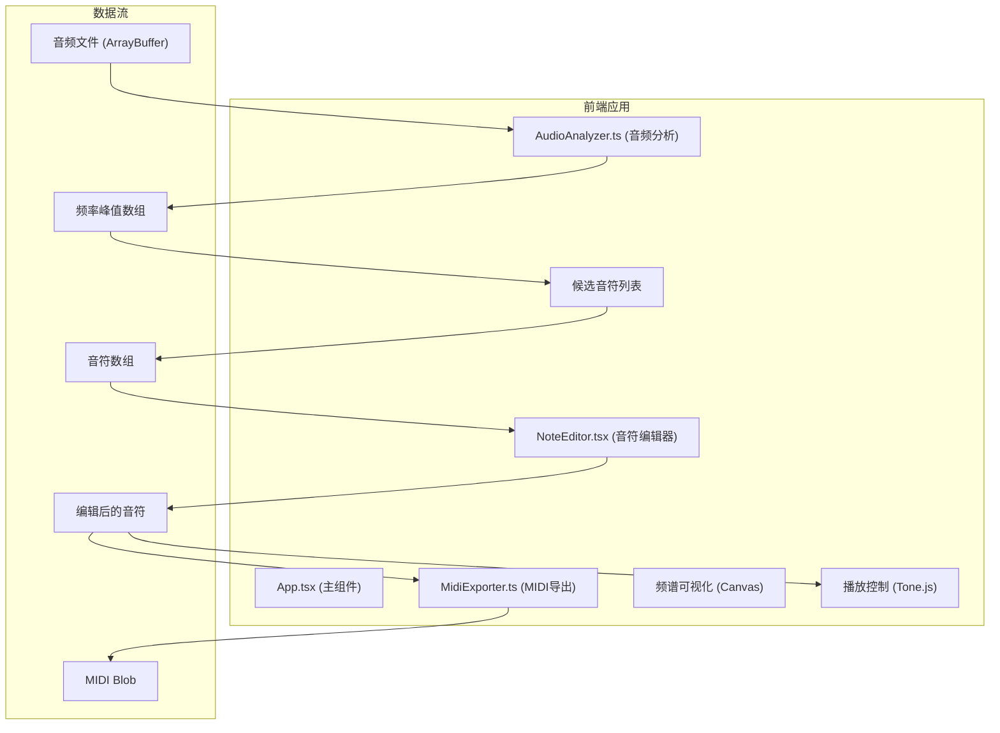

## 1. 架构设计



## 2. 技术描述

- **前端框架**：React 18 + TypeScript
- **构建工具**：Vite 5
- **样式方案**：原生CSS（深色主题，CSS变量）
- **音频处理**：Web Audio API + 自定义FFT实现
- **音频合成**：Tone.js (MIDI播放、合成器)
- **音乐理论**：musicvis-lib（音高计算、频率转换）
- **唯一标识**：uuid
- **状态管理**：React useState/useRef（轻量级应用，无需额外状态库）

## 3. 项目结构

```
src/
├── AudioAnalyzer.ts      # 音频分析模块：解码、FFT、峰值提取
├── NoteEditor.tsx        # 钢琴卷帘编辑器组件
├── MidiExporter.ts       # MIDI导出模块
├── App.tsx               # 主应用组件
├── main.tsx              # 入口文件
├── index.css             # 全局样式
└── types.ts              # 类型定义
```

## 4. 模块数据流

### 4.1 音频分析模块 (AudioAnalyzer.ts)
- 输入：ArrayBuffer（音频文件数据）
- 输出：FrequencyPeak[]（频率峰值数组，含频率、幅度、时间）
- 核心功能：
  - decodeAudio(): 解码音频文件
  - performFFT(): 执行快速傅里叶变换
  - findPeaks(): 检测频谱峰值
  - getTopPeaks(): 返回前N个候选峰值

### 4.2 音符编辑器 (NoteEditor.tsx)
- 输入：Note[]（音符数组）
- 输出：更新后的Note[]
- 核心功能：
  - 钢琴键盘渲染（C2-C6，48键）
  - 音符块拖拽（上下改音高，左右改时间）
  - 音符时长调整（边缘拖拽）
  - 网格吸附（四分音符）
  - 右键删除音符
  - 点击空白添加音符

### 4.3 MIDI导出模块 (MidiExporter.ts)
- 输入：Note[]（编辑后的音符数组）
- 输出：MIDI文件下载
- 核心功能：
  - convertToMidi(): 音符数组转MIDI格式
  - downloadMidi(): 触发浏览器下载

## 5. 数据模型

### 5.1 类型定义

```typescript
interface FrequencyPeak {
  frequency: number;
  amplitude: number;
  time: number;
  confidence: number;
  noteName: string;
  octave: number;
}

interface Note {
  id: string;
  midiNumber: number;
  startTime: number;
  duration: number;
  velocity: number;
}

interface EditorState {
  notes: Note[];
  isPlaying: boolean;
  currentTime: number;
  tempo: number;
  selectedNoteId: string | null;
}
```

## 6. 性能优化策略

### 6.1 频谱图性能
- 使用requestAnimationFrame实现60fps刷新
- Canvas离屏渲染优化
- 频谱数据降采样显示

### 6.2 编辑器性能
- 使用CSS transform实现拖拽（GPU加速）
- 音符块按需渲染（虚拟滚动）
- 防抖处理重计算逻辑

### 6.3 音频分析性能
- 使用Web Audio API原生FFT
- 分帧处理大数据量音频
- Web Worker离线计算（可选优化）

## 7. 关键配置

### 7.1 Vite配置
- 处理WAV/MP3音频文件类型
- 配置assetsInlineLimit避免小音频内联
- 优化生产构建

### 7.2 TypeScript配置
- 严格模式（strict: true）
- 完整类型检查
- ES2020目标语法
