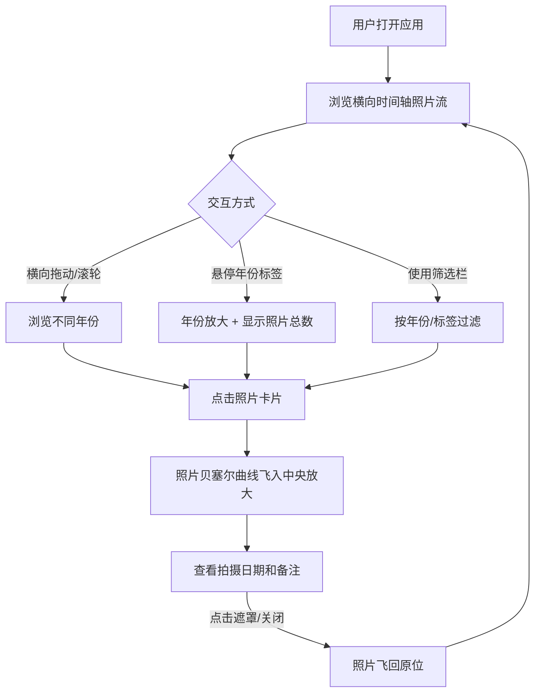

## 1. 产品概述

个人时间轴相册 —— 将日常随手拍的照片按时间线组织成可交互滚动的视觉故事线，比普通相册浏览更具沉浸感和叙事性。
- 目标用户：喜欢记录生活的个人用户，希望以时间叙事的方式回顾和展示照片
- 核心价值：让照片不再是孤立的网格，而是一条流动的时间故事线，赋予回忆叙事性

## 2. 核心功能

### 2.1 用户角色
| 角色 | 注册方式 | 核心权限 |
|------|----------|----------|
| 个人用户 | 无需注册（本地应用） | 浏览、筛选、放大查看照片 |

### 2.2 功能模块
1. **时间轴主页**: 横向时间轴布局、年份标签、背景渐变、照片卡片瀑布流
2. **照片详情**: 模态框放大查看、拍摄日期与备注展示

### 2.3 页面详情
| 页面名称 | 模块名称 | 功能描述 |
|----------|----------|----------|
| 时间轴主页 | 横向时间轴 | 照片按年份横向排列，底部显示年份标签，悬停放大并显示照片总数；滚动到当前年份时标签淡入固定为标题 |
| 时间轴主页 | 背景渐变 | 背景从深灰渐变到米白再渐变回深灰，营造随时间流动的视觉感受 |
| 时间轴主页 | 筛选栏 | 按年份和标签（旅行、美食、日常、家人）筛选照片，筛选动画包含缩小淡出（400ms cubic-bezier）和依次放大淡入（间隔150ms） |
| 时间轴主页 | 照片卡片瀑布流 | 桌面4列、平板3列、手机2列；卡片4:3宽高比裁切；暖色调滤镜；悬停恢复彩色并上移5px |
| 照片详情 | 模态框 | 照片从原位贝塞尔曲线飞入中央放大；白色细边框+柔和阴影；显示日期和备注；点击遮罩或关闭按钮飞回原位 |

## 3. 核心流程

用户打开应用 → 看到横向时间轴上的照片卡片流 → 横向拖动或滚轮浏览不同年份 → 悬停年份标签查看信息 → 使用筛选栏按年份/标签过滤 → 点击照片卡片 → 照片飞入中央放大查看详情 → 点击遮罩或关闭按钮 → 照片飞回原位 → 继续浏览

## 4. 用户界面设计

### 4.1 设计风格
- 主色调：深灰 #1a1a2e → 米白 #f5f0e8 → 深灰 #1a1a2e 渐变背景
- 强调色：暖金色 #d4a574（年份标签高亮、交互反馈）
- 按钮风格：圆角胶囊型，微透明背景 + 毛玻璃效果
- 字体：Playfair Display（标题/年份）+ DM Sans（正文/备注）
- 布局风格：横向时间轴 + 瀑布流卡片
- 图标风格：Lucide 线性图标

### 4.2 页面设计概览
| 页面名称 | 模块名称 | UI 元素 |
|----------|----------|---------|
| 时间轴主页 | 背景层 | 三段式渐变（深灰→米白→深灰），随滚动位置动态偏移 |
| 时间轴主页 | 时间轴轨道 | 底部细长年份标签，悬停时放大1.5倍并显示照片数量badge；当前年份固定为顶部标题 |
| 时间轴主页 | 筛选栏 | 顶部半透明浮动栏，年份下拉 + 标签pill按钮组，选中态为暖金色 |
| 时间轴主页 | 照片卡片 | 4:3比例裁切，暖色调滤镜叠加，默认灰阶，悬停彩色+上移5px+阴影加深 |
| 时间轴主页 | 照片卡片动画 | 筛选时：不符合项缩小淡出400ms cubic-bezier；符合项依次放大淡入间隔150ms |
| 照片详情 | 模态框遮罩 | 黑色半透明（rgba(0,0,0,0.7)），点击关闭 |
| 照片详情 | 放大照片 | 白色细边框2px + box-shadow柔和阴影，从原位贝塞尔曲线飞入 |
| 照片详情 | 日期备注 | 照片下方，Playfair Display日期 + DM Sans备注文字 |

### 4.3 响应式设计
- 桌面端（≥1024px）：4列瀑布流，横向时间轴全宽
- 平板端（768px-1023px）：3列瀑布流
- 手机端（<768px）：2列瀑布流，触控拖动浏览

### 4.4 3D 场景指导
不适用
