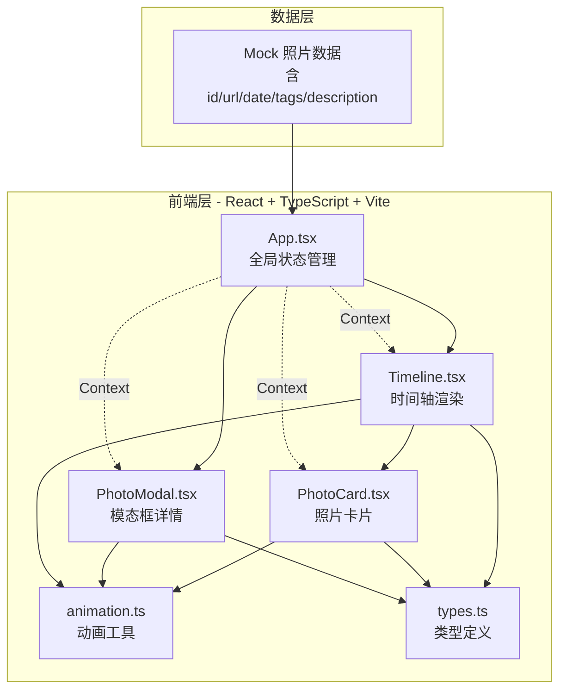
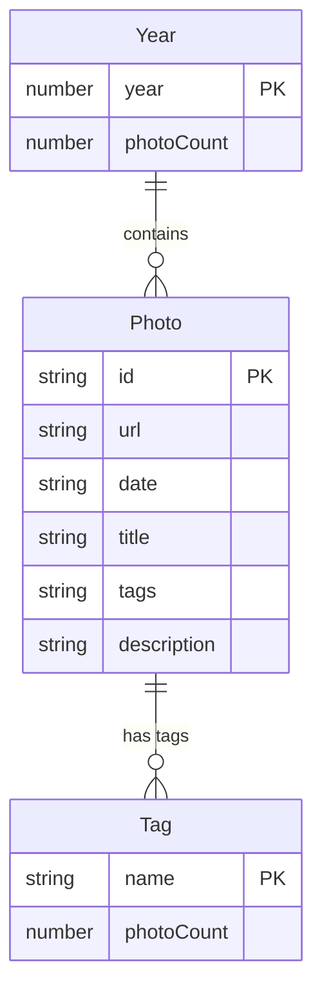

## 1. 架构设计



## 2. 技术说明
- 前端：React@18 + TypeScript + Vite
- 初始化工具：Vite
- 后端：无（纯前端应用，使用 Mock 数据）
- 数据库：无（使用内存 Mock 数据）
- 样式方案：CSS Modules + CSS Variables + CSS Keyframes
- 动画方案：CSS Keyframes + requestAnimationFrame

## 3. 路由定义
| 路由 | 用途 |
|------|------|
| / | 时间轴主页，包含所有照片和筛选功能 |

单页应用，无需多路由。

## 4. API 定义
无后端 API。应用使用 Mock 数据直接在前端渲染。

照片数据结构：
```typescript
interface Photo {
  id: string;
  url: string;
  date: string;
  title: string;
  tags: string[];
  description: string;
}

type Filter = {
  year: number | null;
  tag: string | null;
};
```

## 5. 服务器架构图
不适用（纯前端应用）

## 6. 数据模型

### 6.1 数据模型定义



### 6.2 数据定义语言
无数据库表，使用 TypeScript 类型定义和内存数组：

```typescript
const mockPhotos: Photo[] = [
  {
    id: "1",
    url: "https://picsum.photos/seed/photo1/800/600",
    date: "2024-03-15",
    title: "春日漫步",
    tags: ["旅行", "日常"],
    description: "公园里的樱花开了"
  },
  // ... 更多照片
];
```
