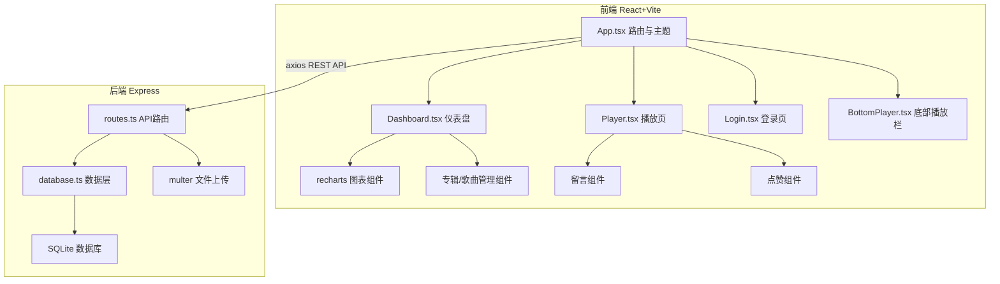
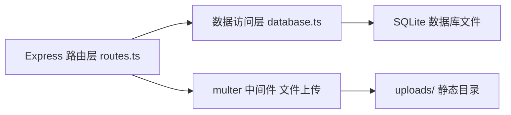
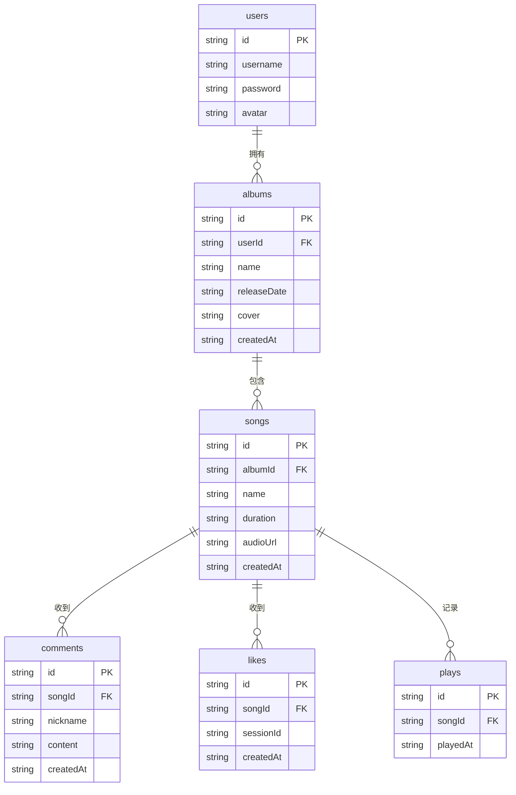

## 1. 架构设计



## 2. 技术说明

- 前端：React 18 + TypeScript + Vite + Tailwind CSS + Zustand
- 初始化工具：vite-init（react-express-ts 模板）
- 后端：Express 4 + TypeScript + multer（文件上传）
- 数据库：SQLite（better-sqlite3）
- 图表：recharts
- 图标：lucide-react
- 状态管理：Zustand

## 3. 路由定义

| 路由 | 用途 |
|------|------|
| /login | 登录页面 |
| /dashboard | 音乐人仪表盘（需登录） |
| /player/:songId | 音乐播放与详情页 |

## 4. API 定义

### 4.1 认证相关

| 方法 | 路径 | 描述 | 请求体 | 响应 |
|------|------|------|--------|------|
| POST | /api/auth/login | 音乐人登录 | { username, password } | { success, user } |

### 4.2 专辑管理

| 方法 | 路径 | 描述 | 请求体 | 响应 |
|------|------|------|--------|------|
| GET | /api/albums | 获取专辑列表 | - | Album[] |
| POST | /api/albums | 创建专辑 | FormData: name, releaseDate, cover | Album |
| PUT | /api/albums/:id | 更新专辑 | FormData: name, releaseDate, cover? | Album |
| DELETE | /api/albums/:id | 删除专辑 | - | { success } |

### 4.3 歌曲管理

| 方法 | 路径 | 描述 | 请求体 | 响应 |
|------|------|------|--------|------|
| GET | /api/albums/:albumId/songs | 获取专辑歌曲 | - | Song[] |
| POST | /api/albums/:albumId/songs | 添加歌曲 | FormData: name, audio, duration? | Song |
| PUT | /api/songs/:id | 更新歌曲 | FormData: name?, audio? | Song |
| DELETE | /api/songs/:id | 删除歌曲 | - | { success } |

### 4.4 互动相关

| 方法 | 路径 | 描述 | 请求体 | 响应 |
|------|------|------|--------|------|
| GET | /api/songs/:songId/comments | 获取留言 | - | Comment[] |
| POST | /api/songs/:songId/comments | 提交留言 | { nickname, content } | Comment |
| POST | /api/songs/:songId/like | 点赞/取消 | - | { liked, likeCount } |
| GET | /api/songs/:songId/like-status | 获取点赞状态 | - | { liked, likeCount } |
| POST | /api/songs/:songId/play | 记录播放 | - | { playCount } |

### 4.5 统计相关

| 方法 | 路径 | 描述 | 请求体 | 响应 |
|------|------|------|--------|------|
| GET | /api/stats/plays-trend | 7天播放趋势 | - | { date, count }[] |
| GET | /api/stats/top-songs | 热门歌曲Top5 | - | { song, playCount }[] |
| GET | /api/stats/summary | 总体统计摘要 | - | { totalPlays, totalLikes, totalComments } |

### 4.6 TypeScript 类型定义

```typescript
interface User {
  id: string
  username: string
  avatar?: string
}

interface Album {
  id: string
  userId: string
  name: string
  releaseDate: string
  cover?: string
  songCount?: number
  createdAt: string
}

interface Song {
  id: string
  albumId: string
  name: string
  duration?: number
  audioUrl?: string
  playCount: number
  likeCount: number
  createdAt: string
}

interface Comment {
  id: string
  songId: string
  nickname: string
  content: string
  createdAt: string
}

interface Like {
  id: string
  songId: string
  sessionId: string
  createdAt: string
}

interface Play {
  id: string
  songId: string
  playedAt: string
}
```

## 5. 服务端架构图



## 6. 数据模型

### 6.1 数据模型定义



### 6.2 数据定义语言

```sql
CREATE TABLE users (
  id TEXT PRIMARY KEY,
  username TEXT NOT NULL UNIQUE,
  password TEXT NOT NULL,
  avatar TEXT
);

CREATE TABLE albums (
  id TEXT PRIMARY KEY,
  userId TEXT NOT NULL,
  name TEXT NOT NULL,
  releaseDate TEXT NOT NULL,
  cover TEXT,
  createdAt TEXT NOT NULL,
  FOREIGN KEY (userId) REFERENCES users(id)
);

CREATE TABLE songs (
  id TEXT PRIMARY KEY,
  albumId TEXT NOT NULL,
  name TEXT NOT NULL,
  duration REAL DEFAULT 0,
  audioUrl TEXT,
  createdAt TEXT NOT NULL,
  FOREIGN KEY (albumId) REFERENCES albums(id) ON DELETE CASCADE
);

CREATE TABLE comments (
  id TEXT PRIMARY KEY,
  songId TEXT NOT NULL,
  nickname TEXT NOT NULL,
  content TEXT NOT NULL,
  createdAt TEXT NOT NULL,
  FOREIGN KEY (songId) REFERENCES songs(id) ON DELETE CASCADE
);

CREATE TABLE likes (
  id TEXT PRIMARY KEY,
  songId TEXT NOT NULL,
  sessionId TEXT NOT NULL,
  createdAt TEXT NOT NULL,
  FOREIGN KEY (songId) REFERENCES songs(id) ON DELETE CASCADE,
  UNIQUE(songId, sessionId)
);

CREATE TABLE plays (
  id TEXT PRIMARY KEY,
  songId TEXT NOT NULL,
  playedAt TEXT NOT NULL,
  FOREIGN KEY (songId) REFERENCES songs(id) ON DELETE CASCADE
);

CREATE INDEX idx_songs_albumId ON songs(albumId);
CREATE INDEX idx_comments_songId ON comments(songId);
CREATE INDEX idx_likes_songId ON likes(songId);
CREATE INDEX idx_plays_songId ON plays(songId);
CREATE INDEX idx_plays_playedAt ON plays(playedAt);

INSERT INTO users (id, username, password, avatar) VALUES ('1', 'indie_artist', 'music2024', NULL);
```
