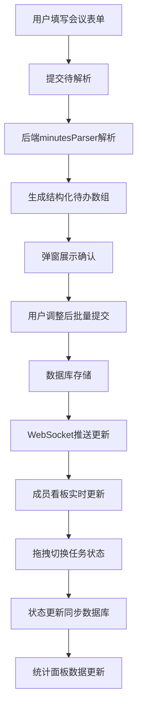

## 1. 产品概述

MeetTask 是一款团队会议纪要与待办事项同步跟踪的全栈应用，帮助团队成员在会议后自动生成结构化纪要，并将讨论中产生的待办事项自动分发到对应成员的个人面板中，实现「会议→待办→完成→统计」的闭环追踪。

- 主要解决团队会议后待办事项分散、跟踪困难、责任不明确的问题
- 目标用户为研发团队、项目团队、产品团队等需要频繁开会并跟踪任务的协作团队
- 产品价值在于自动化提取待办、实时同步更新、可视化进度追踪，提升团队协作效率

## 2. 核心功能

### 2.1 用户角色

| 角色 | 注册方式 | 核心权限 |
|------|----------|----------|
| 团队成员 | 自动识别（基于参会人列表） | 创建会议、查看个人看板、更新任务状态、查看统计数据 |

### 2.2 功能模块

1. **创建会议页面**：会议表单、待办解析、确认弹窗、批量提交
2. **任务看板页面**：三列拖拽看板、卡片状态切换、截止日期提醒、实时通知
3. **统计面板页面**：成员完成统计、逾期统计、平均处理时长、柱状图可视化

### 2.3 页面详情

| 页面名称 | 模块名称 | 功能描述 |
|----------|----------|----------|
| 创建会议 | 会议表单 | 输入会议主题、参会人列表（逗号分隔）、讨论摘要文本 |
| 创建会议 | 待办解析 | 后端自动解析「@姓名」格式的待办事项，提取负责人和动作描述 |
| 创建会议 | 确认弹窗 | 展示解析结果，支持手动调整后批量提交 |
| 任务看板 | 三列布局 | 待开始、进行中、已完成三列，柔和渐变背景 |
| 任务看板 | 拖拽卡片 | 支持拖拽切换状态，拖拽时旋转5度放大1.05倍，松开后弹性动画回弹 |
| 任务看板 | 截止日期 | 剩余天数颜色标记：绿色>3天、黄色1-3天、红色<1天 |
| 任务看板 | 实时通知 | WebSocket推送新任务或状态变更，顶部5秒自动消失的横幅通知 |
| 统计面板 | 柱状图 | 每位成员一根横柱，颜色从绿到红渐变，长度按完成数比例缩放 |
| 统计面板 | Tooltip | 鼠标悬停显示具体数值：本周完成数、逾期任务数、平均处理时长 |

## 3. 核心流程

用户在会议表单输入会议信息并提交，后端解析文本提取待办事项，用户确认后批量保存到数据库，系统通过WebSocket实时推送到所有在线成员的任务看板，成员通过拖拽更新任务状态，最终在统计面板展示团队绩效数据。

## 4. 用户界面设计

### 4.1 设计风格

- **主色调**：深色模式背景 `#1a1a2e`，主内容白色卡片 `#ffffff`
- **渐变色**：
  - 待开始：浅灰蓝到浅灰 `linear-gradient(135deg, #f0f4f8 0%, #e8e8e8 100%)`
  - 进行中：浅蓝到浅青 `linear-gradient(135deg, #e3f2fd 0%, #e0f7fa 100%)`
  - 已完成：浅绿到浅薄荷绿 `linear-gradient(135deg, #e8f5e9 0%, #e0f2f1 100%)`
- **卡片样式**：圆角 16px，阴影 `box-shadow: 0 2px 12px rgba(0,0,0,0.08)`
- **字体**：使用系统现代字体组合，标题加粗，正文清晰易读
- **动画**：所有状态切换 0.3s 缓入缓出，拖拽弹性动画 0.4s 弹性系数 0.6

### 4.2 页面设计概述

| 页面名称 | 模块名称 | UI元素 |
|----------|----------|---------|
| 创建会议 | 左侧导航 | 固定宽度220px，Logo、三个页面按钮、在线成员头像 |
| 创建会议 | 表单区域 | 白色卡片，输入框标签清晰，提交按钮醒目 |
| 创建会议 | 确认弹窗 | 侧边滑入，待办列表可编辑，确认/取消按钮 |
| 任务看板 | 三列布局 | 等宽三列，每列标题和卡片容器，渐变背景 |
| 任务看板 | 任务卡片 | 白色小卡片，任务描述、截止日期、状态标签 |
| 任务看板 | 通知横幅 | 顶部半透明浅蓝，左侧脉动圆点，右侧倒计时进度条 |
| 统计面板 | 柱状图 | 横条柱状图，颜色渐变，悬停Tooltip |
| 统计面板 | 数据卡片 | 每位成员统计摘要，图标+数值+单位 |

### 4.3 响应式

- **桌面端**（≥768px）：左侧固定导航栏220px，内容区域自适应
- **移动端**（<768px）：导航栏折叠为顶部汉堡菜单，内容占满全宽，卡片堆叠显示
- **触摸优化**：拖拽区域扩大，点击目标≥44px，滑动手势支持

### 4.4 性能指标

- WebSocket推送延迟 ≤ 200ms
- 看板拖拽响应 ≥ 60fps
- 首次加载时间 ≤ 2秒（gzip压缩后资源 < 500KB）
