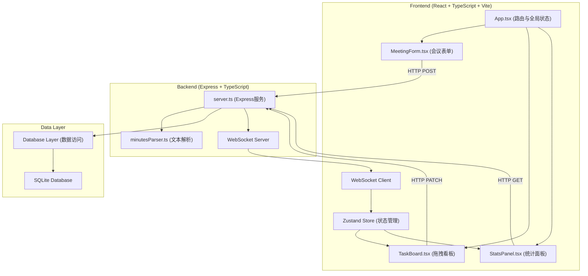
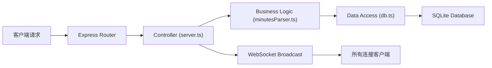
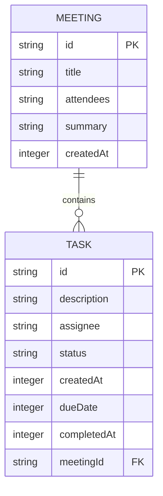

## 1. 架构设计



## 2. 技术描述

- **前端**：React@18 + TypeScript@5 + Vite@5 + Zustand@4 + lucide-react@0.344
- **后端**：Express@4 + TypeScript@5 + sqlite3@5 + ws@8 + uuid@9
- **构建工具**：Vite@5，配置 React 插件和 WebSocket 代理
- **数据库**：SQLite3，本地文件存储
- **实时通信**：ws 库实现 WebSocket 双向通信

## 3. 项目文件结构

```
auto149/
├── package.json
├── vite.config.js
├── tsconfig.json
├── index.html
└── src/
    ├── frontend/
    │   ├── App.tsx
    │   ├── components/
    │   │   ├── MeetingForm.tsx
    │   │   ├── TaskBoard.tsx
    │   │   └── StatsPanel.tsx
    │   ├── store/
    │   │   └── useStore.ts
    │   ├── types/
    │   │   └── index.ts
    │   └── utils/
    │       └── api.ts
    └── backend/
        ├── server.ts
        ├── minutesParser.ts
        ├── db.ts
        └── types.ts
```

## 4. 路由定义

| 前端路由 | 页面 | 后端API | Purpose |
|----------|------|---------|---------|
| `/` | 创建会议 | | 根路径重定向到创建会议 |
| `/meeting` | 创建会议 | `POST /api/meetings` | 创建会议并解析待办 |
| `/board` | 任务看板 | `GET /api/tasks` | 获取所有待办事项 |
| `/board` | 任务看板 | `PATCH /api/tasks/:id` | 更新任务状态 |
| `/stats` | 统计面板 | `GET /api/stats` | 获取统计数据 |
| | WebSocket | `ws://localhost:3001` | 实时数据同步 |

## 5. API 定义

### 5.1 类型定义

```typescript
// shared types
interface Task {
  id: string;
  description: string;
  assignee: string;
  status: 'pending' | 'in-progress' | 'completed';
  createdAt: number;
  dueDate: number;
  completedAt?: number;
  meetingId: string;
}

interface Meeting {
  id: string;
  title: string;
  attendees: string[];
  summary: string;
  createdAt: number;
}

interface MemberStats {
  name: string;
  completedThisWeek: number;
  overdue: number;
  avgProcessingHours: number;
}

interface ParsedTask {
  description: string;
  assignee: string;
  dueDate?: number;
}
```

### 5.2 请求/响应

**POST /api/meetings/parse**
```typescript
// Request
{
  title: string;
  attendees: string;
  summary: string;
}

// Response
{
  meeting: Meeting;
  parsedTasks: ParsedTask[];
}
```

**POST /api/meetings**
```typescript
// Request
{
  meeting: Meeting;
  tasks: Omit<Task, 'id' | 'createdAt' | 'status'>[];
}

// Response
{
  success: boolean;
  tasks: Task[];
}
```

**GET /api/tasks?assignee=xxx**
```typescript
// Response
{
  tasks: Task[];
}
```

**PATCH /api/tasks/:id**
```typescript
// Request
{
  status: 'pending' | 'in-progress' | 'completed';
}

// Response
{
  success: boolean;
  task: Task;
}
```

**GET /api/stats**
```typescript
// Response
{
  stats: MemberStats[];
}
```

## 6. 服务器架构



## 7. 数据模型

### 7.1 ER 图



### 7.2 DDL 语句

```sql
CREATE TABLE IF NOT EXISTS meetings (
  id TEXT PRIMARY KEY,
  title TEXT NOT NULL,
  attendees TEXT NOT NULL,
  summary TEXT NOT NULL,
  createdAt INTEGER NOT NULL
);

CREATE TABLE IF NOT EXISTS tasks (
  id TEXT PRIMARY KEY,
  description TEXT NOT NULL,
  assignee TEXT NOT NULL,
  status TEXT NOT NULL DEFAULT 'pending',
  createdAt INTEGER NOT NULL,
  dueDate INTEGER NOT NULL,
  completedAt INTEGER,
  meetingId TEXT NOT NULL,
  FOREIGN KEY (meetingId) REFERENCES meetings(id)
);

CREATE INDEX IF NOT EXISTS idx_tasks_assignee ON tasks(assignee);
CREATE INDEX IF NOT EXISTS idx_tasks_status ON tasks(status);
CREATE INDEX IF NOT EXISTS idx_tasks_dueDate ON tasks(dueDate);
```

## 8. 数据流

```
用户提交会议记录
  → 前端 MeetingForm 收集数据
  → HTTP POST /api/meetings/parse
  → 后端 server.ts 接收请求
  → 调用 minutesParser.ts 解析文本
    → 正则匹配 @姓名 关键词
    → 提取截止日期
    → 生成 ParsedTask 数组
  → 返回解析结果给前端
  → 用户确认/调整后提交
  → HTTP POST /api/meetings
  → 数据库存储 meeting + tasks
  → WebSocket 广播 tasks_created 事件
  → 所有在线客户端接收
  → Zustand store 更新
  → TaskBoard 自动刷新
  → 显示通知横幅

用户拖拽卡片切换状态
  → 前端更新本地状态（乐观更新）
  → HTTP PATCH /api/tasks/:id
  → 后端更新数据库
  → WebSocket 广播 task_updated 事件
  → 其他客户端同步更新
```
