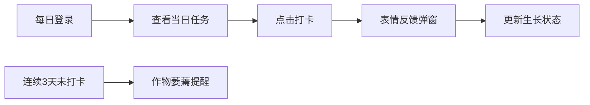

## 1. 产品概述

社区农场共享种植计划与收成追踪系统，帮助社区居民认领虚拟菜地、追踪作物生长、管理日常任务、与邻居交换多余收成。解决传统微信群管理混乱、信息不对称的问题。

- 目标用户：社区农场参与者、小区居民、种植爱好者
- 核心价值：数字化管理种植流程、促进邻里资源共享、提升种植参与感

## 2. 核心功能

### 2.1 用户角色

| 角色 | 注册方式 | 核心权限 |
|------|----------|----------|
| 普通用户 | 用户名注册 | 认领菜地、打卡任务、交换收成、查看信息 |

### 2.2 功能模块

1. **菜地认领页面**：5x5米网格图展示、颜色状态标识、点击认领流程
2. **主面板页面**：认领地列表、当日任务打卡、作物生长状态概览
3. **交换市场**：可交换作物卡片、交换申请流程、实时通知
4. **任务系统**：种植日历生成、每日任务提醒、打卡反馈动画
5. **实时通知**：WebSocket推送交换请求、作物状态变化提醒

### 2.3 页面详情

| 页面名称 | 模块名称 | 功能描述 |
|----------|----------|----------|
| 菜地认领页 | 网格展示 | Canvas绘制5x5网格，空闲绿色、已认领蓝色、成熟金色 |
| 菜地认领页 | 认领交互 | 点击空闲格子弹出作物选择，确认后生成种植日历 |
| 主面板页 | 地块列表 | flex-wrap自适应布局展示用户所有认领地 |
| 主面板页 | 任务打卡 | 当日任务列表，点击打卡记录时间并更新生长状态 |
| 主面板页 | 作物概览 | 显示各作物当前生长阶段、成熟倒计时 |
| 交换市场 | 作物卡片 | 展示所有用户可交换的收成，含作物名、数量、持有者 |
| 交换市场 | 交换流程 | 申请→对方确认→双方库存更新，半透明弹窗展示进度 |
| 通知系统 | 实时推送 | WebSocket推送交换请求、状态变化等通知 |

## 3. 核心流程

### 3.1 认领与种植流程

用户进入菜地页面 → 浏览网格寻找空闲地块 → 点击空闲格子 → 选择作物种类 → 确认认领 → 系统自动生成种植日历 → 跳转到主面板查看任务

### 3.2 打卡与生长流程

用户每日登录 → 查看当日任务 → 点击完成打卡 → 表情反馈弹窗 → 更新作物生长状态 → 连续3天未打卡则作物萎蔫

### 3.3 交换流程

浏览交换市场 → 选择想要的作物 → 点击申请交换 → 对方收到通知 → 对方接受/拒绝 → 双方库存更新 → 交换结果通知

## 4. 用户界面设计

### 4.1 设计风格

- **主色调**：草绿 #7CB342、丰收黄 #FFB300
- **背景色**：浅米色 #FFF8E7
- **标题栏**：左到右草绿到丰收黄渐变
- **卡片样式**：圆角16px，底部2px内阴影，悬浮感
- **交互动效**：hover时0.1秒缩放1.02倍、阴影加深
- **字体**：温暖友好的无衬线字体，移动端字体略大
- **图标风格**：emoji图标为主，贴合农业主题

### 4.2 页面设计概览

| 页面名称 | 模块名称 | UI元素 |
|----------|----------|--------|
| 菜地认领页 | 网格画布 | Canvas绘制、颜色编码、点击交互、脉冲动画 |
| 主面板页 | 任务卡片 | 阶段进度条、任务列表、打卡按钮、脉冲提醒 |
| 交换市场 | 作物卡片 | emoji图标、数量标签、用户名、申请按钮 |
| 全局 | 弹窗 | 半透明背景、圆形渐变、平滑滑动动画 |
| 全局 | 导航栏 | 渐变色标题、图标导航、响应式布局 |

### 4.3 响应式设计

- 桌面端优先，移动端自适应
- 移动端卡片改为两列布局
- 触摸优化：更大的点击区域、弹性滚动效果（overscroll-behavior: contain）
- 字体大小自适应，移动端略大

### 4.4 动效设计

- 页面切换：≤200ms平滑过渡
- 列表滚动：稳定30fps以上
- 任务高亮：脉冲动画提醒
- 打卡反馈：圆形渐变弹窗（绿到黄）、三种随机表情
- 交换状态：半透明弹出层、平滑滑动切换
- 卡片交互：0.1s缩放1.02倍 + 阴影加深
