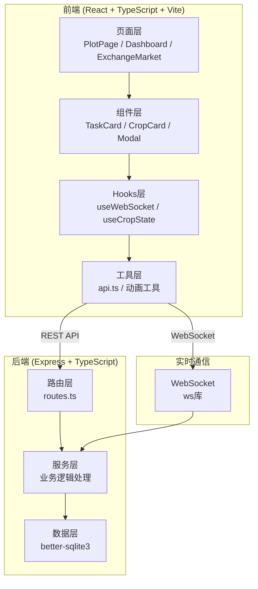
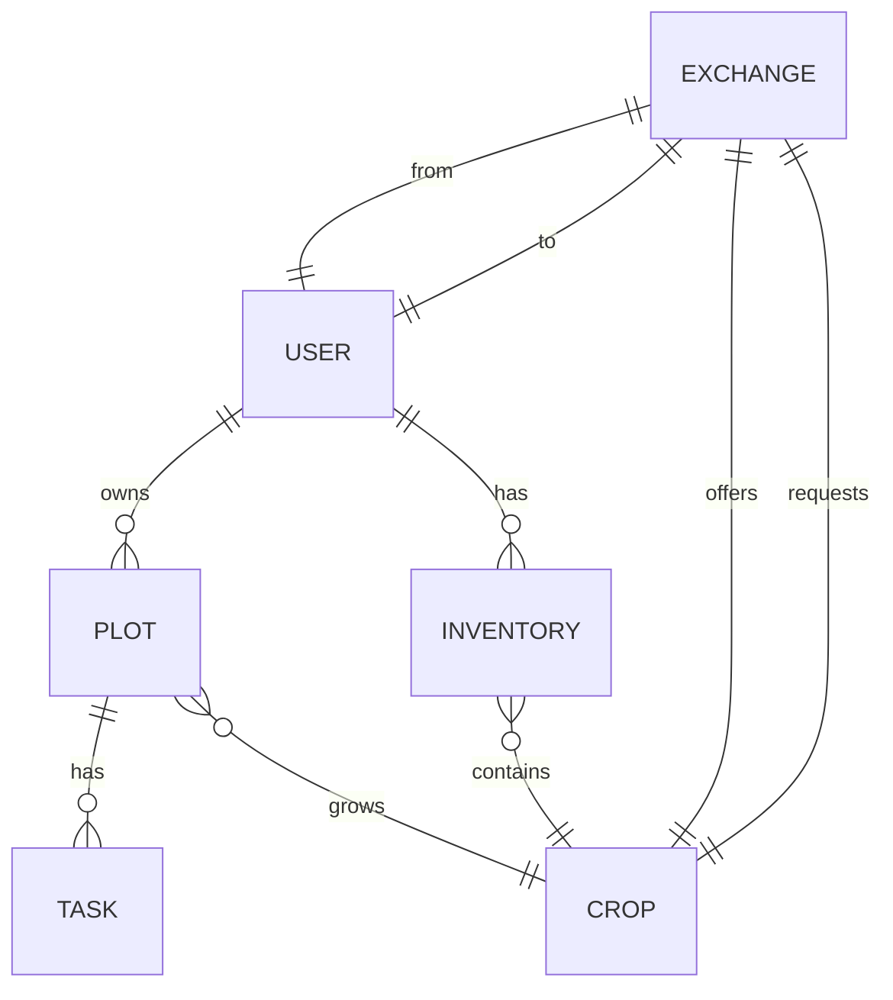

## 1. 架构设计



## 2. 技术栈说明

- **前端框架**：React 18 + TypeScript 5
- **构建工具**：Vite 5 + @vitejs/plugin-react
- **路由管理**：React Router v6 (BrowserRouter)
- **后端框架**：Express 4 + TypeScript
- **数据库**：better-sqlite3 (SQLite)
- **实时通信**：ws (WebSocket库)
- **跨域处理**：cors
- **唯一ID**：uuid
- **HTTP客户端**：fetch API 封装

## 3. 目录结构

```
项目根目录/
├── package.json
├── vite.config.js
├── tsconfig.json
├── index.html
├── server/
│   ├── index.ts          # 后端入口：Express+WebSocket+SQLite初始化
│   └── routes.ts         # REST API路由定义
└── src/
    ├── main.tsx          # React入口
    ├── pages/
    │   ├── PlotPage.tsx  # 菜地格子认领页面 (Canvas)
    │   └── Dashboard.tsx # 用户主面板
    ├── components/
    │   └── ExchangeMarket.tsx  # 交换市场组件
    ├── hooks/
    │   └── useWebSocket.ts     # WebSocket自定义Hook
    └── utils/
        └── api.ts        # REST API封装
```

## 4. 路由定义

| 前端路由 | 页面 | 说明 |
|----------|------|------|
| / | 重定向到 /plots | 首页 |
| /plots | PlotPage | 菜地网格认领页 |
| /dashboard | Dashboard | 用户主面板/任务打卡 |
| /market | ExchangeMarket | 交换市场 |

## 5. API 定义

### 5.1 用户相关

```typescript
// POST /api/users/register
interface RegisterRequest { username: string; }
interface RegisterResponse { id: string; username: string; }

// GET /api/users/:id
interface UserResponse { id: string; username: string; }
```

### 5.2 地块相关

```typescript
// GET /api/plots
interface Plot {
  id: string;
  row: number;
  col: number;
  status: 'empty' | 'claimed' | 'mature' | 'wilted';
  cropId?: string;
  userId?: string;
  plantedAt?: string;
}

// POST /api/plots/:id/claim
interface ClaimPlotRequest { userId: string; cropId: string; }
interface ClaimPlotResponse { plot: Plot; tasks: Task[]; }
```

### 5.3 作物相关

```typescript
// GET /api/crops
interface Crop {
  id: string;
  name: string;
  emoji: string;
  stages: {
    seed: number;     // 播种期天数
    sprout: number;   // 发芽期天数
    bloom: number;    // 开花期天数
    harvest: number;  // 收获期天数
  };
  tasksPerStage: {
    water: number;    // 浇水频率（次/天）
    fertilize: number;// 施肥频率
    weed: number;     // 除草频率
  };
}
```

### 5.4 任务相关

```typescript
// GET /api/tasks?userId=xxx&date=yyyy-mm-dd
interface Task {
  id: string;
  plotId: string;
  cropId: string;
  type: 'water' | 'fertilize' | 'weed';
  stage: 'seed' | 'sprout' | 'bloom' | 'harvest';
  scheduledDate: string;
  completed: boolean;
  completedAt?: string;
}

// POST /api/tasks/:id/complete
interface CompleteTaskResponse {
  task: Task;
  plot: Plot;
  newStage?: string;
  newMatureDate?: string;
}
```

### 5.5 库存相关

```typescript
// GET /api/inventory?userId=xxx
interface InventoryItem {
  id: string;
  userId: string;
  cropId: string;
  quantity: number;
}

// POST /api/harvest/:plotId
interface HarvestResponse { inventory: InventoryItem; plot: Plot; }
```

### 5.6 交换相关

```typescript
// GET /api/exchange/market
interface MarketItem {
  id: string;
  userId: string;
  username: string;
  cropId: string;
  cropName: string;
  cropEmoji: string;
  quantity: number;
}

// POST /api/exchange/request
interface ExchangeRequest {
  fromUserId: string;
  toUserId: string;
  offerCropId: string;
  offerQuantity: number;
  requestCropId: string;
  requestQuantity: number;
}

// PUT /api/exchange/:id/accept
// PUT /api/exchange/:id/reject
interface ExchangeResponse {
  id: string;
  status: 'pending' | 'accepted' | 'rejected';
  fromUser: { id: string; username: string };
  toUser: { id: string; username: string };
  offer: { cropId: string; cropName: string; quantity: number };
  request: { cropId: string; cropName: string; quantity: number };
}
```

## 6. 数据模型

### 6.1 ER图



### 6.2 数据库表

```sql
-- 用户表
CREATE TABLE users (
  id TEXT PRIMARY KEY,
  username TEXT UNIQUE NOT NULL,
  created_at TEXT NOT NULL
);

-- 作物表（预设20种常见蔬菜）
CREATE TABLE crops (
  id TEXT PRIMARY KEY,
  name TEXT NOT NULL,
  emoji TEXT NOT NULL,
  seed_days INTEGER NOT NULL,
  sprout_days INTEGER NOT NULL,
  bloom_days INTEGER NOT NULL,
  harvest_days INTEGER NOT NULL,
  water_per_day REAL NOT NULL,
  fertilize_per_day REAL NOT NULL,
  weed_per_day REAL NOT NULL
);

-- 地块表（5x5网格，共25块）
CREATE TABLE plots (
  id TEXT PRIMARY KEY,
  row INTEGER NOT NULL,
  col INTEGER NOT NULL,
  status TEXT NOT NULL DEFAULT 'empty', -- empty, claimed, mature, wilted
  user_id TEXT,
  crop_id TEXT,
  planted_at TEXT,
  current_stage TEXT, -- seed, sprout, bloom, harvest
  stage_progress REAL DEFAULT 0,
  last_checkin_date TEXT,
  missed_days INTEGER DEFAULT 0,
  FOREIGN KEY (user_id) REFERENCES users(id),
  FOREIGN KEY (crop_id) REFERENCES crops(id)
);

-- 任务表
CREATE TABLE tasks (
  id TEXT PRIMARY KEY,
  plot_id TEXT NOT NULL,
  crop_id TEXT NOT NULL,
  type TEXT NOT NULL, -- water, fertilize, weed
  stage TEXT NOT NULL, -- seed, sprout, bloom, harvest
  scheduled_date TEXT NOT NULL,
  completed INTEGER DEFAULT 0,
  completed_at TEXT,
  FOREIGN KEY (plot_id) REFERENCES plots(id),
  FOREIGN KEY (crop_id) REFERENCES crops(id)
);

-- 库存表
CREATE TABLE inventory (
  id TEXT PRIMARY KEY,
  user_id TEXT NOT NULL,
  crop_id TEXT NOT NULL,
  quantity INTEGER NOT NULL DEFAULT 0,
  FOREIGN KEY (user_id) REFERENCES users(id),
  FOREIGN KEY (crop_id) REFERENCES crops(id)
);

-- 交换申请表
CREATE TABLE exchanges (
  id TEXT PRIMARY KEY,
  from_user_id TEXT NOT NULL,
  to_user_id TEXT NOT NULL,
  offer_crop_id TEXT NOT NULL,
  offer_quantity INTEGER NOT NULL,
  request_crop_id TEXT NOT NULL,
  request_quantity INTEGER NOT NULL,
  status TEXT NOT NULL DEFAULT 'pending', -- pending, accepted, rejected
  created_at TEXT NOT NULL,
  updated_at TEXT,
  FOREIGN KEY (from_user_id) REFERENCES users(id),
  FOREIGN KEY (to_user_id) REFERENCES users(id)
);
```

## 7. WebSocket消息协议

```typescript
// 消息类型
type WSMessage = 
  | { type: 'exchange_request'; data: ExchangeResponse }
  | { type: 'exchange_accepted'; data: ExchangeResponse }
  | { type: 'exchange_rejected'; data: ExchangeResponse }
  | { type: 'crop_wilted'; data: { plotId: string; cropName: string } }
  | { type: 'crop_mature'; data: { plotId: string; cropName: string } };

// 连接时发送用户ID认证
// { type: 'auth'; userId: string }
```

## 8. 性能指标

- 页面切换时间：≤ 200ms
- 列表滚动帧率：≥ 30fps
- API响应时间：≤ 100ms（本地SQLite）
- WebSocket消息延迟：≤ 50ms
