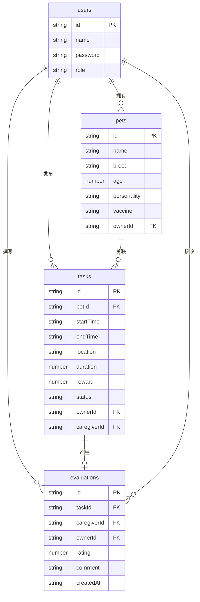

## 1. 架构设计

```mermaid
flowchart TB
    subgraph "前端 (React + Vite)"
        "App.tsx 路由管理" --> "Home.tsx 首页"
        "App.tsx 路由管理" --> "Tasks.tsx 任务大厅"
        "App.tsx 路由管理" --> "Profile.tsx 我的档案"
        "App.tsx 路由管理" --> "CaregiverDetail.tsx 看护者详情"
    end
    subgraph "后端 (Express + SQLite)"
        "app.ts API路由" --> "用户模块 /api/users"
        "app.ts API路由" --> "宠物模块 /api/pets"
        "app.ts API路由" --> "任务模块 /api/tasks"
        "app.ts API路由" --> "评价模块 /api/evaluations"
        "app.ts API路由" --> "看护者模块 /api/caregivers"
    end
    subgraph "数据层 (SQLite)"
        "users表"
        "pets表"
        "tasks表"
        "evaluations表"
    end
    "前端" -->|"REST API"| "后端"
    "用户模块" --> "users表"
    "宠物模块" --> "pets表"
    "任务模块" --> "tasks表"
    "评价模块" --> "evaluations表"
    "看护者模块" --> "evaluations表"
    "看护者模块" --> "tasks表"
```

## 2. 技术说明

- 前端：React@18 + TypeScript + Vite + TailwindCSS@3 + Zustand
- 初始化工具：vite-init（react-express-ts模板）
- 后端：Express@4 + TypeScript + SQLite3
- 数据库：SQLite（文件数据库，零配置部署）
- 状态管理：Zustand（前端全局状态）
- 路由：react-router-dom v6
- 图标：lucide-react

## 3. 路由定义

| 路由 | 用途 |
|------|------|
| /home | 首页，展示看护者排行榜和热门任务 |
| /tasks | 任务大厅，浏览和发布任务 |
| /profile | 我的档案，管理宠物档案 |
| /caregiver/:id | 看护者详情页，查看评价列表 |
| /login | 登录/注册页面 |

## 4. API定义

### 4.1 用户模块

| 方法 | 路由 | 描述 | 请求体 | 响应 |
|------|------|------|--------|------|
| POST | /api/users/register | 用户注册 | {name, password, role} | {id, name, role} |
| POST | /api/users/login | 用户登录 | {name, password} | {id, name, role} |
| GET | /api/users/:id | 获取用户信息 | - | {id, name, role} |

### 4.2 宠物模块

| 方法 | 路由 | 描述 | 请求体 | 响应 |
|------|------|------|--------|------|
| GET | /api/pets?ownerId= | 获取用户宠物列表 | - | Pet[] |
| POST | /api/pets | 添加宠物 | {name, breed, age, personality[], vaccine, ownerId} | Pet |
| PUT | /api/pets/:id | 编辑宠物 | {name, breed, age, personality[], vaccine} | Pet |
| DELETE | /api/pets/:id | 删除宠物 | - | {success} |

### 4.3 任务模块

| 方法 | 路由 | 描述 | 请求体 | 响应 |
|------|------|------|--------|------|
| GET | /api/tasks | 获取任务列表 | - | Task[] |
| GET | /api/tasks/hot | 获取热门任务 | - | Task[] |
| POST | /api/tasks | 发布任务 | {petId, startTime, endTime, location, duration, reward, ownerId} | Task |
| POST | /api/tasks/:id/assign | 接单 | {caregiverId} | Task |

### 4.4 评价模块

| 方法 | 路由 | 描述 | 请求体 | 响应 |
|------|------|------|--------|------|
| POST | /api/evaluations | 提交评价 | {taskId, caregiverId, rating, comment, ownerId} | Evaluation |
| GET | /api/evaluations?caregiverId= | 获取看护者评价列表 | - | Evaluation[] |

### 4.5 看护者模块

| 方法 | 路由 | 描述 | 请求体 | 响应 |
|------|------|------|--------|------|
| GET | /api/caregivers/top | 获取TOP5看护者 | - | CaregiverStats[] |
| GET | /api/caregivers/:id/stats | 获取看护者统计 | - | {avgRating, totalOrders, recentComment} |
| GET | /api/caregivers/:id | 获取看护者详情 | - | CaregiverDetail |

### 4.6 TypeScript类型定义

```typescript
interface User {
  id: string;
  name: string;
  password: string;
  role: 'owner' | 'caregiver';
}

interface Pet {
  id: string;
  name: string;
  breed: string;
  age: number;
  personality: string[];
  vaccine: '已打全' | '部分' | '未打';
  ownerId: string;
}

interface Task {
  id: string;
  petId: string;
  startTime: string;
  endTime: string;
  location: string;
  duration: number;
  reward: number;
  status: 'pending' | 'assigned' | 'completed';
  ownerId: string;
  caregiverId: string | null;
}

interface Evaluation {
  id: string;
  taskId: string;
  caregiverId: string;
  ownerId: string;
  rating: number;
  comment: string;
  createdAt: string;
}

interface CaregiverStats {
  caregiverId: string;
  name: string;
  avgRating: number;
  totalOrders: number;
  recentComment: string | null;
}
```

## 5. 服务端架构图

```mermaid
flowchart LR
    "Controller 路由处理" --> "Service 业务逻辑"
    "Service 业务逻辑" --> "Repository 数据查询"
    "Repository 数据查询" --> "SQLite 数据库"
```

## 6. 数据模型

### 6.1 数据模型定义



### 6.2 数据定义语言

```sql
CREATE TABLE IF NOT EXISTS users (
  id TEXT PRIMARY KEY,
  name TEXT NOT NULL UNIQUE,
  password TEXT NOT NULL,
  role TEXT NOT NULL CHECK(role IN ('owner', 'caregiver'))
);

CREATE TABLE IF NOT EXISTS pets (
  id TEXT PRIMARY KEY,
  name TEXT NOT NULL,
  breed TEXT NOT NULL,
  age INTEGER NOT NULL,
  personality TEXT NOT NULL,
  vaccine TEXT NOT NULL CHECK(vaccine IN ('已打全', '部分', '未打')),
  ownerId TEXT NOT NULL,
  FOREIGN KEY (ownerId) REFERENCES users(id)
);

CREATE TABLE IF NOT EXISTS tasks (
  id TEXT PRIMARY KEY,
  petId TEXT NOT NULL,
  startTime TEXT NOT NULL,
  endTime TEXT NOT NULL,
  location TEXT NOT NULL,
  duration INTEGER NOT NULL,
  reward INTEGER NOT NULL,
  status TEXT NOT NULL DEFAULT 'pending' CHECK(status IN ('pending', 'assigned', 'completed')),
  ownerId TEXT NOT NULL,
  caregiverId TEXT,
  FOREIGN KEY (petId) REFERENCES pets(id),
  FOREIGN KEY (ownerId) REFERENCES users(id),
  FOREIGN KEY (caregiverId) REFERENCES users(id)
);

CREATE TABLE IF NOT EXISTS evaluations (
  id TEXT PRIMARY KEY,
  taskId TEXT NOT NULL,
  caregiverId TEXT NOT NULL,
  ownerId TEXT NOT NULL,
  rating INTEGER NOT NULL CHECK(rating BETWEEN 1 AND 5),
  comment TEXT NOT NULL,
  createdAt TEXT NOT NULL,
  FOREIGN KEY (taskId) REFERENCES tasks(id),
  FOREIGN KEY (caregiverId) REFERENCES users(id),
  FOREIGN KEY (ownerId) REFERENCES users(id)
);

-- 初始看护者数据
INSERT INTO users (id, name, password, role) VALUES
  ('cg1', '小王', '123456', 'caregiver'),
  ('cg2', '阿李', '123456', 'caregiver'),
  ('cg3', '张姐', '123456', 'caregiver'),
  ('cg4', '赵哥', '123456', 'caregiver'),
  ('cg5', '刘阿姨', '123456', 'caregiver');
```
