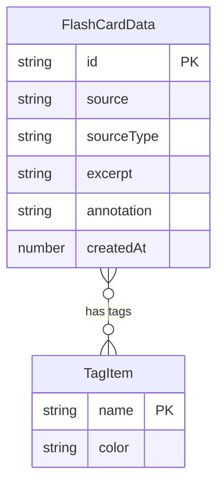

## 1. 架构设计

```mermaid
graph TB
    subgraph "前端层"
        "main.tsx" --> "App根组件"
        "App根组件" --> "CardList"
        "App根组件" --> "TagManager"
        "App根组件" --> "ExplorePanel"
        "CardList" --> "FlashCard"
    end
    subgraph "数据服务层"
        "cardService.ts" --> "localStorage"
    end
    "CardList" --> "cardService.ts"
    "ExplorePanel" --> "cardService.ts"
    "TagManager" --> "cardService.ts"
```

## 2. 技术说明
- 前端：React@18 + TypeScript + Vite
- 初始化工具：Vite
- 状态管理：Zustand
- 样式：CSS Modules / 全局CSS变量
- 后端：无（纯前端，localStorage持久化）
- 数据库：localStorage

## 3. 路由定义
| 路由 | 用途 |
|------|------|
| / | 主页面（碎片列表+标签管理+探索面板） |

## 4. API定义
无后端API，所有数据操作通过 cardService.ts 纯函数操作 localStorage。

### 数据类型定义
```typescript
interface FlashCardData {
  id: string;
  source: string;
  sourceType: 'book' | 'article';
  excerpt: string;
  annotation: string;
  tags: string[];
  createdAt: number;
}

interface TagItem {
  name: string;
  color: string;
}
```

### cardService 函数签名
```typescript
addCard(card: Omit<FlashCardData, 'id' | 'createdAt'>): FlashCardData
getAllCards(): FlashCardData[]
saveCards(cards: FlashCardData[]): void
filterByTag(cards: FlashCardData[], tag: string): FlashCardData[]
findRelated(cardId: string, cards: FlashCardData[]): FlashCardData[]
getPresetTags(): TagItem[]
addCustomTag(name: string): TagItem
```

## 5. 服务器架构图
无服务器架构。

## 6. 数据模型

### 6.1 数据模型定义


### 6.2 数据存储
使用 localStorage 键名 `flashcards` 存储卡片数组和 `customTags` 存储自定义标签。

## 7. 文件结构
```
├── package.json
├── vite.config.js
├── tsconfig.json
├── index.html
└── src/
    ├── main.tsx
    ├── components/
    │   ├── CardList.tsx
    │   ├── FlashCard.tsx
    │   ├── TagManager.tsx
    │   └── ExplorePanel.tsx
    ├── services/
    │   └── cardService.ts
    └── styles/
        └── global.css
```
