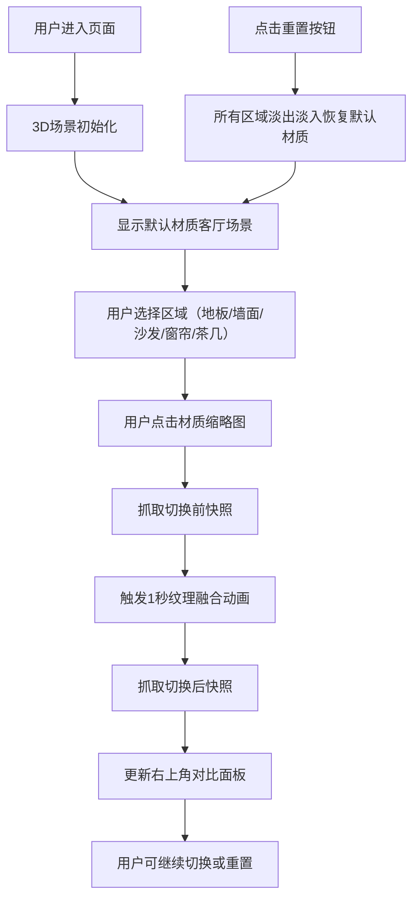

## 1. 产品概述

3D室内装饰材质搭配预览应用，帮助业主和设计师在建筑设计或室内装修前期，直观评估不同材质和纹理组合在三维空间中的整体视觉效果，提供快速生成并对比多种方案的交互工具。

- 核心价值：降低材质选择决策成本，通过3D可视化和实时对比提升设计效率
- 目标用户：室内设计师、业主、装修顾问

## 2. 核心功能

### 2.1 功能模块

1. **3D场景展示**：预设客厅3D场景，包含地板、墙面、沙发、窗帘、茶几5个区域
2. **材质切换面板**：侧边栏材质选择，支持木质、石材、布艺、金属、玻璃等大类，每类4种具体纹理
3. **纹理融合动画**：材质切换时1秒渐进式过渡动画（alpha渐变）
4. **双方案对比面板**：右上角自动抓取切换前后快照，左右分屏对比
5. **场景重置功能**：一键恢复所有区域为默认白色哑光材质
6. **场景交互**：鼠标拖拽旋转、右键平移、滚轮缩放

### 2.3 页面详情

| 页面名称 | 模块名称 | 功能描述 |
|---------|---------|----------|
| 主页面 | 3D场景渲染区 | 中央显示3D客厅场景，支持OrbitControls交互 |
| 主页面 | 侧边材质面板 | 左侧240px宽，区域选择+材质网格，两列等宽布局 |
| 主页面 | 对比快照面板 | 右上角500px宽，左右分屏展示切换前后快照 |
| 主页面 | 重置按钮 | 侧边栏底部，红色圆角矩形按钮 |

## 3. 核心流程

用户选择区域 → 点击材质缩略图 → 触发材质过渡动画 → 抓取切换前后快照 → 更新对比面板

## 4. 用户界面设计

### 4.1 设计风格
- **主色调**：深灰色工业风（#2a2a2a面板背景，#e0e0e0对比面板）
- **强调色**：蓝色#4a90d9（选中状态）、红色#d9534f（重置按钮）
- **整体风格**：简约工业风，低饱和度，专注3D内容展示
- **按钮样式**：圆角矩形，材质缩略图80x80px，悬停放大至90px带阴影

### 4.2 页面设计概览

| 页面名称 | 模块名称 | UI元素 |
|---------|---------|-------|
| 主页面 | 3D场景区 | 灰色背景(#f0f0f0)，45度俯视斜视角，OrbitControls交互 |
| 主页面 | 侧边材质面板 | 深灰背景(#2a2a2a)，宽240px，白色粗体区域标题，两列网格材质缩略图(80x80px) |
| 主页面 | 对比面板 | 浅灰背景(#e0e0e0)，宽500px，左右分栏，1px黑色分割线，快照240x180px圆角 |
| 主页面 | 重置按钮 | 红色背景(#d9534f)，白色文字，圆角矩形，悬停微亮 |

### 4.3 响应式
- 桌面端优先，固定布局
- 3D场景自适应窗口大小
- 侧边栏和对比面板固定定位

### 4.4 3D场景指引
- **环境**：灰色工业风背景，柔和环境光+方向光
- **光照**：AmbientLight基础环境光 + DirectionalLight主光源 + 补光
- **相机**：PerspectiveCamera，45度俯视斜角，初始距离适中
- **交互**：OrbitControls，左键旋转，右键平移，滚轮缩放
- **材质**：MeshStandardMaterial，支持金属度、粗糙度、贴图
- **动画**：Tween.js实现alpha通道渐变过渡
