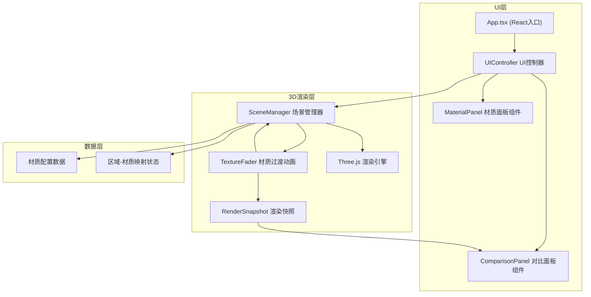

## 1. 架构设计



## 2. 技术说明

- **前端框架**：React 18 + TypeScript
- **构建工具**：Vite 5 + @vitejs/plugin-react
- **3D引擎**：Three.js (r160+)
- **动画库**：@tweenjs/tween.js
- **调试工具**：dat.gui
- **样式方案**：原生CSS + CSS Modules

### 文件结构与调用关系

```
src/
├── main.ts                 # 应用入口
│   └── 创建sceneManager → sceneManager.buildScene()
│   └── 创建uiController → uiController.init()
├── App.tsx                 # React根组件
├── scene/
│   ├── sceneManager.ts     # 3D场景管理器
│   │   └── 接收UI指令 → 调用textureFader.animateTextureFade()
│   │   └── 返回过渡完成事件 → UI模块
│   ├── textureFader.ts     # 材质过渡动画模块
│   │   └── 接收切换请求 → 执行Tween动画
│   │   └── 调用renderSnapshot.snapshotComparison()
│   │   └── 返回更新通知
│   └── renderSnapshot.ts   # 渲染快照模块
│       └── 接收命令 → 抓取canvas为DataURL
│       └── 发送至UI对比面板
├── ui/
│   ├── uiController.ts     # UI控制器
│   │   └── 监听用户点击 → 调用sceneManager.switchMaterial()
│   │   └── 接收回调 → 更新DOM
│   ├── MaterialPanel.tsx   # 材质选择面板组件
│   └── ComparisonPanel.tsx # 对比面板组件
├── data/
│   └── materials.ts        # 材质配置数据
├── types/
│   └── index.ts            # TypeScript类型定义
└── styles/
    └── globals.css         # 全局样式
```

## 3. 核心数据类型

```typescript
// 材质类型
interface MaterialConfig {
  id: string;
  name: string;
  category: 'wood' | 'stone' | 'fabric' | 'metal' | 'glass';
  color: string;
  roughness: number;
  metalness: number;
  textureUrl?: string;
}

// 区域类型
interface AreaConfig {
  id: string;
  name: string;
  defaultMaterialId: string;
}

// 快照数据
interface SnapshotData {
  before: string;  // DataURL
  after: string;   // DataURL
  areaId: string;
  materialId: string;
}
```

## 4. 性能优化策略

- 材质纹理使用Canvas程序化生成，避免外部资源加载
- 材质过渡使用shader材质或多材质混合，保证60fps
- 快照抓取使用canvas.toDataURL()，限制尺寸240x180
- 场景几何体复用，避免重复创建
- 使用MeshStandardMaterial的合理配置，平衡质量与性能
