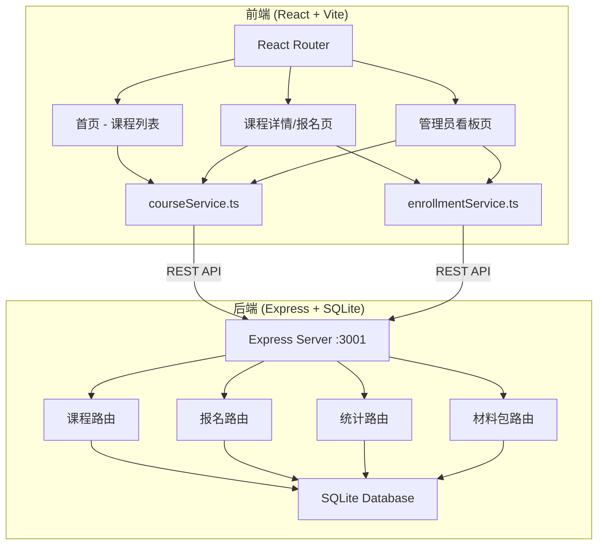
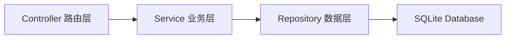
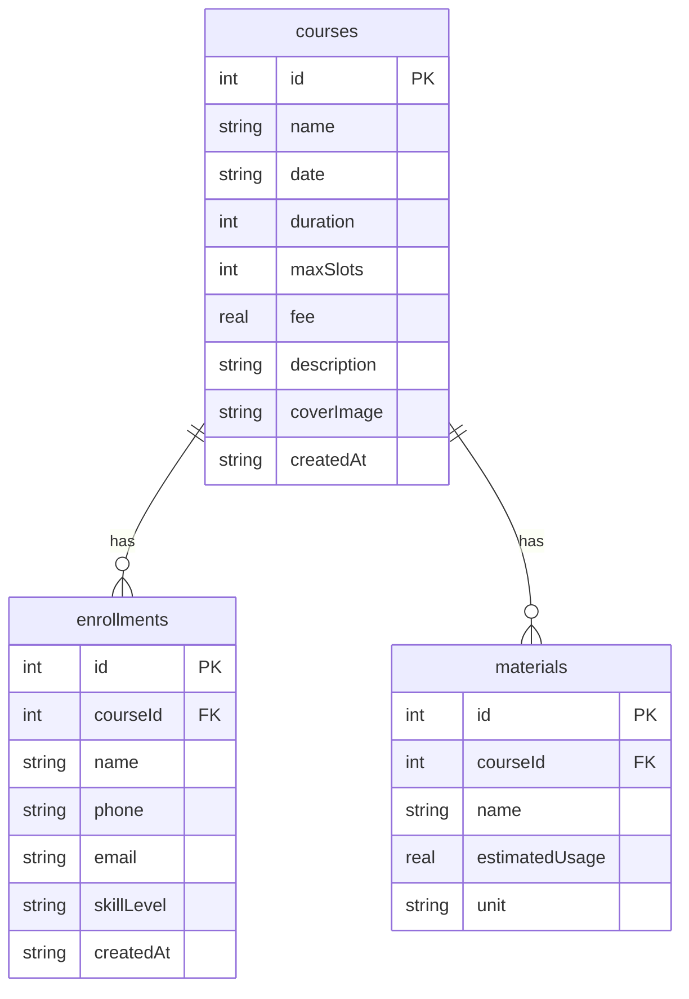

## 1. 架构设计



## 2. 技术说明

- **前端**：React@18 + TypeScript + Vite，CSS Modules / 内联样式
- **初始化工具**：Vite（@vitejs/plugin-react）
- **后端**：Express@4 + SQLite3
- **数据库**：SQLite（文件存储，无需外部服务）
- **构建工具**：Vite，通过 proxy 转发 /api 请求到后端
- **CSV导出**：csv-writer 库

## 3. 路由定义

| 路由 | 用途 |
|------|------|
| `/` | 首页，展示课程卡片列表 |
| `/course/:id` | 课程详情页，包含课程信息、报名表单、学员列表、材料包清单 |
| `/admin` | 管理员看板页，统计卡片、课程管理、材料总览 |

## 4. API 定义

### 课程相关

| 方法 | 路径 | 请求体 | 响应 |
|------|------|--------|------|
| GET | `/api/courses` | - | `Course[]` |
| POST | `/api/courses` | `{ name, date, duration, maxSlots, fee, description, coverImage, materials }` | `Course` |
| GET | `/api/courses/:id` | - | `Course & { enrollments, materials }` |

### 报名相关

| 方法 | 路径 | 请求体 | 响应 |
|------|------|--------|------|
| POST | `/api/enrollments` | `{ courseId, name, phone, email, skillLevel }` | `Enrollment` |
| GET | `/api/enrollments/:courseId` | - | `Enrollment[]` |
| DELETE | `/api/enrollments/:id` | - | `{ success: boolean }` |

### 统计相关

| 方法 | 路径 | 请求体 | 响应 |
|------|------|--------|------|
| GET | `/api/stats` | - | `{ totalCourses, totalEnrollments, pendingMaterialKits }` |

### 材料包相关

| 方法 | 路径 | 请求体 | 响应 |
|------|------|--------|------|
| GET | `/api/materials/:courseId` | - | `MaterialItem[]`（含总量计算） |
| GET | `/api/export-csv/:courseId` | - | CSV文件下载 |

### TypeScript 类型定义

```typescript
interface Course {
  id: number;
  name: string;
  date: string;
  duration: number;
  maxSlots: number;
  fee: number;
  description: string;
  coverImage: string;
  createdAt: string;
}

interface Enrollment {
  id: number;
  courseId: number;
  name: string;
  phone: string;
  email: string;
  skillLevel: 'beginner' | 'intermediate' | 'advanced';
  createdAt: string;
}

interface MaterialItem {
  id: number;
  courseId: number;
  name: string;
  estimatedUsage: number;
  unit: string;
}

interface MaterialSummary {
  name: string;
  estimatedUsage: number;
  unit: string;
  totalQuantity: number;
  enrollCount: number;
}

interface Stats {
  totalCourses: number;
  totalEnrollments: number;
  pendingMaterialKits: number;
}
```

## 5. 服务端架构图



## 6. 数据模型

### 6.1 数据模型定义



### 6.2 数据定义语言

```sql
CREATE TABLE IF NOT EXISTS courses (
  id INTEGER PRIMARY KEY AUTOINCREMENT,
  name TEXT NOT NULL,
  date TEXT NOT NULL,
  duration INTEGER NOT NULL,
  maxSlots INTEGER NOT NULL,
  fee REAL NOT NULL DEFAULT 0,
  description TEXT DEFAULT '',
  coverImage TEXT DEFAULT '',
  createdAt TEXT DEFAULT (datetime('now'))
);

CREATE TABLE IF NOT EXISTS enrollments (
  id INTEGER PRIMARY KEY AUTOINCREMENT,
  courseId INTEGER NOT NULL,
  name TEXT NOT NULL,
  phone TEXT NOT NULL,
  email TEXT NOT NULL,
  skillLevel TEXT NOT NULL CHECK(skillLevel IN ('beginner', 'intermediate', 'advanced')),
  createdAt TEXT DEFAULT (datetime('now')),
  FOREIGN KEY (courseId) REFERENCES courses(id)
);

CREATE TABLE IF NOT EXISTS materials (
  id INTEGER PRIMARY KEY AUTOINCREMENT,
  courseId INTEGER NOT NULL,
  name TEXT NOT NULL,
  estimatedUsage REAL NOT NULL,
  unit TEXT NOT NULL,
  FOREIGN KEY (courseId) REFERENCES courses(id)
);

INSERT INTO courses (name, date, duration, maxSlots, fee, description, coverImage) VALUES
  ('手工陶艺入门', '2026-07-05T14:00', 120, 15, 128, '从揉泥到拉坯，体验手作陶艺的乐趣，完成属于自己的第一个陶艺作品。', ''),
  ('编织艺术工坊', '2026-07-12T10:00', 90, 12, 88, '学习基础编织技法，制作一条精美手工围巾，感受线与针的温暖。', ''),
  ('木工手作体验', '2026-07-19T09:00', 150, 10, 168, '使用传统木工工具，亲手打磨一件实用木器，感受木与手的对话。', ''),
  ('皮艺手作课堂', '2026-07-26T14:00', 120, 8, 198, '从裁切到缝制，完成一个手工皮具卡包，体验皮革工艺的精致。', '');

INSERT INTO materials (courseId, name, estimatedUsage, unit) VALUES
  (1, '陶土', 2, 'kg'),
  (1, '釉料', 0.5, 'kg'),
  (1, '修坯工具', 1, '套'),
  (2, '毛线', 3, '卷'),
  (2, '编织针', 1, '副'),
  (3, '木板', 1, '块'),
  (3, '砂纸', 3, '张'),
  (3, '木工胶', 1, '瓶'),
  (4, '植鞣革', 0.5, 'sqft'),
  (4, '缝线', 2, 'm'),
  (4, '铆钉', 4, '个');

INSERT INTO enrollments (courseId, name, phone, email, skillLevel) VALUES
  (1, '张小明', '13800138001', 'zhangxm@example.com', 'beginner'),
  (1, '李芳', '13900139002', 'lifang@example.com', 'intermediate'),
  (2, '王大伟', '13700137003', 'wangdw@example.com', 'beginner'),
  (3, '赵敏', '13600136004', 'zhaomin@example.com', 'advanced'),
  (4, '陈思远', '13500135005', 'chensy@example.com', 'intermediate');
```
