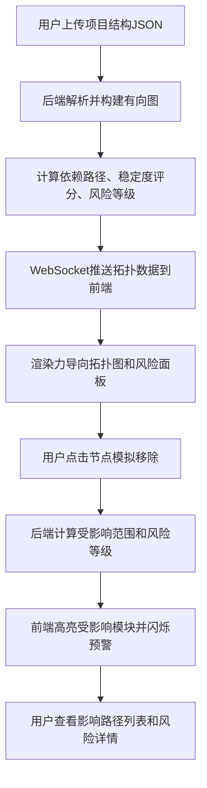

## 1. 产品概述

模块间依赖关系可视化与破损预警平台，帮助敏捷开发团队直观展示软件模块间的调用关系，自动检测耦合度，模拟模块移除影响范围，并基于历史数据提供风险预警，有效降低代码变更导致的线上故障。

- **核心价值**：解决模块耦合度高、变更影响范围不可见、线上故障频发的痛点
- **目标用户**：软件架构师、技术负责人、开发团队
- **市场定位**：面向DevOps和敏捷开发团队的架构可视化与风险管控工具

## 2. 核心功能

### 2.1 用户角色

| 角色 | 注册方式 | 核心权限 |
|------|----------|----------|
| 开发用户 | 直接访问使用 | 上传项目结构、查看拓扑图、模拟移除操作、查看风险数据 |

### 2.2 功能模块

1. **首页工作台**：JSON上传区、力导向拓扑图主画布、风险分析面板
2. **拓扑图可视化**：模块节点展示、依赖连线、力导向布局、交互操作
3. **模拟分析**：模块移除模拟、影响范围高亮、调用链展示
4. **风险分析**：模块稳定度评分、风险等级评估、历史趋势分析

### 2.3 页面详情

| 页面名称 | 模块名称 | 功能描述 |
|---------|---------|----------|
| 首页工作台 | JSON上传模块 | 支持粘贴JSON文本或上传文件，实时校验格式，解析模块、文件及调用关系 |
| 首页工作台 | 力导向拓扑图 | D3-force实现的SVG拓扑图，节点大小表示度数，连线粗细表示调用频率，支持拖拽缩放 |
| 首页工作台 | 风险面板 | 展示模块列表（可搜索筛选）、风险评分柱状图、历史趋势折线图 |
| 首页工作台 | 模拟移除功能 | 点击节点触发移除模拟，标红受影响模块和调用链，展示影响路径列表 |

## 3. 核心流程

## 4. 用户界面设计

### 4.1 设计风格

- **设计基调**：科技感深色主题，强调数据可视化的专业性和未来感
- **主色渐变**：#7c3aed（紫色，低风险）→ #eab308（黄色，中风险）→ #ef4444（红色，高风险）
- **背景色**：#1e1e2e（深灰蓝），营造沉浸式数据可视化环境
- **辅助色**：#60a5fa（蓝色，选中高亮）、#34d399（绿色，正常状态）
- **字体**：标题使用 Space Grotesk 粗体，正文使用 JetBrains Mono 等宽字体
- **按钮风格**：圆角8px，悬停有轻微上浮动效和光晕
- **布局风格**：左侧70%拓扑图主画布 + 右侧30%风险面板，小屏面板折叠为底部抽屉
- **图标风格**：线性简约图标，统一16px/24px尺寸

### 4.2 页面设计概述

| 页面名称 | 模块名称 | UI元素 |
|---------|---------|--------|
| 首页工作台 | JSON上传模块 | 拖拽上传区、文本粘贴框、格式校验提示、上传进度条 |
| 首页工作台 | 力导向拓扑图 | SVG画布、圆形节点（大小/颜色动态变化）、有向箭头连线、缩放控制条、图例说明 |
| 首页工作台 | 风险面板 | 搜索输入框、模块列表表格（可排序）、风险评分柱状图、历史趋势折线图 |
| 首页工作台 | 模拟移除功能 | 右键/点击菜单、确认对话框、影响范围高亮动画、影响路径列表 |

### 4.3 交互动效

- **节点选中**：放大1.3倍，显示模块名和依赖数，边缘脉冲光晕动画
- **节点拖拽**：弹性缓冲动画，释放后平滑过渡到新位置
- **风险预警**：受影响节点边缘红色脉冲光晕，连线闪烁高亮
- **页面加载**：拓扑图节点分批淡入，连线依次绘制
- **数据更新**：WebSocket推送时节点平滑过渡到新状态

### 4.4 响应式设计

- **桌面端（≥1200px）**：左侧70%拓扑图 + 右侧30%风险面板，双栏布局
- **平板端（768px-1199px）**：左侧60% + 右侧40%，面板可折叠
- **移动端（<768px）**：拓扑图全屏，风险面板折叠为底部悬浮抽屉，点击展开

## 5. 性能指标

- 50个模块、200条边时，初始布局计算≤3秒
- 拖拽和缩放帧率≥30fps
- 模拟移除高亮动画完成时间≤500ms
- WebSocket消息推送延迟≤100ms
