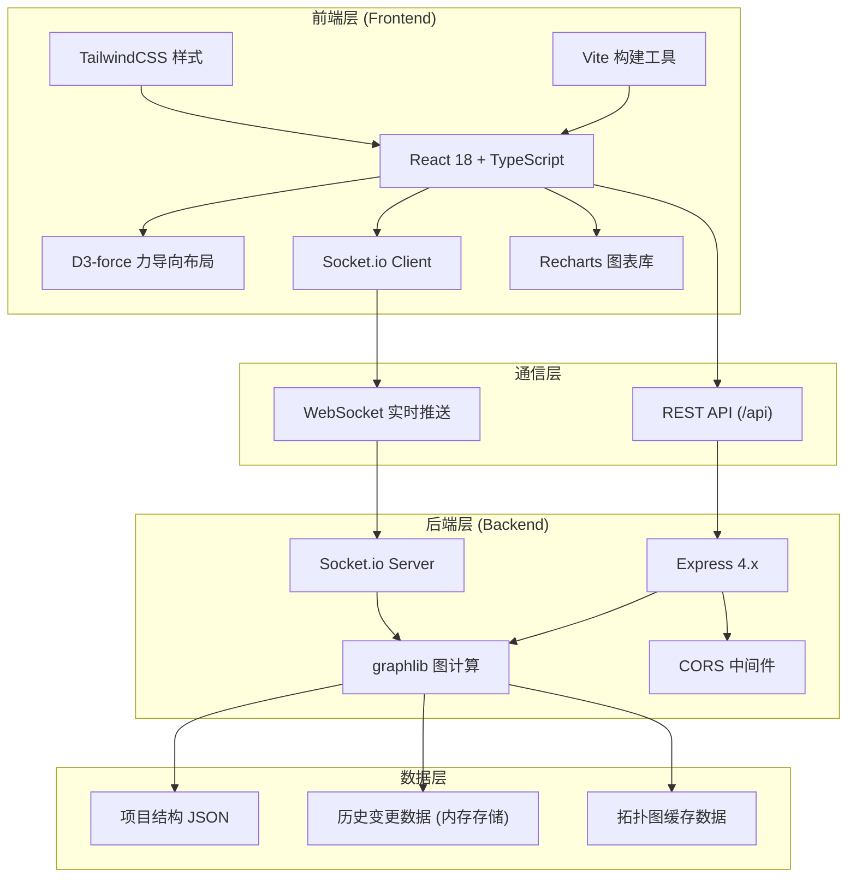
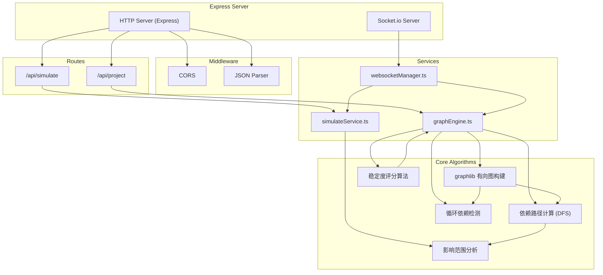
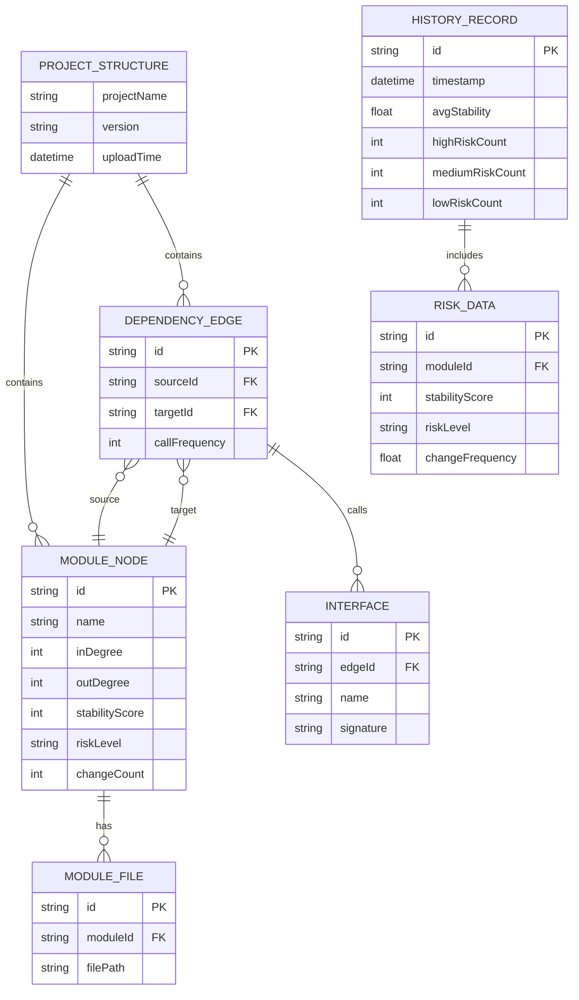

## 1. 架构设计



## 2. 技术描述

- **前端框架**：React 18 + TypeScript (严格模式)
- **构建工具**：Vite 5.x，支持热更新和代理配置
- **拓扑可视化**：D3 v7 + d3-force，力导向布局
- **图表组件**：Recharts 2.x，风险评分和趋势图
- **样式方案**：TailwindCSS 3.x，深色主题
- **实时通信**：Socket.io Client 4.x
- **后端框架**：Express 4.x
- **图计算引擎**：graphlib 2.x，有向图运算
- **WebSocket**：Socket.io Server 4.x
- **唯一标识**：uuid 9.x
- **跨域处理**：cors 2.x
- **并发启动**：concurrently，同时启动前后端

## 3. 目录结构

```
auto24/
├── package.json              # 根依赖配置，concurrently启动脚本
├── vite.config.js            # Vite配置，代理/api和WebSocket
├── tsconfig.json             # TypeScript严格模式配置
├── index.html                # 入口HTML
├── src/
│   ├── main.tsx              # React入口
│   ├── App.tsx               # 主应用组件
│   ├── types/
│   │   └── index.ts          # 全局类型定义
│   ├── components/
│   │   ├── TopologyCanvas.tsx  # 力导向拓扑图组件
│   │   ├── RiskPanel.tsx       # 风险面板组件
│   │   ├── JsonUploader.tsx    # JSON上传组件
│   │   └── ImpactDialog.tsx    # 影响范围对话框
│   ├── hooks/
│   │   ├── useWebSocket.ts     # WebSocket Hook
│   │   └── useApi.ts           # API请求Hook
│   └── services/
│       └── api.ts              # API请求封装
├── server/
│   ├── index.ts              # Express服务器入口
│   ├── graphEngine.ts        # 图计算引擎（核心）
│   ├── simulateService.ts    # 移除模拟服务
│   ├── websocketManager.ts   # WebSocket管理器
│   ├── routes/
│   │   ├── project.ts        # 项目相关路由
│   │   └── simulate.ts       # 模拟相关路由
│   └── types/
│       └── index.ts          # 后端类型定义
└── .trae/documents/          # 文档目录
```

## 4. 路由定义

| 路由 | 方法 | 用途 |
|------|------|------|
| /api/project/upload | POST | 上传项目结构JSON |
| /api/project/topology | GET | 获取当前拓扑数据 |
| /api/project/risk | GET | 获取风险评分数据 |
| /api/project/history | GET | 获取历史风险趋势数据 |
| /api/simulate/remove | POST | 模拟模块移除 |
| /socket.io | WS | WebSocket实时通信 |

## 5. API 定义

### 5.1 类型定义

```typescript
// 模块节点
interface ModuleNode {
  id: string;
  name: string;
  files: string[];
  inDegree: number;
  outDegree: number;
  stabilityScore: number; // 0-100，越高越稳定
  riskLevel: 'low' | 'medium' | 'high';
  changeCount: number;
  x?: number;
  y?: number;
}

// 依赖边
interface DependencyEdge {
  id: string;
  source: string;
  target: string;
  callFrequency: number;
  interfaces: string[];
}

// 项目结构
interface ProjectStructure {
  projectName: string;
  modules: ModuleNode[];
  dependencies: DependencyEdge[];
}

// 拓扑数据
interface TopologyData {
  nodes: ModuleNode[];
  edges: DependencyEdge[];
  circularDependencies: string[][];
}

// 风险数据
interface RiskData {
  moduleId: string;
  moduleName: string;
  stabilityScore: number;
  riskLevel: 'low' | 'medium' | 'high';
  changeCount: number;
  dependencyChangeFrequency: number;
}

// 历史记录
interface HistoryRecord {
  timestamp: number;
  version: string;
  averageStability: number;
  highRiskCount: number;
  mediumRiskCount: number;
  lowRiskCount: number;
}

// 模拟移除请求
interface SimulateRemoveRequest {
  moduleId: string;
}

// 模拟移除响应
interface SimulateRemoveResponse {
  removedModule: string;
  affectedModules: string[];
  affectedEdges: string[];
  impactPaths: string[][];
  riskLevel: 'low' | 'medium' | 'high';
  affectedCount: number;
  totalModules: number;
}
```

### 5.2 请求/响应示例

**POST /api/project/upload**
```typescript
// Request Body: ProjectStructure
// Response: { success: boolean; topology: TopologyData; risks: RiskData[] }
```

**POST /api/simulate/remove**
```typescript
// Request Body: { moduleId: string }
// Response: SimulateRemoveResponse
```

## 6. 服务器架构



## 7. 数据模型

### 7.1 核心数据结构



### 7.2 核心算法

**稳定度评分算法**：
```
stabilityScore = 100 - (changeCountWeight * normalizedChangeCount 
                  + dependencyWeight * normalizedDependencyChangeFrequency
                  + couplingWeight * normalizedCouplingDegree)

权重：changeCountWeight = 0.4, dependencyWeight = 0.35, couplingWeight = 0.25
```

**风险等级判定**：
- score ≥ 70 → low (绿色 #7c3aed)
- 40 ≤ score < 70 → medium (黄色 #eab308)
- score < 40 → high (红色 #ef4444)

**影响范围分析**：
- 从移除节点出发，BFS遍历所有可达节点（下游影响）
- 反向BFS遍历所有依赖该节点的节点（上游影响）
- 计算受影响节点占总节点比例，判定整体风险等级

## 8. 关键技术点

1. **力导向布局性能优化**：d3-force 仿真器节流，50节点200边布局≤3秒
2. **WebSocket实时推送**：拓扑变更时广播到所有在线客户端
3. **图计算效率**：graphlib 预计算路径，避免重复遍历
4. **动画性能**：CSS transform + opacity 实现60fps节点动画
5. **内存管理**：历史数据最多保留20条，定期清理过期缓存
