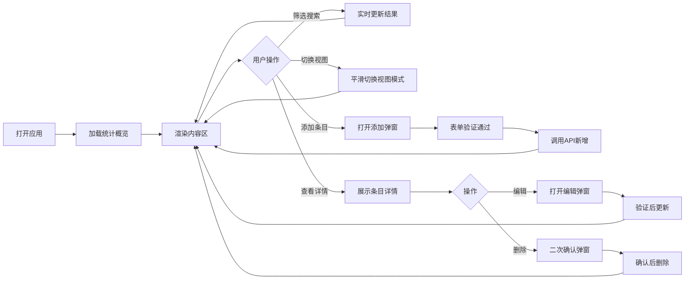

## 1. 产品概述
个人收藏管理应用，用于统一管理书籍、电影、音乐三类跨媒体收藏，解决收藏分散、难以检索和发现的问题。
- 面向普通用户，提供个人媒体收藏的集中化管理体验
- 通过多视图展示、多维筛选、标签分类帮助用户高效组织和浏览收藏

## 2. 核心功能

### 2.1 用户角色
| 角色 | 注册方式 | 核心权限 |
|------|----------|----------|
| 普通用户 | 无需注册，本地使用 | 添加、编辑、删除、浏览、筛选收藏条目 |

### 2.2 功能模块
1. **首页**：统计概览（总条目数、各类型数量、平均评分、标签词云）、筛选搜索区、视图切换区、内容展示区
2. **条目管理**：添加条目弹窗、编辑条目弹窗、删除确认弹窗、条目详情展示
3. **多视图展示**：网格卡片视图、列表视图、时间线视图
4. **筛选搜索**：媒体类型筛选、评分范围筛选、标签多选、文本搜索

### 2.3 页面详情
| 页面名称 | 模块名称 | 功能描述 |
|----------|----------|----------|
| 首页 | 统计概览 | 显示总条目数、各媒体类型数量、平均评分、标签词云（点击跳转筛选） |
| 首页 | 筛选搜索栏 | 类型切换、评分滑块、标签多选下拉、文本输入框 |
| 首页 | 视图切换栏 | 网格/列表/时间线三种模式切换按钮，平滑过渡动画 |
| 首页 | 内容展示区 | 根据当前视图渲染条目，空状态带友好提示插图 |
| 添加弹窗 | 表单模块 | 标题、创作者、年份、封面URL、评分(1-5星)、标签(最多5个+自动补全) |
| 编辑弹窗 | 表单模块 | 复用添加表单，封面URL字段禁用不可编辑 |
| 删除弹窗 | 确认模块 | 二次确认提示，展示条目标题 |

## 3. 核心流程
用户打开应用 → 查看统计概览和已有收藏 → 通过筛选/搜索定位条目 → 点击条目查看详情 → 编辑/删除条目或通过添加按钮新增条目

## 4. 用户界面设计

### 4.1 设计风格
- **配色方案**：暖色调主题，奶白背景(#FDF8F3)、棕褐色主色(#8B5A2B)、深褐文字(#3E2723)、浅棕辅助(#D7CCC8)
- **卡片样式**：圆角12px，投影模糊半径8px，悬停上移3px并加深阴影
- **过渡动画**：统一0.25s ease-out
- **字体**：标题使用 Playfair Display（优雅衬线），正文使用 Noto Sans SC（清晰易读）
- **图标**：使用 lucide-react 图标库

### 4.2 页面设计概览
| 页面名称 | 模块名称 | UI元素 |
|----------|----------|--------|
| 首页 | 统计概览 | 四宫格统计卡片 + 标签词云，暖色系渐变背景，数值加粗显示 |
| 首页 | 筛选搜索栏 | 圆角输入框、胶囊式类型按钮、星级评分控件、标签多选下拉 |
| 首页 | 视图切换栏 | 三个图标按钮，当前选中高亮棕褐色底色 |
| 首页 | 网格视图 | 3列响应式网格，封面图为主，元信息悬浮叠加显示 |
| 首页 | 列表视图 | 单行紧凑布局，封面缩略图+标题+评分+标签，悬停浅棕底纹 |
| 首页 | 时间线视图 | 左侧垂直轴线 + 彩色圆点（书=#5D4037 电影=#BF360C 音乐=#4E342E） |
| 弹窗 | 表单模块 | 暖色系输入框样式，星级交互控件，标签自动补全提示 |
| 空状态 | 提示模块 | 居中插图 + 友好文案 + 添加引导按钮 |

### 4.3 响应式
- 桌面端（≥1280px）：网格视图3列，侧边筛选栏展开
- 平板端（768-1279px）：网格视图2列，筛选栏横向排列
- 移动端（≥375px）：网格视图1列，导航栏折叠为汉堡菜单，筛选区可折叠收起

### 4.4 性能要求
- 列表滚动帧率稳定≥55fps
- 视图切换和筛选渲染≤200ms
- 使用CSS transform/opacity实现动画，避免重排重绘
