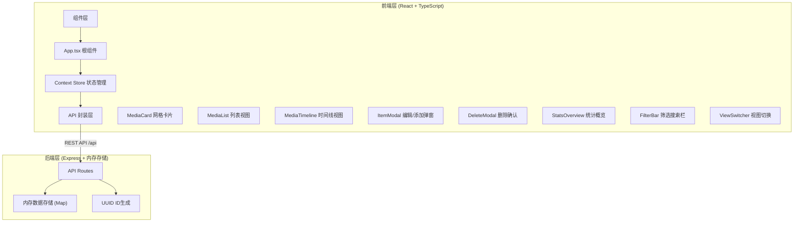
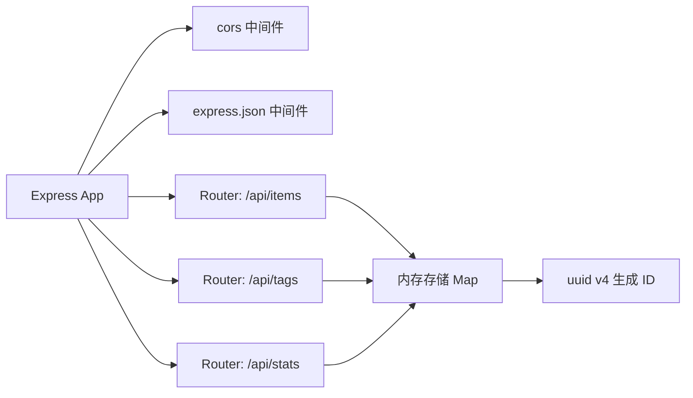
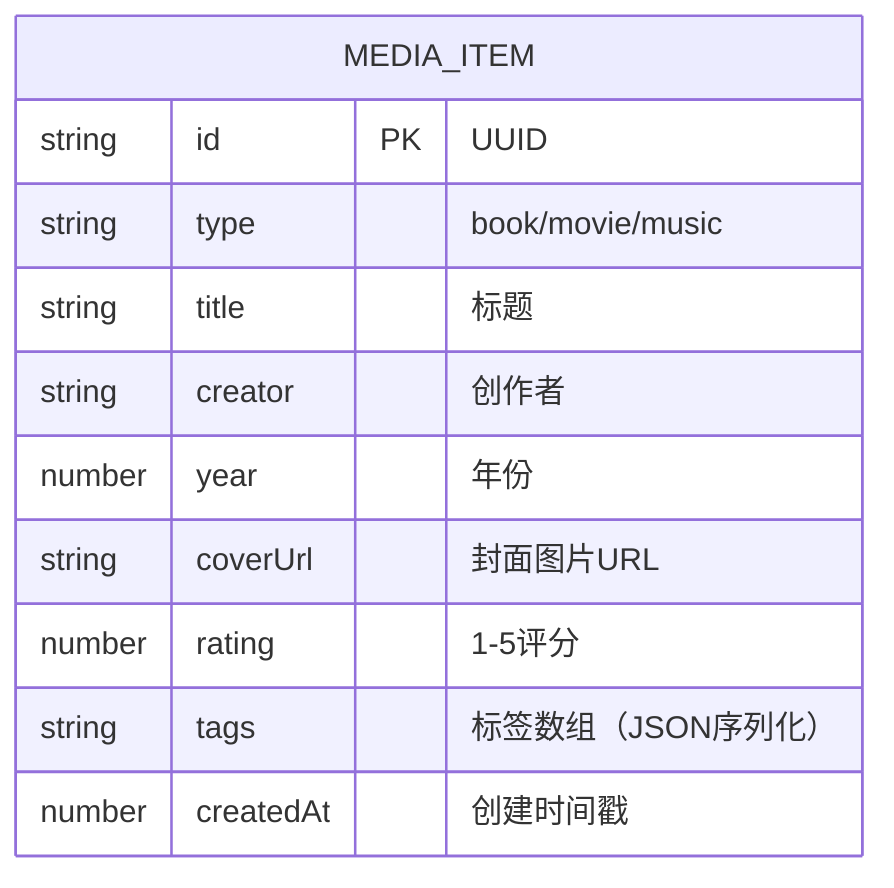

## 1. 架构设计



## 2. 技术描述
- **前端**：React 18 + TypeScript + Vite 构建，使用 React Context 进行状态管理
- **后端**：Express 4 + TypeScript，内存存储（Map），uuid 生成 ID，cors 跨域
- **构建工具**：Vite，前端代理 /api 到后端 3001 端口
- **样式方案**：自定义 CSS（CSS Variables 主题系统），不引入 Tailwind
- **并发启动**：concurrently 同时启动 Vite(5173) 和 Express(3001)

## 3. 路由定义
| 路由 | 用途 |
|------|------|
| / | 单页应用首页（所有功能均在此页面，无多路由） |

## 4. API 定义

### TypeScript 类型
```typescript
type MediaType = 'book' | 'movie' | 'music';

interface MediaItem {
  id: string;
  type: MediaType;
  title: string;
  creator: string;
  year: number;
  coverUrl: string;
  rating: number; // 1-5
  tags: string[]; // max 5
  createdAt: number;
}

interface Filter {
  type: MediaType | 'all';
  ratingMin: number; // 0-5, 0 = no limit
  ratingMax: number; // 0-5, 0 = no limit
  tags: string[];
  search: string;
}

type ViewMode = 'grid' | 'list' | 'timeline';
```

### REST API 端点
| 方法 | 路径 | 请求体 | 响应 | 描述 |
|------|------|--------|------|------|
| GET | /api/items | - | MediaItem[] | 获取所有条目列表 |
| POST | /api/items | Omit<MediaItem, 'id' \| 'createdAt'> | MediaItem | 新增条目 |
| PUT | /api/items/:id | Partial<Omit<MediaItem, 'id' \| 'createdAt' \| 'coverUrl'>> | MediaItem | 更新条目（coverUrl不可改） |
| DELETE | /api/items/:id | - | { success: true } | 删除条目 |
| GET | /api/tags | - | string[] | 获取所有已存在的标签（用于自动补全） |
| GET | /api/stats | - | StatsData | 获取统计数据（总数、分类计数、平均分、标签词频） |

## 5. 服务器架构图



## 6. 数据模型

### 6.1 数据模型定义



### 6.2 初始示例数据
后端启动时预置 12 条示例数据（4 本书 + 4 部电影 + 4 张音乐），涵盖常用标签如"经典"、"科幻"、"治愈"、"推荐"等，便于展示统计和筛选功能。
